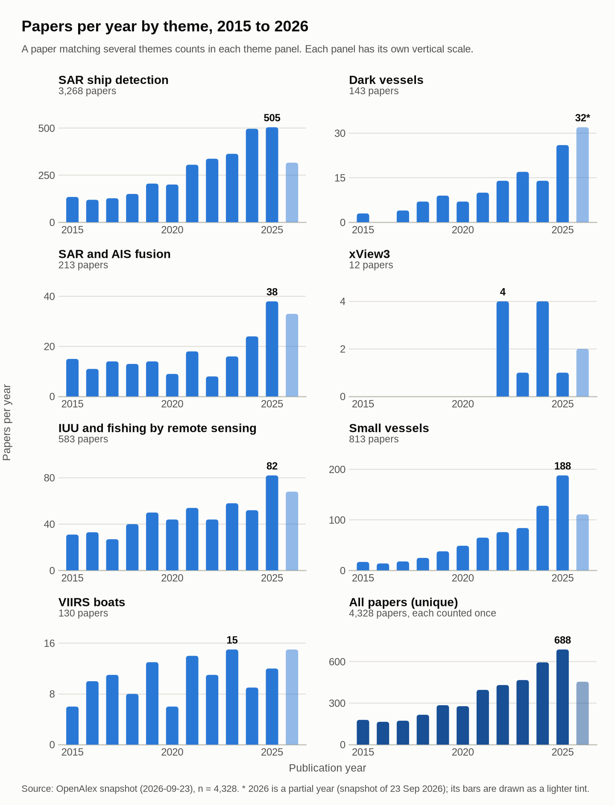
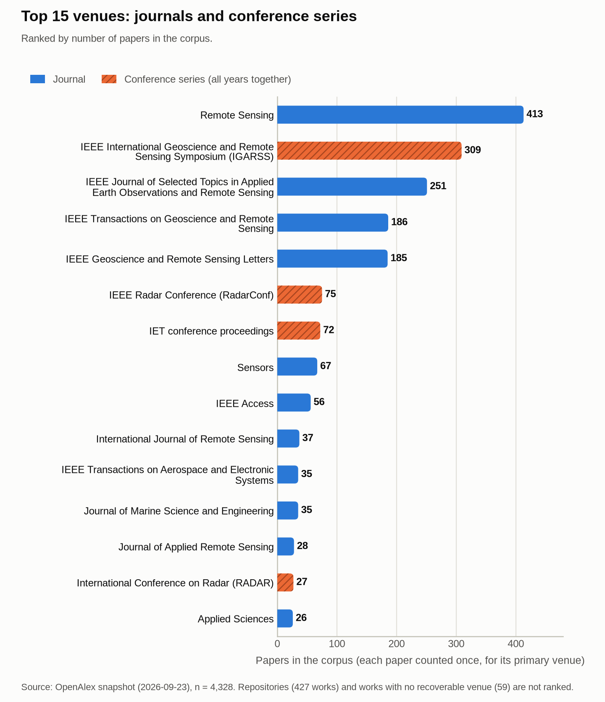
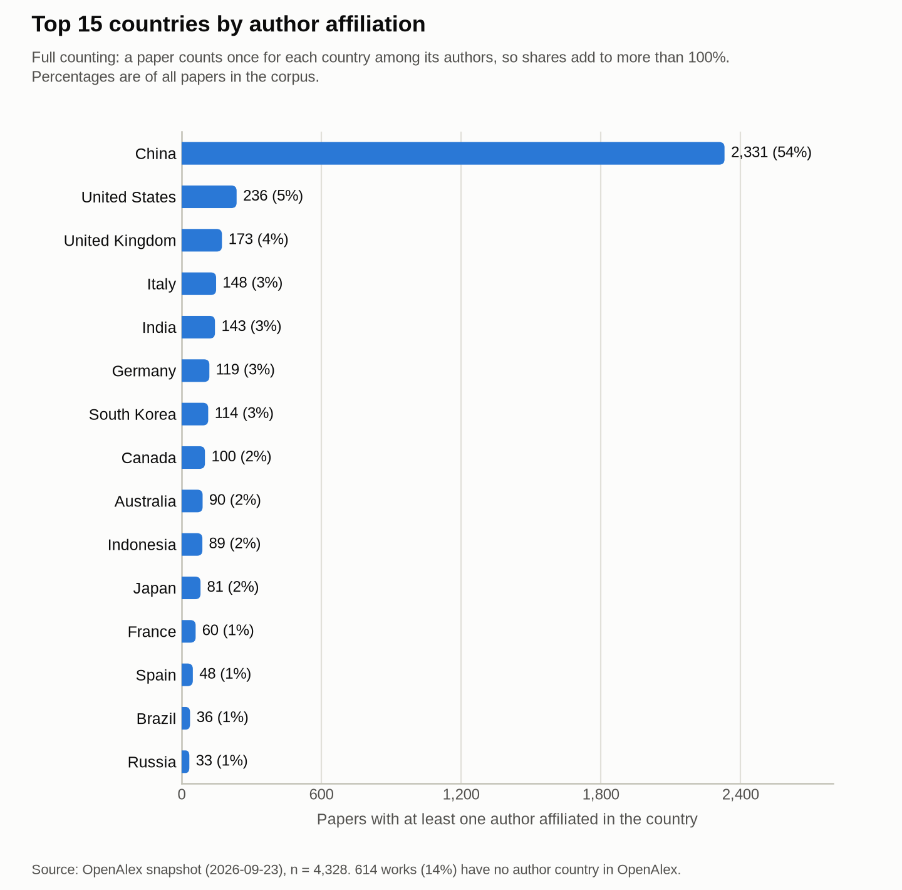
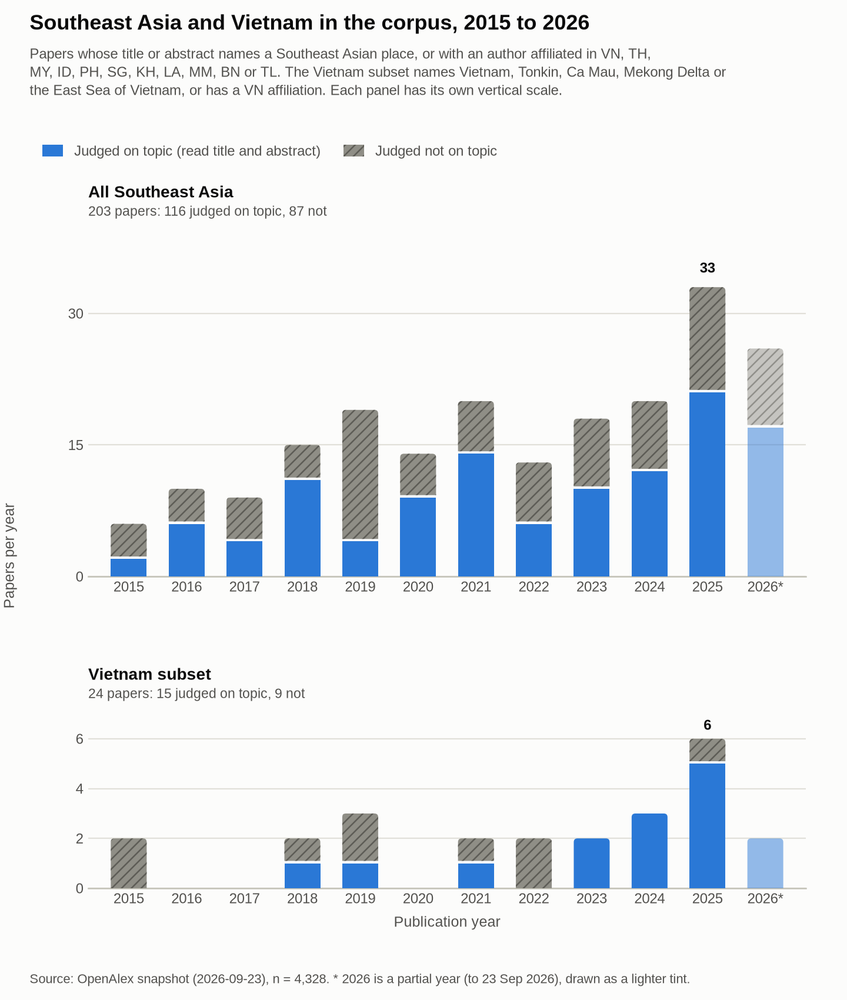

# Bibliometric scan of dark vessel research, 2015 to 2026

Snapshot: OpenAlex works, 2026-09-23. Tables built 2026-10-02. Corpus: 4,328 works. Tables are in `data/biblio/`, charts in `docs/figures/`.

## Purpose

This scan measures how much research exists on dark vessels, meaning ships detected in Sentinel-1 synthetic aperture radar (SAR) imagery that do not broadcast Automatic Identification System (AIS) positions, and on the neighbouring topics that feed that work: SAR ship detection, SAR and AIS fusion, illegal, unreported and unregulated (IUU) fishing monitoring by remote sensing, small-vessel detection and night-light boat detection. It reports volume by year, venues, countries, institutions, the most cited works and the Southeast Asia and Vietnam subset, and it supplies the evidence base for the gap analysis, which is written separately. The project area of interest is the whole South China Sea (Natural Earth marine areas South China Sea, Gulf of Tonkin and Gulf of Thailand), so the Southeast Asia subset is deliberately broad. "Dark" does not mean illegal. In this project it means only that no AIS position was matched to a detection (`DARK_CAVEAT` in `src/darkvessel/config.py`). The IMO requirement covers "all international and cargo ships exceeding a certain size, and all passenger ships" (W2592354307, DOI 10.1163/22116427_008010013), AIS is "not mandatory" for small vessels (W1920429187, DOI 10.9749/jin.132.78), and AIS is sometimes disabled, with links to hiding position from competitors and pirates (W4307930356, DOI 10.1126/sciadv.abq2109). An unmatched detection is a lead for review, not evidence of wrongdoing.

## Data and method

### Source

The corpus comes from the OpenAlex works snapshot on S3. The manifest date is 2026-09-23: 2,040 Parquet files, 476,196,327 records, 707.14 GB. The OpenAlex API, doi.org, Crossref, Semantic Scholar and arXiv were blocked in the build environment, so there was no live query and no cross-check against another index. Only the S3 snapshot was reachable. Every count in this document is computed from the snapshot. Facts about single works cite the OpenAlex record ID and the DOI.

The scanner (`scripts/biblio_scan.py`) never downloads a whole file. For each file it fetches the Parquet footer, then reads only the column chunks it needs with HTTP range requests: year, title, abstract and DOI for every row, and type, citations, source, authors and affiliations only for row groups that contain a match. It read 302.15 GB (42.7% of the snapshot) in 7 resumable runs (the longest took 8.4 minutes), 35.9 minutes of wall-clock time in total, with 0 errors. The local cache is 194 MB. Other reads were 4.18 GB for the recall check, about 5.5 GB for venue and anchor metadata re-reads and 0.17 GB for the deleted-ID list, so about 312 GB crossed the network in logged runs (development tests that were not logged are not counted).

**Table 1. From snapshot to corpus**

| Stage | Works |
| :--- | ---: |
| Records in the snapshot | 476,196,327 |
| Published 2015 to 2026 | 246,253,115 |
| Pass the keyword prefilter on title and abstract | 3,816,223 |
| Match at least one theme in loose mode (stored by the scan) | 6,041 |
| Removed: OpenAlex type is not article, conference-paper, review or preprint | -934 |
| Removed: fail the strict guards (no theme left) | -515 |
| Eligible records | 4,592 |
| Removed: duplicates merged into another record | -264 |
| Corpus | 4,328 |

The records removed by type were 229 datasets, 194 dissertations, 126 of type "other", 93 conference abstracts, 70 reports, 64 book chapters, 53 software records, 46 peer-review records and 59 of ten smaller types (books, editorials, errata and others).

The OpenAlex deleted-ID list was checked as well (52,309,193 IDs, 168 MB): 0 of the stored matches were on it.

### Queries

Text searched: title plus the abstract rebuilt from OpenAlex's inverted index. Matching is case-insensitive except for the abbreviations SAR, AIS and IUU. A work gets every theme it matches. The exact expressions are in `src/darkvessel/biblio/themes.py`; a machine-readable copy is `data/biblio/queries.json` and a readable one is `data/biblio/queries.md`.

| Theme | Query in words |
| :--- | :--- |
| `sar_ship_detection` | SAR term AND (ship, vessel or boat) AND (detect, recogni, classif or segment) |
| `dark_vessels` | dark vessel, ship, fleet, fishing, boat or target; non-broadcasting; AIS gap or disabling; going dark; AND a maritime word (medical 'dark vessel' excluded) |
| `sar_ais_fusion` | (AIS or automatic identification system) AND SAR term AND (fusion, fuse, match, correlat, associat, integrat or combin) |
| `xview3` | xView3, xView-3 or xView 3 |
| `iuu_remote_sensing` | (IUU, illegal fishing, unreported and unregulated, fishing effort, fishing vessel, boat or fleet, fishing activity) AND (satellite, remote sensing, SAR, VIIRS, Sentinel, imagery or night light) |
| `small_vessel` | (small vessel, boat or ship; small fishing; small target with a maritime term; artisanal; small-scale fish*) AND detect* AND (SAR, satellite, remote sensing, imagery or radar) |
| `viirs_boats` | (VIIRS, day/night band, night-time light or low light imaging) AND (boat, fishing, vessel or ship) |

The scan used a loose version of these expressions and stored every match (6,041 works). The corpus applies stricter guards to the stored text. The guards reject a bare "SAR" that means search and rescue, specific absorption rate, a Special Administrative Region or a biomedical term; blood vessels and research vessels; "dark target" (MODIS), "dark fishing spider" and "non-broadcast film"; "AIS" that means an ice sheet or a stroke without a ship word near it; "fishing effort" or "fishing activity" with no vessel, fleet, AIS or VMS word, and animal telemetry; "small target" with no maritime term; and VIIRS papers that are about calibration or light pollution. Loose matching reproduces the stored scan result exactly (6,041 of 6,041; `loose_matcher_mismatches` = 0 in `summary.json`).

Recall of the scanner was checked on 24 randomly chosen files (seed 20260923): a broader independent prefilter with the substring gates switched off looked at 6,393,763 rows (3,793,413 in range, 311,754 broad candidates) and found 115 theme matches. The scan had stored all 115; 0 were missing. This tests the scanner, not the keyword definitions. Four anchor DOIs were also watched during the scan and all four were found (see Anchor papers).

### Corpus rules and duplicates

The corpus keeps works published 2015 to 2026 with OpenAlex type article, conference-paper, review or preprint. By OpenAlex type the corpus holds 2,646 articles, 1,571 conference papers, 102 preprints and 9 reviews. Duplicates are removed in this order: deleted OpenAlex IDs; same OpenAlex ID; same DOI; same normalised title and year; a preprint, repository or weak record matched to a published record with the same title (publication year within 1, or within 3 when the first authors agree); a weak record whose title is contained in another; same title and venue within one year. Label prefixes such as "Article" and "ORIGINAL ARTICLE" are stripped before comparison. The published version survives over a preprint, themes and affiliations are united across the merged group, and the citation counts of merged records are added in `cited_by_with_merged`, which is used only to rank the top 20. There were 264 merges: 236 same title and year, 18 preprint and published pairs, 7 repository or weak-record pairs, 2 same title and venue, and 1 title variant. No two records shared an OpenAlex ID or a DOI. Every merge is listed in `data/biblio/dedupe_log.csv`. Example: the xView3-SAR arXiv preprint W4320009597 was merged into the NeurIPS proceedings record W7133194003.

### Counting rules

- **Papers per year:** by OpenAlex publication year. A work counts once in each theme it matches and once in the all-papers total.
- **Venues:** each work counts once, for its primary venue. Conference years are merged into one series (IGARSS 2015 to 2025 is one venue). Journals and conference series are ranked together; repositories and works with no recoverable venue are reported separately and are not ranked.
- **Countries and institutions:** full counting. A work counts once for every country or institution among its authors, so shares add to more than 100%. Percentages use all works in the corpus as the denominator; the countries table also gives the share among works that have any author country.
- **Citations:** OpenAlex `cited_by_count` at the snapshot date. It is not field-normalised.

### Venue attribution

OpenAlex gives 3,208 works a primary source. The other 1,120 (25.9% of the corpus) had none, and that group hid IGARSS and other proceedings. Venues were recovered in this order: another entry in `locations[]` that is a journal, conference, book series or e-book platform; the raw source name harvested on the primary location (URLs are ignored); raw names on other locations; the DOI prefix (for example 10.1109/IGARSS gives the IGARSS series); a repository location. Result: 1,039 from the raw primary source name, 7 from another location, 15 from the DOI prefix and 59 still unattributed (1.4%). The corpus then has 2,584 journal works, 1,258 conference works, 427 repository records and 59 unattributed works. Repositories (arXiv, Zenodo, elib, DOAJ and similar) are reported separately in `data/biblio/top_repositories.csv` and are excluded from the venue ranking. A check of 409 works whose primary location is a repository found a journal or conference location for only 14, so they were left as repositories (`data/biblio/venue_repository_check.json`).

### Precision

Precision is the share of corpus works that are about the topic, judged by reading the title and abstract (title only when OpenAlex has no abstract). A work is relevant if detecting, classifying, tracking or monitoring vessels or fishing activity at sea, from SAR, radar, optical or night-light satellite data or from AIS and VMS vessel data, or the dark vessel and IUU monitoring problem itself, is a main topic. It is not relevant if the matching words are incidental (ships named as example targets, "SAR" meaning something else, vessels as research platforms) or if the work is a legal or policy study of the sanctions "dark fleet" with no detection or monitoring method. Borderline cases were counted relevant when the work detects or tracks vessels with a non-satellite sensor (maritime radar, cameras, lidar, GPS loggers) and not relevant when it predicts fishing grounds from temperature and chlorophyll with no vessel data. One rater (the author of this scan) judged every item; there is no inter-rater check.

**Overall: 43 of 50 relevant (86%; 95% Wilson interval 73.8% to 93.0%)** in a random sample of 50 corpus works (seed 20260923; works are ranked by a seeded SHA-256 hash of the OpenAlex ID and the first 50 are taken, so the sample does not depend on row order). The sample was drawn after the strict guards were frozen. The guards themselves were written after reading false positives in earlier exploratory samples of the same corpus, so the figure is not a fully independent test. Applied to the corpus, 86% means roughly 3,700 on-topic works among the 4,328 (interval about 3,190 to 4,030).

The main sample has too few works from the small themes, so a second, stratified sample was drawn for each (seed 20260924). The xView3 theme has 12 works and all 12 were read.

**Table 2. Precision by theme**

| Theme | Works | In the main sample (relevant of n) | Theme sample (relevant of n; 95% interval) |
| :--- | ---: | ---: | ---: |
| SAR ship detection | 3,268 | 38 of 40 | 38 of 40 (95%; 83% to 99%), main sample |
| Dark vessels | 143 | 1 of 2 | 9 of 15 (60%; 36% to 80%) |
| SAR and AIS fusion | 213 | 2 of 2 | 14 of 15 (93%; 70% to 99%) |
| xView3 | 12 | none drawn | 12 of 12 (100%; 76% to 100%) |
| IUU and fishing by remote sensing | 583 | 3 of 5 | 12 of 20 (60%; 39% to 78%) |
| Small vessels | 813 | 4 of 6 | 18 of 20 (90%; 70% to 97%) |
| VIIRS boats | 130 | none drawn | 12 of 15 (80%; 55% to 93%) |

Dark vessels and IUU are the weak themes, at 60% each. In the dark-vessel sample, three of the six misses are legal studies of the shadow fleet of sanctioned tankers (W4406786647, W4409452809, W4415217064), one is a news digest in which "went dark" means a blackout (W2224714789), one is satellite AIS radio reception (W4392204494) and one is a deep-sea mining data platform (W7155486165). The eight IUU misses are unrelated or loosely related studies: a poetry book review (W4255255172), a community case study (W2790064035), a satellite network design paper (W4412398754), an EU fish export ban reform (W7130938537), air quality from marine traffic (W4313149173), a general overview of night-time light data mining (W3145700396), an Indonesian purse seine gear study (W2613446435) and Java Sea oceanography (W4391377810). Item-level judgments with a note for each are in `data/biblio/precision_sample.csv`, `data/biblio/precision_theme_sample.csv` and `data/biblio/precision_judgments.json`.

**Table 3. The 7 works judged not relevant in the main sample**

| OpenAlex ID | Year | Title | Reason |
| :--- | :--- | :--- | :--- |
| W2912410187 | 2018 | UNMANNED AERIAL SYSTEM LIDAR SURVEY OF TWO BREAKWATERS IN THE HAWAIIAN ISLANDS | UAS lidar survey of breakwaters in small-boat harbors; no vessel detection. |
| W3040434942 | 2020 | A Proposed Approach to Determine the Edges in SAR images | Edge detection in SAR images; ships named only among example objects. |
| W4364305662 | 2022 | Latent-Space Analysis for Improved Overhead Imagery Explainability | Explainability metric for automated target recognition, ships among several target types (borderline). |
| W4402452093 | 2024 | Harnessing the fisheries sector of the blue economy for sustainable economic growth and development in Nigeria: Opportunities, challenges, and strategies | Policy review of the fisheries sector of Nigeria's blue economy. |
| W4415217064 | 2025 | A Study on the Maritime Legal Issues Related to Shadow Fleet | Legal study of the shadow fleet (Korean); no detection or monitoring method (borderline). |
| W7096415365 | 2016 | Remote sensing technology for Tsunami Disasters Along the Andaman | Remote sensing of tsunami damage along the Andaman coast. |
| W7168128229 | 2026 | Morphological Evolution of a Nearshore Nourishment Constructed of Dredged Sediment in Southern Lake Michigan | Nearshore sediment nourishment in Lake Michigan; 'small boat harbor' only as a place name. |

### Outputs and how to rerun

`corpus.csv`, `papers_per_year.csv`, `top_venues.csv`, `top_repositories.csv`, `top_countries.csv`, `top_institutions.csv`, `top20_cited.csv`, `sea_vietnam.csv` (with a judgment per work), `anchors.csv`, `elvidge_viirs_boats.csv`, `dedupe_log.csv`, `precision_sample.csv`, `precision_theme_sample.csv`, `queries.md`, `queries.json` and `summary.json` are in `data/biblio/`, with the supporting files `precision_judgments.json`, `sea_vietnam_judgments.json`, `anchor_summaries.json`, `anchor_metadata.json`, `scan_recall_check.json` and `venue_repository_check.json`. To rerun: `scripts/biblio_scan.py` (resumable, `--max-minutes 8.5`), `scripts/biblio_venues.py`, `scripts/biblio_anchors.py`, `scripts/biblio_build.py`, `scripts/biblio_figures.py`. Offline tests: `tests/test_biblio_dedupe.py` and `tests/test_biblio_venues.py`.

## Results

### Volume and growth

The corpus has 4,328 unique works. Output rose from 179 works in 2015 to 688 in 2025, a factor of 3.8 or 14.4% a year compound. 2026 has 455 works in the snapshot (dated 23 September 2026) and is a partial year. SAR ship detection dominates: 3,268 works, 75.5% of the corpus. Dark vessels has 143 works (3.3%), up from 3 in 2015 to 26 in 2025, and 2026 already has 32. SAR and AIS fusion has 213 works, xView3 has 12 (none before 2022) and VIIRS boats has 130 with no clear trend. Small vessels rose from 17 to 188 works. 738 works (17.1%) match more than one theme. Part of the dark-vessel growth since 2023 is legal and policy writing on the sanctions "dark fleet" or "shadow fleet". Seventeen corpus works use those phrases in the title or abstract and 13 of them were published in 2025 and 2026; three of them are legal analyses (W4409452809, DOI 10.22397/wlri.2024.41.1.111; W4411220789, DOI 10.1108/jppel-02-2025-0022; W4416444567, DOI 10.1163/22134484-12341231).

**Figure 1. Papers per year by theme.** Each panel has its own vertical scale; 2026 is partial.

**Table 4. Papers per year by theme.** A work in several themes is counted in each; the last column counts each work once. * Partial year.

| Year | SAR ship detection | Dark vessels | SAR and AIS fusion | xView3 | IUU | Small vessels | VIIRS boats | All works |
| :--- | ---: | ---: | ---: | ---: | ---: | ---: | ---: | ---: |
| 2015 | 135 | 3 | 15 | 0 | 31 | 17 | 6 | 179 |
| 2016 | 120 | 0 | 11 | 0 | 33 | 14 | 10 | 165 |
| 2017 | 128 | 4 | 14 | 0 | 27 | 18 | 11 | 173 |
| 2018 | 151 | 7 | 13 | 0 | 40 | 25 | 8 | 216 |
| 2019 | 206 | 9 | 14 | 0 | 50 | 38 | 13 | 285 |
| 2020 | 201 | 7 | 9 | 0 | 44 | 49 | 6 | 278 |
| 2021 | 306 | 10 | 18 | 0 | 54 | 65 | 14 | 396 |
| 2022 | 338 | 14 | 8 | 4 | 44 | 76 | 11 | 431 |
| 2023 | 364 | 17 | 16 | 1 | 58 | 84 | 15 | 467 |
| 2024 | 497 | 14 | 24 | 4 | 52 | 128 | 9 | 595 |
| 2025 | 505 | 26 | 38 | 1 | 82 | 188 | 12 | 688 |
| 2026* | 317 | 32 | 33 | 2 | 68 | 111 | 15 | 455 |
| Total | 3,268 | 143 | 213 | 12 | 583 | 813 | 130 | 4,328 |

### Venues

The ranking below covers journals and conference series only. Repositories (427 works; the five largest are elib 77, DOAJ 60, Zenodo 49, arXiv 46, Preprints.org 16) and the 59 unattributed works are reported separately. The five leading venues hold 1,344 works (31.1% of the corpus) and all five are remote sensing venues. IGARSS ranks second with 309 works once its symposia from 2015 to 2025 are merged into one series and its records with no OpenAlex source are recovered; it was hidden in the unattributed group before the recovery.

**Figure 2. Top 15 venues: journals and conference series.**

**Table 5. Top 15 venues.** Citations are the sum of OpenAlex citation counts of the venue's works in the corpus.

| Rank | Venue | Type | Works | Citations | Dark vessel works |
| ---: | :--- | :--- | ---: | ---: | ---: |
| 1 | Remote Sensing | journal | 413 | 13,165 | 7 |
| 2 | IEEE International Geoscience and Remote Sensing Symposium (IGARSS) | conference | 309 | 1,814 | 7 |
| 3 | IEEE Journal of Selected Topics in Applied Earth Observations and Remote Sensing | journal | 251 | 5,971 | 1 |
| 4 | IEEE Transactions on Geoscience and Remote Sensing | journal | 186 | 8,265 | 0 |
| 5 | IEEE Geoscience and Remote Sensing Letters | journal | 185 | 4,947 | 0 |
| 6 | IEEE Radar Conference (RadarConf) | conference | 75 | 484 | 0 |
| 7 | IET conference proceedings | conference | 72 | 45 | 0 |
| 8 | Sensors | journal | 67 | 1,634 | 2 |
| 9 | IEEE Access | journal | 56 | 2,378 | 3 |
| 10 | International Journal of Remote Sensing | journal | 37 | 498 | 1 |
| 11 | IEEE Transactions on Aerospace and Electronic Systems | journal | 35 | 733 | 1 |
| 12 | Journal of Marine Science and Engineering | journal | 35 | 395 | 4 |
| 13 | Journal of Applied Remote Sensing | journal | 28 | 197 | 0 |
| 14 | International Conference on Radar (RADAR) | conference | 27 | 39 | 0 |
| 15 | Applied Sciences | journal | 26 | 193 | 2 |

Venues for dark-vessel work differ from the overall ranking. Of the 143 dark-vessel works, 79 are in journals, 34 in conferences and 30 in repositories. The journal and conference venues with the most are IGARSS 7, Remote Sensing 7, Journal of Marine Science and Engineering 4, FUSION 4, IEEE Access 3, Science Advances 3. 867 works (20.0%) carry at least one of the dark-vessel, SAR and AIS fusion or IUU themes.

**Remote Sensing of Environment, Fish and Fisheries, ICES Journal of Marine Science.** Remote Sensing of Environment (RSE) has few works in the corpus and none on the dark-vessel themes: 4 works, none tagged dark vessels, SAR and AIS fusion or IUU. Fish and Fisheries and the ICES Journal of Marine Science (ICES JMS) carry the topical record: every one of their works has one of those three tags. The counts differ from the figures quoted in the project notes (RSE 5, Fish and Fisheries 6, ICES JMS 9): `docs/journals.md` counted an earlier build of 4,554 works, before the strict guards and duplicate merging. The final corpus has RSE 4, Fish and Fisheries 4 and ICES JMS 9. A tag is a keyword match, so the last column of Table 6 gives my reading of the abstracts: all of Fish and Fisheries is on topic, but 3 of the 9 ICES JMS works are not.

**Table 6. Selected journals**

| Venue | Works | With a dark vessel, SAR and AIS fusion or IUU tag | On topic by reading |
| :--- | ---: | ---: | :--- |
| Remote Sensing of Environment | 4 | 0 | 3 of 4 |
| Fish and Fisheries | 4 | 4 | 4 of 4 |
| ICES Journal of Marine Science | 9 | 9 | 5 of 9, plus 1 borderline |
| Science Advances | 7 | 7 | not read in full |
| Marine Policy | 4 | 4 | not read in full |
| Fisheries Research | 6 | 5 | not read in full |

- Remote Sensing of Environment: Not on topic: W4200586701 (sea-ice thickness from Sentinel-1). Two of the three on-topic works are vessel detection from optical imagery (W4410395857 Sentinel-2 recreational vessels, W2786644902 optical survey); one is SAR ships and wakes (W4310062787).
- Fish and Fisheries: All four use satellite vessel tracking or detection (W7170243367, W4413756509, W2997773234, W2800578035).
- ICES Journal of Marine Science: Not on topic: W4389100605 (seabird impacts overview), W2794652535 (essay on marine protected area effectiveness), W2306836095 (orange roughy acoustics). Borderline: W4415558401 (capacity development for Global Fishing Watch technology).

### Countries

Authors affiliated in China appear on 2,331 works, 53.9% of the corpus and 62.8% of the works that have any author country. The United States (236), the United Kingdom (173), Italy (148) and India (143) follow. Indonesia is tenth with 89 works. 614 works (14%) have no author country in OpenAlex and are in no country count. The Chinese share comes from SAR ship detection and small-vessel detection, where 62% and 67% of the works in the theme have a Chinese author; in the dark-vessel and IUU themes the United States leads (Table 8).

**Figure 3. Top 15 countries by author affiliation (full counting).**

**Table 7. Top 15 countries.**

| Rank | Country | Works | % of corpus | % of works with country data |
| ---: | :--- | ---: | ---: | ---: |
| 1 | China | 2,331 | 53.9% | 62.8% |
| 2 | United States | 236 | 5.5% | 6.3% |
| 3 | United Kingdom | 173 | 4.0% | 4.7% |
| 4 | Italy | 148 | 3.4% | 4.0% |
| 5 | India | 143 | 3.3% | 3.9% |
| 6 | Germany | 119 | 2.8% | 3.2% |
| 7 | South Korea | 114 | 2.6% | 3.1% |
| 8 | Canada | 100 | 2.3% | 2.7% |
| 9 | Australia | 90 | 2.1% | 2.4% |
| 10 | Indonesia | 89 | 2.1% | 2.4% |
| 11 | Japan | 81 | 1.9% | 2.2% |
| 12 | France | 60 | 1.4% | 1.6% |
| 13 | Spain | 48 | 1.1% | 1.3% |
| 14 | Brazil | 36 | 0.8% | 1.0% |
| 15 | Russia | 33 | 0.8% | 0.9% |

**Table 8. Leading countries within each theme.** Counts are works with at least one author in the country.

| Theme | Works | Works with country data | Top three countries |
| :--- | ---: | ---: | :--- |
| SAR ship detection | 3,268 | 2,872 | China 2023, United Kingdom 120, Italy 119 |
| Dark vessels | 143 | 101 | United States 27, China 15, Australia 9 |
| SAR and AIS fusion | 213 | 164 | China 48, Italy 24, United Kingdom 13 |
| xView3 | 12 | 10 | India 2, China 2, Australia 2 |
| IUU and fishing by remote sensing | 583 | 443 | United States 94, China 75, Indonesia 64 |
| Small vessels | 813 | 744 | China 541, United Kingdom 30, Australia 28 |
| VIIRS boats | 130 | 100 | China 28, United States 25, Indonesia 20 |

### Institutions

Institutions are the OpenAlex institution entities named in author affiliations, counted fully. Chinese Academy of Sciences leads with 222 works (5.1% of the corpus), then National University of Defense Technology (207) and Xidian University (169). 14 of the top 15 are Chinese. The only non-Chinese institution in the top 10 is Deutsches Zentrum für Luft- und Raumfahrt e. V. (DLR). OpenAlex lists the Chinese Academy of Sciences, the University of Chinese Academy of Sciences and the Aerospace Information Research Institute as separate entities and no roll-up was done.

**Table 9. Top 15 institutions.**

| Rank | Institution | Country | Works | % of corpus |
| ---: | :--- | :--- | ---: | ---: |
| 1 | Chinese Academy of Sciences | CN | 222 | 5.1% |
| 2 | National University of Defense Technology | CN | 207 | 4.8% |
| 3 | Xidian University | CN | 169 | 3.9% |
| 4 | University of Electronic Science and Technology of China | CN | 142 | 3.3% |
| 5 | University of Chinese Academy of Sciences | CN | 140 | 3.2% |
| 6 | Aerospace Information Research Institute | CN | 126 | 2.9% |
| 7 | Tsinghua University | CN | 90 | 2.1% |
| 8 | Beijing Institute of Technology | CN | 88 | 2.0% |
| 9 | Beihang University | CN | 86 | 2.0% |
| 10 | Deutsches Zentrum für Luft- und Raumfahrt e. V. (DLR) | DE | 72 | 1.7% |
| 11 | Shanghai Jiao Tong University | CN | 71 | 1.6% |
| 12 | Shanghai Maritime University | CN | 64 | 1.5% |
| 13 | Harbin Institute of Technology | CN | 61 | 1.4% |
| 14 | Southwest Jiaotong University | CN | 59 | 1.4% |
| 15 | Beijing University of Chemical Technology | CN | 59 | 1.4% |

### Most cited works

Table 10 ranks by OpenAlex citations including the citations of merged duplicates. 19 of the top 20 carry the SAR ship detection theme, and most are SAR ship datasets or detectors from 2017 to 2021. The top 20 include one fisheries paper (rank 15, W2806290544) and none carries the dark-vessel theme. Rank 18 has 178 citations of its own and 106 on a merged duplicate.

**Table 10. Top 20 most cited works.**

| Rank | Cites | Year | Title | Venue | DOI | OpenAlex ID |
| ---: | ---: | ---: | :--- | :--- | :--- | :--- |
| 1 | 912 | 2020 | HRSID: A High-Resolution SAR Images Dataset for Ship Detection and Instance Segmentation | IEEE Access | 10.1109/access.2020.3005861 | W3038948729 |
| 2 | 718 | 2021 | SAR Ship Detection Dataset (SSDD): Official Release and Comprehensive Data Analysis | Remote Sensing | 10.3390/rs13183690 | W3200733355 |
| 3 | 668 | 2017 | Ship detection in SAR images based on an improved faster R-CNN | 2017 SAR in Big Data Era: Models, Methods and Applications (BIGSARDATA) | 10.1109/bigsardata.2017.8124934 | W2774244034 |
| 4 | 530 | 2019 | A SAR Dataset of Ship Detection for Deep Learning under Complex Backgrounds | Remote Sensing | 10.3390/rs11070765 | W2928007866 |
| 5 | 491 | 2019 | Dense Attention Pyramid Networks for Multi-Scale Ship Detection in SAR Images | IEEE Transactions on Geoscience and Remote Sensing | 10.1109/tgrs.2019.2923988 | W2961699889 |
| 6 | 424 | 2017 | OpenSARShip: A Dataset Dedicated to Sentinel-1 Ship Interpretation | IEEE Journal of Selected Topics in Applied Earth Observations and Remote Sensing | 10.1109/jstars.2017.2755672 | W2762294195 |
| 7 | 384 | 2018 | Squeeze and Excitation Rank Faster R-CNN for Ship Detection in SAR Images | IEEE Geoscience and Remote Sensing Letters | 10.1109/lgrs.2018.2882551 | W2904480641 |
| 8 | 356 | 2019 | Automatic Ship Detection Based on RetinaNet Using Multi-Resolution Gaofen-3 Imagery | Remote Sensing | 10.3390/rs11050531 | W2919011445 |
| 9 | 339 | 2017 | Contextual Region-Based Convolutional Neural Network with Multilayer Fusion for SAR Ship Detection | Remote Sensing | 10.3390/rs9080860 | W2747165560 |
| 10 | 325 | 2018 | Vessel detection and classification from spaceborne optical images: A literature survey | Remote Sensing of Environment | 10.1016/j.rse.2017.12.033 | W2786644902 |
| 11 | 320 | 2019 | Ship Detection Based on YOLOv2 for SAR Imagery | Remote Sensing | 10.3390/rs11070786 | W2928870406 |
| 12 | 305 | 2020 | An Anchor-Free Method Based on Feature Balancing and Refinement Network for Multiscale Ship Detection in SAR Images | IEEE Transactions on Geoscience and Remote Sensing | 10.1109/tgrs.2020.3005151 | W3041525128 |
| 13 | 303 | 2018 | A Densely Connected End-to-End Neural Network for Multiscale and Multiscene SAR Ship Detection | IEEE Access | 10.1109/access.2018.2825376 | W2799646862 |
| 14 | 297 | 2020 | FUSAR-Ship: building a high-resolution SAR-AIS matchup dataset of Gaofen-3 for ship detection and recognition | Science China Information Sciences | 10.1007/s11432-019-2772-5 | W3012162230 |
| 15 | 293 | 2018 | The economics of fishing the high seas | Science Advances | 10.1126/sciadv.aat2504 | W2806290544 |
| 16 | 293 | 2020 | LS-SSDD-v1.0: A Deep Learning Dataset Dedicated to Small Ship Detection from Large-Scale Sentinel-1 SAR Images | Remote Sensing | 10.3390/rs12182997 | W3089780760 |
| 17 | 287 | 2021 | BiFA-YOLO: A Novel YOLO-Based Method for Arbitrary-Oriented Ship Detection in High-Resolution SAR Images | Remote Sensing | 10.3390/rs13214209 | W3208019692 |
| 18 | 284 | 2019 | Deep Transfer Learning for Few-Shot SAR Image Classification | Remote Sensing | 10.3390/rs11111374 | W2944029760 |
| 19 | 267 | 2020 | Ship Detection in Large-Scale SAR Images Via Spatial Shuffle-Group Enhance Attention | IEEE Transactions on Geoscience and Remote Sensing | 10.1109/tgrs.2020.2997200 | W3033996275 |
| 20 | 263 | 2020 | Attention Receptive Pyramid Network for Ship Detection in SAR Images | IEEE Journal of Selected Topics in Applied Earth Observations and Remote Sensing | 10.1109/jstars.2020.2997081 | W3032837604 |

**Table 11a. Five most cited works in the dark vessels theme.**

| Cites | Year | Title | Venue | DOI | OpenAlex ID |
| ---: | ---: | :--- | :--- | :--- | :--- |
| 147 | 2022 | Hot spots of unseen fishing vessels | Science Advances | 10.1126/sciadv.abq2109 | W4307930356 |
| 138 | 2020 | Illuminating dark fishing fleets in North Korea | Science Advances | 10.1126/sciadv.abb1197 | W3045253480 |
| 107 | 2017 | A comparison of VMS and AIS data: the effect of data coverage and vessel position recording frequency on estimates of fishing footprints | ICES Journal of Marine Science | 10.1093/icesjms/fsx230 | W2793227382 |
| 72 | 2024 | The Application of Artificial Intelligence Technology in Shipping: A Bibliometric Review | Journal of Marine Science and Engineering | 10.3390/jmse12040624 | W4394565999 |
| 71 | 2020 | A distributed framework for extracting maritime traffic patterns | International Journal of Geographical Information Systems | 10.1080/13658816.2020.1792914 | W3043228368 |

Rows 4 and 5 of Table 11a are marginal keyword matches. W4394565999 matched on "research gaps in AIS data applications", which are gaps in research and not gaps in AIS coverage; W3043228368 mentions AIS switch-off only as one example of an anomaly and extracts shipping lanes. Neither is about dark vessels. Seven corpus works match the dark-vessel theme only through the phrase "gaps in AIS"; in six it means gaps in AIS data coverage or transmission and in one (W4394565999) it means research gaps.

**Table 11b. Five most cited works in the SAR and AIS fusion theme.**

| Cites | Year | Title | Venue | DOI | OpenAlex ID |
| ---: | ---: | :--- | :--- | :--- | :--- |
| 424 | 2017 | OpenSARShip: A Dataset Dedicated to Sentinel-1 Ship Interpretation | IEEE Journal of Selected Topics in Applied Earth Observations and Remote Sensing | 10.1109/jstars.2017.2755672 | W2762294195 |
| 297 | 2020 | FUSAR-Ship: building a high-resolution SAR-AIS matchup dataset of Gaofen-3 for ship detection and recognition | Science China Information Sciences | 10.1007/s11432-019-2772-5 | W3012162230 |
| 293 | 2020 | LS-SSDD-v1.0: A Deep Learning Dataset Dedicated to Small Ship Detection from Large-Scale Sentinel-1 SAR Images | Remote Sensing | 10.3390/rs12182997 | W3089780760 |
| 127 | 2015 | Overview of the RADARSAT Constellation Mission | Canadian Journal of Remote Sensing | 10.1080/07038992.2015.1104633 | W2269655503 |
| 120 | 2019 | Operational Monitoring of Illegal Fishing in Ghana through Exploitation of Satellite Earth Observation and AIS Data | Remote Sensing | 10.3390/rs11030293 | W2912855045 |

### Southeast Asia and Vietnam

A work is in the Southeast Asia subset if its title or abstract names Vietnam, Viet Nam, Tonkin, Mekong, Ca Mau, Gulf of Thailand, South China Sea, Spratly, Paracel, Malacca, Sulu, Celebes, Java Sea, Andaman, Indonesia, Philippines, Malaysia, Thailand, Cambodia, Myanmar, Brunei, Singapore or Timor-Leste, or if an author is affiliated in VN, TH, MY, ID, PH, SG, KH, LA, MM, BN or TL. Plain "East Sea" is not counted because it also names the Sea of Japan. The Vietnam flag needs Vietnam, Tonkin, Ca Mau, East Sea (Vietnam), Mekong Delta or a VN affiliation. The subset is broad on purpose, so I read the title and abstract of every one of its works and judged whether it is on topic, with the rule used for the precision sample. Judgments are in `data/biblio/sea_vietnam.csv` (columns `judged_on_topic` and `judgment_note`) and `data/biblio/sea_vietnam_judgments.json`.

The subset has 203 works (4.7% of the corpus): 73 flagged by both place name and affiliation, 68 by place name only and 62 by affiliation only. **116 of 203 (57%) are on topic.** That is far below the 86% for the corpus: the place-name and affiliation rules pull in oil-spill SAR studies, fishing-ground studies from temperature and chlorophyll, legal and policy essays, Indonesian-language fisheries reports and unrelated papers by authors with a Southeast Asian affiliation. Author affiliations in the subset: Indonesia 89, Vietnam 15, Malaysia 12, Philippines 11, Singapore 9, Thailand 3, Myanmar 1 (no work has an author in Cambodia, Laos, Brunei or Timor-Leste). Most frequent place names: Indonesia 74, South China Sea 26, Philippines 18, Vietnam 13, Singapore 13, Java Sea 9. Themes among the 116 on-topic works: IUU and fishing by remote sensing 67, SAR ship detection 44, VIIRS boats 34, small vessels 15, SAR and AIS fusion 12, dark vessels 5; none uses xView3.

The project area of interest, the South China Sea, is named in the title or abstract of 29 works (17 on topic): South China Sea 26, Gulf of Thailand 2, Spratly 1. No work names the Gulf of Tonkin or the Paracel Islands. Checking variant names against the stored text of the whole corpus: Beibu, Hainan, Natuna and Xisha add no works that are not already in the subset, Nansha adds 2 and plain "East Sea" matches 4 works. Most on-topic South China Sea work is VIIRS lit-fishing-boat mapping and VMS comparison (W3191781564, W4206029051, W4200283324, W4413757851, W4414550502). Only 5 of the 12 Southeast Asian works tagged dark vessels are on topic (W7167731618, W7213862670, W7213865140, W7110534747, W4311603024), and W7110534747 covers the Americas, not Southeast Asia. The SAR and AIS-based Southeast Asian work is mainly Indonesian (for example W3027811057, W4200244151, W4411695175, W7116380133).

**Figure 4. Southeast Asia and Vietnam works per year, split by the on-topic judgment.**

**Table 12. Southeast Asia and Vietnam subsets.**

| Measure | Southeast Asia | Vietnam subset |
| :--- | :--- | :--- |
| Works in the subset | 203 | 24 |
| Flagged by place name only | 68 | 9 |
| Flagged by author affiliation only | 62 | 11 |
| Flagged by both | 73 | 4 |
| Judged on topic | 116 (57%) | 15 (63%) |
| On topic, by theme | IUU and fishing by remote sensing 67, SAR ship detection 44, VIIRS boats 34, small vessels 15, SAR and AIS fusion 12, dark vessels 5 | SAR ship detection 11, IUU and fishing by remote sensing 4, VIIRS boats 3, small vessels 2 |

Of the 15 on-topic Vietnam works, 9 are in the subset only because an author is affiliated in Vietnam: eight are SAR ship detection methods that name no Southeast Asian place in the title or abstract, and one (W2801975478, fishery closures rated with VIIRS boat detection) names the Philippines. The other six name Vietnam or the Mekong. Three detect sand-mining boats on the Mekong in Sentinel-1 imagery (W4414122041, W4402491950, W4389678108), which is river work, not marine. Three use VIIRS boat detection or AIS: W4413757851 (lit fishing boats in the South China Sea), W3159780453 (AIS and VBD fusion in the northern South China Sea) and W3122835659 (an economics paper that uses satellite fishing-boat detection). No on-topic work in the corpus detects vessels at sea in SAR imagery and names Vietnam.

**Table 13. The 24 Vietnam-flagged works.** The reason for each judgment is in `sea_vietnam.csv`.

| Year | Title | Venue | DOI | OpenAlex ID | Themes | On topic |
| ---: | :--- | :--- | :--- | :--- | :--- | :--- |
| 2026 | SSD-YOLOv12: an improved YOLOv12n model for ship detection using SAR data | Neural Computing and Applications | 10.1007/s00521-025-11735-z | W7128407600 | SAR ship detection | yes |
| 2026 | CHL-YOLO: A Lightweight Detector for Complex SAR Ship Detection | IEEE Access | 10.1109/access.2026.3725428 | W7203831484 | SAR ship detection, small vessels | yes |
| 2025 | YOLO-SR: An optimized convolutional architecture for robust ship detection in SAR Imagery | Intelligent Systems with Applications | 10.1016/j.iswa.2025.200538 | W4410635202 | SAR ship detection, small vessels | yes |
| 2025 | Nighttime Remote Sensing Analysis of Lit Fishing Boats: Fisheries Management Challenges in the South China Sea (2013-2022) | Remote Sensing | 10.3390/rs17172967 | W4413757851 | IUU and fishing by remote sensing, VIIRS boats | yes |
| 2025 | Applying deep learning for boat detection and numerical modeling to assess sand mining impacts on river morphology: A case study in the Vietnamese Mekong Delta | Geomorphology | 10.1016/j.geomorph.2025.110010 | W4414122041 | SAR ship detection | yes |
| 2025 | The role of satellite image technology in maritime surveillance and national sovereignty using the Synthetic Aperture Radar (SAR) data approach | IOP Conference Series Earth and Environmental Science | 10.1088/1755-1315/1461/1/012036 | W4408717739 | SAR ship detection | yes |
| 2025 | SSC-YOLO: Spectral-Spatial Fusion Convolution for Ship Detection in SAR Imagery | 2025 International Conference on Advanced Technologies for Communications (ATC) | 10.1109/atc67618.2025.11268806 | W4417052393 | SAR ship detection | yes |
| 2025 | Intimacies of Art and Empire | Nineteenth Century Studies | 10.5325/ninecentstud.37.0179 | W7124145476 | IUU and fishing by remote sensing | no |
| 2024 | ShipGeoNet: SAR Image-Based Geometric Feature Extraction of Ships Using Convolutional Neural Networks | IEEE Transactions on Geoscience and Remote Sensing | 10.1109/tgrs.2024.3352150 | W4390691920 | SAR ship detection | yes |
| 2024 | SwinYOLOv7: Robust ship detection in complex synthetic aperture radar images | Applied Soft Computing | 10.1016/j.asoc.2024.111704 | W4396698889 | SAR ship detection | yes |
| 2024 | Recurrence interval of riverbed sand mining hotspots in the Mekong delta: Potential indications of unsustainable replenishment rates | Journal of Environmental Management | 10.1016/j.jenvman.2024.122435 | W4402491950 | SAR ship detection | yes |
| 2023 | Multi-scale ship target detection using SAR images based on improved Yolov5 | Frontiers in Marine Science | 10.3389/fmars.2022.1086140 | W4316041497 | SAR ship detection | yes |
| 2023 | A deep learning framework to map riverbed sand mining budgets in large tropical deltas | GIScience & Remote Sensing | 10.1080/15481603.2023.2285178 | W4389678108 | SAR ship detection | yes |
| 2022 | A bibliometric analysis on the visibility of the Sentinel-1 mission in the scientific literature | Arabian Journal of Geosciences | 10.1007/s12517-022-10089-3 | W4224224810 | SAR ship detection | no |
| 2022 | Experimental Study of Trajectory Features for the Recognition of Low-Flying Low-Speed Radar Targets Using Passive Coherent Radar Systems | Journal of the Russian Universities Radioelectronics | 10.32603/1993-8985-2022-25-3-39-50 | W4283659296 | small vessels | no |
| 2021 | AIS and VBD Data Fusion for Marine Fishing Intensity Mapping and Analysis in the Northern Part of the South China Sea | ISPRS International Journal of Geo-Information | 10.3390/ijgi10050277 | W3159780453 | IUU and fishing by remote sensing, VIIRS boats | yes |
| 2021 | The potential study of fishing area and its relationship to marine security in Natuna island | IOP Conference Series Materials Science and Engineering | 10.1088/1757-899x/1052/1/012006 | W3130005010 | IUU and fishing by remote sensing | no |
| 2019 | Long-Term Evolution of Morphology at Loc An Estuary, Vung Tau, Vietnam | Marine Geodesy | 10.1080/01490419.2019.1606125 | W2944781944 | IUU and fishing by remote sensing | no |
| 2019 | 중국의 정보 수집능력과 정보조직 변화 연구 | 군사논단 | none recorded | W3083338186 | SAR ship detection | no |
| 2019 | Labor Market Impacts and Responses: The Economic Consequences of a Marine Environmental Disaster | RePEc: Research Papers in Economics | 10.22004/ag.econ.290963 | W3122835659 | IUU and fishing by remote sensing | yes |
| 2018 | Rating the Effectiveness of Fishery Closures With Visible Infrared Imaging Radiometer Suite Boat Detection Data | Frontiers in Marine Science | 10.3389/fmars.2018.00132 | W2801975478 | IUU and fishing by remote sensing, VIIRS boats | yes |
| 2018 | Can Vietnam's Military Stand Up to China in the South China Sea? | Asia policy | 10.1353/asp.2018.0010 | W2786368535 | IUU and fishing by remote sensing | no |
| 2015 | Dispatches | Frontiers in Ecology and the Environment | 10.1890/1540-9295-13.2.68 | W4231070414 | small vessels | no |
| 2015 | CONCEPTUAL MODEL OF THE SEASONAL INLET CLOSURE IN THE DA DIEN ESTUARY |  | none recorded | W2180638940 | IUU and fishing by remote sensing | no |

**Table 14. Ten most cited on-topic works in the Southeast Asia subset.**

| Cites | Year | Title | Venue | DOI | OpenAlex ID |
| ---: | ---: | :--- | :--- | :--- | :--- |
| 75 | 2019 | Cross-Matching VIIRS Boat Detections with Vessel Monitoring System Tracks in Indonesia | Remote Sensing | 10.3390/rs11090995 | W2940541941 |
| 71 | 2024 | ShipGeoNet: SAR Image-Based Geometric Feature Extraction of Ships Using Convolutional Neural Networks | IEEE Transactions on Geoscience and Remote Sensing | 10.1109/tgrs.2024.3352150 | W4390691920 |
| 71 | 2018 | Mapping Fishing Activities and Suitable Fishing Grounds Using Nighttime Satellite Images and Maximum Entropy Modelling | Remote Sensing | 10.3390/rs10101604 | W2897839944 |
| 68 | 2018 | Rating the Effectiveness of Fishery Closures With Visible Infrared Imaging Radiometer Suite Boat Detection Data | Frontiers in Marine Science | 10.3389/fmars.2018.00132 | W2801975478 |
| 64 | 2024 | SwinYOLOv7: Robust ship detection in complex synthetic aperture radar images | Applied Soft Computing | 10.1016/j.asoc.2024.111704 | W4396698889 |
| 64 | 2023 | Multi-scale ship target detection using SAR images based on improved Yolov5 | Frontiers in Marine Science | 10.3389/fmars.2022.1086140 | W4316041497 |
| 28 | 2023 | A deep learning framework to map riverbed sand mining budgets in large tropical deltas | GIScience & Remote Sensing | 10.1080/15481603.2023.2285178 | W4389678108 |
| 28 | 2020 | Surveillance System for Illegal Fishing Prevention on UAV Imagery Using Computer Vision | 2020 International Electronics Symposium (IES) | 10.1109/ies50839.2020.9231539 | W3093942418 |
| 25 | 2021 | Trend in fishing activity in the open South China Sea estimated from remote sensing of the lights used at night by fishing vessels | ICES Journal of Marine Science | 10.1093/icesjms/fsab260 | W4206029051 |
| 24 | 2018 | Spatial and seasonal patterns of night-time lights in global ocean derived from VIIRS DNB images | International Journal of Remote Sensing | 10.1080/01431161.2018.1482022 | W2891191818 |

## Anchor papers

All four anchor papers are in the snapshot and in the corpus. Each was matched by DOI or exact title in the stored rows, and metadata were read again from the snapshot with range requests (`scripts/biblio_anchors.py`, 131 MB). Summaries are two sentences taken from the OpenAlex abstract; full text is in `data/biblio/anchors.csv`, which also lists every OpenAlex record that matched an anchor, including duplicates and data deposits.

### Paolo et al. 2024, Nature, "Satellite mapping reveals extensive industrial activity at sea"

- OpenAlex ID W4390535614; DOI 10.1038/s41586-023-06825-8; Nature 625(7993), pages 85-91; published 2024-01-03; cited 253 times; 10 authors; open access status hybrid.
- Corpus: in corpus; themes iuu_remote_sensing.

The paper combines satellite imagery, vessel GPS data and deep-learning models to map industrial vessel activity and offshore energy infrastructure in the world's coastal waters from 2017 to 2021. It finds that 72 to 76% of industrial fishing vessels are not publicly tracked (much of that fishing is around South Asia, Southeast Asia and Africa) and that 21 to 30% of transport and energy vessel activity is missing from public tracking systems; global fishing fell by 12 +/- 1% at the onset of COVID-19 in 2020.

The OpenAlex abstract does not name SAR, AIS or dark vessels, so only the IUU theme matched. That is a recall gap of the keyword method: the SAR and AIS details are in the abstract of the Figshare data deposit for the paper (analysis data, W6902286902, DOI 10.6084/m9.figshare.24309475.v4), which states that the work uses Sentinel-1 SAR and Sentinel-2 optical imagery and 53 billion AIS positions. That deposit and the training-data deposit (W6920716883, DOI 10.6084/m9.figshare.24309469.v1) are typed as articles by OpenAlex and are in the corpus; the author correction W4391474389 (DOI 10.1038/s41586-024-07123-7) is excluded by type.

### Park et al. 2020, Science Advances, "Illuminating dark fishing fleets in North Korea"

- OpenAlex ID W3045253480; DOI 10.1126/sciadv.abb1197; Science Advances 6(30), pages eabb1197; published 2020-07-22; cited 138 times; 15 authors; open access status gold.
- Corpus: in corpus; themes dark_vessels, iuu_remote_sensing.

The study combines four satellite technologies to find illegal fishing by dark fleets, which do not broadcast their positions in public monitoring systems, in the waters between the Koreas, Japan and Russia. It finds more than 900 Chinese-origin vessels in 2017 and more than 700 in 2018 fishing illegally in North Korean waters, with an estimated Todarodes pacificus catch of more than 164,000 t worth more than USD 440 million (about the catch of Japan and South Korea combined), and about 3,000 small-scale North Korean vessels fishing, mostly illegally, in Russian waters.

The abstract stored in OpenAlex for W3045253480 is truncated; it starts mid-sentence at "approximating that of Japan and South Korea combined". The first part of the summary comes from the Faculty Opinions record W4239783885 (DOI 10.3410/f.738375089.793579871), which reproduces the full abstract; its last three sentences match the truncated text word for word. That record is excluded from the corpus by type (peer-review). The journal page itself could not be retrieved, so the full abstract is UNVERIFIED against the journal.

### Paolo et al. 2022, xView3-SAR dataset

- OpenAlex ID W7133194003; DOI 10.52202/068431-2726; Advances in Neural Information Processing Systems 35, pages 37604-37616; published 2022-01-01; cited 3 times; 8 authors; open access status closed.
- Corpus: in corpus; themes dark_vessels, iuu_remote_sensing, sar_ship_detection, xview3.

xView3-SAR is presented as the largest labeled dataset for training machine learning models to detect and characterize vessels and ocean structures in SAR imagery: nearly 1,000 analysis-ready Sentinel-1 images of about 29,400 by 24,400 pixels, annotated by automated and manual analysis, each with co-located bathymetry and wind rasters. The paper also describes the xView3 Computer Vision Challenge, an international competition that uses the dataset for large-scale ship detection and characterization, and releases the data and code.

The NeurIPS record has no abstract in OpenAlex, so the summary is taken from the arXiv preprint W4320009597 (DOI 10.48550/arxiv.2206.00897, published 2022-06-02, cited 17 times, 8 authors), which was merged into this record; the combined citation count is 20. The venue of W7133194003 is "Advances in Neural Information Processing Systems 35", pages 37604 to 37616. That the paper is in the NeurIPS Datasets and Benchmarks track comes from the task brief and is UNVERIFIED in the records retrieved. The title matched the xView3 and dark-vessel themes; the preprint abstract adds the SAR ship detection and IUU themes after the merge.

### Elvidge et al. 2015, Remote Sensing 7(3), "Automatic Boat Identification System for VIIRS Low Light Imaging Data"

- OpenAlex ID W2113827159; DOI 10.3390/rs70303020; Remote Sensing 7(3), pages 3020-3036; published 2015-03-16; cited 216 times; 4 authors; open access status gold.
- Corpus: in corpus; themes iuu_remote_sensing, viirs_boats.

The paper presents algorithms that automatically detect lit fishing boats in VIIRS day/night band data by treating boat lights as spikes, rate each detection as strong or weak, flag cloud-blurred detections with a sharpness index, and remove land features and gas flares. A validation against analyst-selected boat detections found that the algorithm detected 99.3% of the reference pixel set, and the authors state that the data can give fishery agencies up-to-date information on fishing boat activity and indications of illegal fishing in restricted areas and across Exclusive Economic Zone boundaries.

A weak duplicate (W7097694407, a CiteSeerX copy dated 2016-09-17 whose title starts with "Article") was merged into this record. Table 15 lists the Elvidge-authored works in the corpus that match the VIIRS boats theme.

**Table 15. Elvidge-authored works in the VIIRS boats theme.** The 2015 anchor is the first row.

| Year | Title | Venue | DOI | OpenAlex ID | Cites | Note |
| ---: | :--- | :--- | :--- | :--- | ---: | :--- |
| 2015 | Automatic Boat Identification System for VIIRS Low Light Imaging Data | Remote Sensing | 10.3390/rs70303020 | W2113827159 | 216 |  |
| 2016 | VIIRS MONITORING OF LIT FISHING BOAT ACTIVITY IN EAST AND SOUTHEAST ASIA | no venue recorded | none recorded | W7098260452 | 0 | No venue recorded in OpenAlex. |
| 2017 | Supporting international efforts for detecting illegal fishing and GAS flaring using viirs | 2017 IEEE International Geoscience and Remote Sensing Symposium (IGARSS) | 10.1109/igarss.2017.8127580 | W2771713092 | 17 |  |
| 2017 | Findings from Matching VIIRS Boat Detection and VMS Data | AGUFM | none recorded | W3014014081 | 0 | No abstract in OpenAlex; matched on title. |
| 2018 | Mapping Fishing Activities and Suitable Fishing Grounds Using Nighttime Satellite Images and Maximum Entropy Modelling | Remote Sensing | 10.3390/rs10101604 | W2897839944 | 71 |  |
| 2018 | Rating the Effectiveness of Fishery Closures With Visible Infrared Imaging Radiometer Suite Boat Detection Data | Frontiers in Marine Science | 10.3389/fmars.2018.00132 | W2801975478 | 68 |  |
| 2018 | Monitoring of night fishing boat lights with VIIRS | Sovremennye problemy distantsionnogo zondirovaniya Zemli iz kosmosa | 10.21046/2070-7401-2018-15-1-101-119 | W2793514918 | 5 |  |
| 2019 | Cross-Matching VIIRS Boat Detections with Vessel Monitoring System Tracks in Indonesia | Remote Sensing | 10.3390/rs11090995 | W2940541941 | 75 |  |
| 2021 | Extending the DMSP Nighttime Lights Time Series beyond 2013 | Remote Sensing | 10.3390/rs13245004 | W4200618839 | 71 | Off topic: DMSP night-light series; fishing boat lights are only noise to remove. |
| 2022 | VIIRS Monitoring and Reporting on Lit Fishing Vessel Detections in Southeast Asia | IGARSS 2022 - 2022 IEEE International Geoscience and Remote Sensing Symposium | 10.1109/igarss46834.2022.9883658 | W4312633089 | 6 |  |
| 2023 | Discovering Hidden Offshore Lighting Structures with Multiyear Low-Light Imaging Satellite Data | Oceanography & Fisheries Open access Journal | 10.19080/ofoaj.2023.16.555944 | W4388188561 | 2 |  |
| 2025 | A comprehensive global mapping of offshore lighting | Earth system science data | 10.5194/essd-17-579-2025 | W4407270599 | 6 |  |
| 2025 | Review of Long-Term Patterns of Nighttime VIIRS Detections of Lights, Boats and Offshore Lights, Fires, and Flares in S.E. Asia: 2012-2023 | Springer proceedings in earth and environmental sciences | 10.1007/978-981-95-3075-5_1 | W4416260556 | 0 | No abstract in OpenAlex; matched on title. |

## Limitations

- **Snapshot lag.** The snapshot is dated 2026-09-23. Works indexed later are missing. Recent years are usually under-counted because indexing lags publication, so the 2025 and 2026 counts will probably rise; the size of the lag was not measured and is UNVERIFIED. 2026 is a partial year and its bars are drawn as a lighter tint.
- **Keyword recall.** Matching uses title and abstract only. 301 corpus works (7.0%) have no abstract in OpenAlex and match on the title alone, so recall for them is lower. Paolo et al. 2024 matched only the IUU theme because its abstract lacks SAR, AIS and dark vocabulary. Phrases such as "maritime target" are not covered, and the vocabulary is English. The recall check tests the scanner against a broader filter on 24 files; it does not test the themes against a gold list beyond the four anchors. Works that the loose scan missed cannot be recovered without another scan.
- **Precision.** About one corpus work in seven is off topic (86% precision, interval 74% to 93%); dark vessels and IUU are at about 60%. One rater judged all samples. The guards were tuned on earlier samples of the same corpus. All counts are keyword matches, not counts of on-topic works.
- **Dark fleet vocabulary.** The dark-vessel theme mixes two literatures: vessels that do not broadcast AIS (fisheries, maritime domain awareness, remote sensing) and the sanctions-evading tanker "dark fleet" or "shadow fleet" (many of them legal and policy studies). Legal studies were judged not relevant in the precision samples, but they remain in the corpus counts.
- **Affiliation gaps.** 614 works (14%) have no author country in OpenAlex, so country counts are lower bounds. Institution names are OpenAlex entities with no roll-up, and an author with several affiliations counts for each. The Southeast Asia flag by affiliation catches authors from the region on papers that have nothing to do with the region (62 works flagged by affiliation only).
- **Venues.** 59 works have no recoverable venue and 427 are repository records, so the ranking covers 89% of the corpus. Of 409 repository-primary works checked, only 14 had a journal or conference location; the others, including DOAJ and elib records, cannot be assigned to a journal from OpenAlex alone. Conference series are merged by a curated list plus generic cleaning, so the tail of the ranking may split a series.
- **Duplicates and document types.** Merging uses title, year, venue and first-author rules; a preprint and its published version with different titles can survive as two works (not measured). 11 records whose venue is Figshare (9 typed article, 2 conference-paper) are in the corpus, including the two Paolo et al. data deposits; some are not research papers. Two works are flagged retracted by OpenAlex and kept (W4366607717, DOI 10.1007/s12524-023-01689-x; W4312770091, DOI 10.1109/mysurucon55714.2022.9972532). 187 works carry OpenAlex's `is_xpac` flag, kept in `corpus.csv`; what the flag means was not checked here and is UNVERIFIED.
- **No live query.** The OpenAlex API and the DOI, Crossref, Semantic Scholar and arXiv services were blocked. Abstracts are as stored in the snapshot (the Park et al. abstract is truncated), no DOI was resolved and no count was cross-checked against another index. Citation counts are OpenAlex values at the snapshot date.
- **Southeast Asia subset.** The place list comes from the project brief. Of its names, Tonkin and Paracel match no work. The affiliation rule and place rule together are broad (57% on topic), so the subset is a reading list, not a count of Southeast Asian dark-vessel research.

## Gap analysis

Pending: written in a separate pass.
