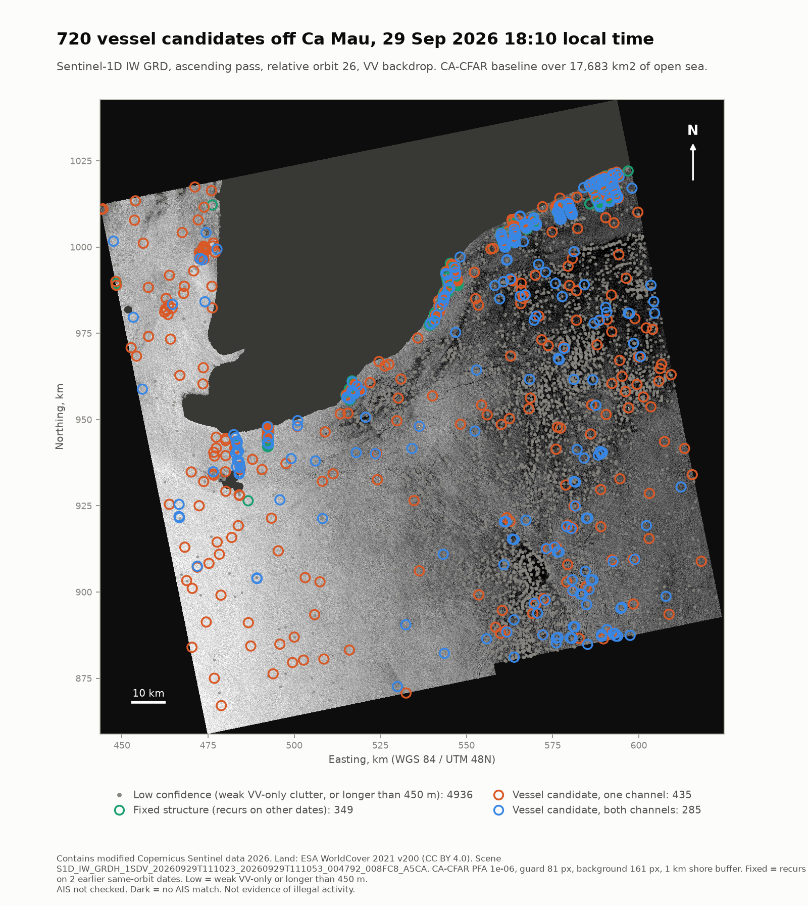
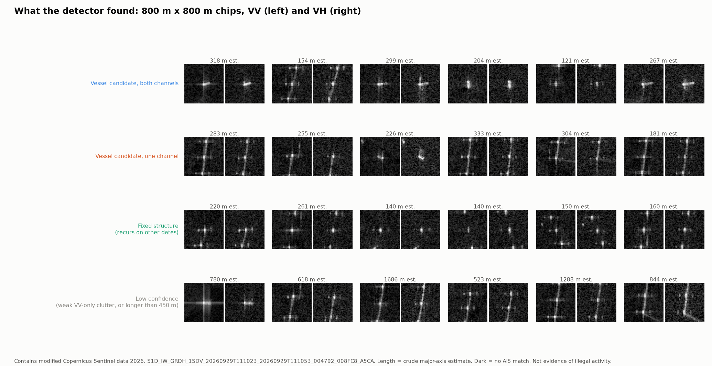

# Workstream 3 detail: Ca Mau sub-area, scene search and CA-CFAR baseline

The project AOI is now the whole South China Sea (see `docs/scs_regional.md`). This document covers the first, detailed run over the Ca Mau sub-area, which the demo page keeps as its scene-detail view.

> **"Dark" does not mean illegal.** A dark detection only means no AIS position was matched to it. Many vessels are not required to carry AIS, AIS can be off for lawful reasons, and satellite AIS misses messages in busy coastal waters. No AIS was connected for this run, so nothing here is labeled dark.

Run date: 2026-10-02. All numbers below come from files in this repo; the script that produced each is named.

## 1. Data access

The brief asked for a STAC search on Microsoft Planetary Computer or Copernicus Data Space. Both STAC APIs were blocked by this environment's network policy on 2026-10-02, so the search ran against the AWS Open Data mirror of Sentinel-1 GRD (bucket `sentinel-s1-l1c`). Anonymous HTTPS listing and range reads worked. The measurement files are Cloud-Optimized GeoTIFFs (1024 px deflate tiles, internal overviews, 210 ground control points), so a window can be read without downloading the 0.5 to 0.65 GB scene. The STAC path (`src/darkvessel/s1/stac.py`) is written and unit tested against fixtures; run `scripts/02_search_scenes.py --source stac_cdse` once the hosts are allowed, to cross-check the AWS result.

## 2. Area of interest

Ca Mau waters, both coasts, 103.5 to 106.0 E, 7.5 to 9.8 N, 69,989 km2 (equal-area); layer `aoi_candidates_*` of `data/aoi.gpkg`. Detail products use UTM zone 48N (EPSG:32648). Script: `scripts/01_make_aoi.py --aoi ca_mau`.

## 3. Sentinel-1C/1D scenes over the AOI, last 90 days

Script `scripts/02_search_scenes.py --aoi ca_mau`; outputs `data/s1_footprints_ca_mau.gpkg` (layers `s1_footprints_4326`, `s1_footprints_utm48n`), `data/s1_scenes_ca_mau.csv`, `data/s1_search_summary_ca_mau.json`.

| Item | Result |
|---|---|
| Search window | 2026-07-04 to 2026-10-02 (UTC) |
| Products intersecting the AOI | 50 IW GRDH products on 27 dates |
| Satellite | Sentinel-1D: 50. Sentinel-1C: 0 |
| Orbit direction | 30 ascending (about 11:10 UTC, 18:10 local), 20 descending (about 22:50 UTC, 05:50 local) |
| Polarisation | All dual VV + VH (1SDV) |
| Relative orbits | 18 descending (16 products), 26 ascending (16), 99 ascending (14), 91 descending (4) |
| Revisit | Median gap between acquisition dates 4 days, maximum 6 days |
| Best single-product AOI coverage | 42 % (relative orbit 26) |

Check on the search itself: the search pre-filters product names by time of day before fetching footprints. Re-running one full 12-day repeat cycle (2026-09-18 to 2026-09-29) with no pre-filter returned the same 7 products, all Sentinel-1D.

Finding that matters for the planned letter: in this 90-day window, Sentinel-1C acquired no IW scenes over the Ca Mau sub-area, at least in the AWS mirror (not yet cross-checked against Copernicus Data Space, which is blocked here). Over the wider South China Sea, 1C did acquire 90 passes (`docs/scs_regional.md`), so 1C test imagery is available inside the region. Whether the Ca Mau gap reflects the Sentinel-1 observation scenario is UNVERIFIED.

## 4. Baseline detector on one scene

Script `scripts/03_run_baseline.py`; code in `src/darkvessel/` (`s1/grd.py`, `landmask.py`, `detect/cfar.py`, `detect/postprocess.py`, `pipeline.py`).

Scene: `S1D_IW_GRDH_1SDV_20260929T111023_20260929T111053_004792_008FC8_A5CA`, acquired 2026-09-29 11:10:23 UTC (18:10 ICT), ascending, relative orbit 26, incidence angle 30.8 to 46.1 degrees across the swath. Chosen as the most recent product with the largest AOI coverage.

Processing, in order:
1. **Windowed read.** Box 104.7 to 105.9 E, 8.0 to 9.2 N mapped to a radar-geometry window of 15,361 x 15,313 pixels at 10 m; only the needed COG tiles were fetched, in parallel.
2. **Calibration.** sigma0 = (DN^2 - N) / A^2 with the ESA sigmaNought table A. For detection, the thermal-noise term N is left in: over this calm sea the VH signal sits at the noise floor, and subtracting noise leaves a near-zero, partly negative background that breaks a mean-based threshold.
3. **Sea mask.** ESA WorldCover 2021 v200 (10 m) sampled on an 80 m grid. Open sea is WorldCover code 0 and nearshore water code 80; only water connected to open sea is kept, which drops inland water such as shrimp ponds. A 1 km shore buffer is removed. 75.1 % of the window was testable sea.
4. **CA-CFAR** on VV and VH separately. Gamma clutter with the equivalent number of looks estimated from the image (VV 5.10, VH 5.45), false-alarm rate 1e-6 (threshold multiplier 4.64 VV, 4.46 VH), guard window 81 px (810 m, longer than a 400 m ship), background window 161 px. Pixels whose background ring is less than half valid are not tested.
5. **Objects.** Detected pixels within 1 px are grouped; objects of 2 to 4,000 px kept. Length = extent along the principal axis times 10 m (a test caught the ellipse-moment method overstating rectangles by about 15 %).
6. **Fusion and grading.** VV and VH objects within 30 m are one detection. high = both channels; medium = VH only, or VV only with peak-to-background contrast of 12 dB or more and 3 px or more; low = other VV-only objects, and any object longer than 450 m (no vessel is that long; these are structure rows or artefacts).
7. **Persistence.** The same box was processed on the two previous dates of the same orbit (2026-09-17, 2026-09-05). A vessel candidate with any detection (any class: a structure can come back weak) within 50 m on both dates is reclassed as a fixed structure. With well under one clutter object per km2, a chance match within 50 m on both dates is negligible.

### Results

| Class | Count | Meaning |
|---|---:|---|
| high | 285 | Vessel candidate seen in VV and VH |
| medium | 435 | Vessel candidate seen in one channel |
| fixed | 349 | Recurs on both earlier dates: structures, or vessels moored in the same place |
| low | 4,936 | VV-only weak objects, concentrated on wind streaks and slick edges (mostly sea clutter), plus objects longer than 450 m |

Raw objects before grading: VV 5,571, VH 1,012, fused 6,005 (VV only 4,993; both 578; VH only 434). The two persistence dates produced 2,228 and 5,511 fused objects; the VV clutter count swings with sea state, which is why the low class exists.

Observations to check, not conclusions:
- Most fixed detections form straight rows near the Ca Mau east coast. That pattern fits nearshore wind turbines or fixed stake-net fishing gear. Identity is UNVERIFIED: no infrastructure database was consulted.
- Several straight rows of both-channel detections along the north-east shore did not recur on both earlier dates, so they stay vessel candidates. Fixed gear on intertidal flats may show only at some tide levels (this coast has a large tidal range), which would defeat a same-time-of-day persistence test. Hypothesis, UNVERIFIED.
- The VH image shows bright rectangular bands that look like radio-frequency interference (RFI). The scene's own RFI annotation (`annotation/rfi/rfi-iw-vh.xml`) reports `rfiDetected = false` in all 20 noise-sensing reports and no mitigation applied. So either the interference fell outside the noise-sensing windows or the bands are something else. Cause unresolved.

### Products

| File | Content |
|---|---|
| `data/detections_baseline.gpkg` | `detections_baseline_4326` / `_utm48n` (one row per detection, attributes include det_id, confidence, lon/lat, length, peak and contrast per channel, incidence, persistence, AIS status, caveat), `processing_window_*`, and a non-spatial `about` table with the full caveat and every setting |
| `data/detections_baseline_perpol.gpkg` | Raw VV and VH objects (gitignored; regenerate with the script) |
| `data/outputs/sigma0_vv_db_utm48n_20m.tif` | VV sigma0 in dB, COG, UTM 48N, 20 m (gitignored, large; regenerate) |
| `data/outputs/small/sigma0_vv_db_utm48n_40m_u8.tif` | Same at 40 m as 8-bit COG; dB = value x 35 / 255 - 35; 0 = no data |
| `data/outputs/small/sigma0_vv_db_4326_u8.tif` | Same 8-bit image in EPSG:4326 at 0.0004 degree (about 44 m) |
| `docs/figures/baseline_map.png` | Quicklook map, north up, UTM 48N |
| `docs/figures/baseline_chips.png` | Image chips of example detections by class |
| `data/baseline_run_summary.json` | All run numbers |

## 5. AIS matching (stub, synthetic data only)

`src/darkvessel/ais/match.py` defines the interface: AIS reports (mmsi, timestamp, lon, lat, optional SOG, COG, length) are interpolated to the SAR time (or dead-reckoned up to 10 minutes from one report), then matched one to one with detections by minimum total distance inside a 1 km gate. The gate absorbs AIS timing error and the along-track shift of moving targets in SAR imagery. Outputs: ais_status (matched, unmatched, ais_only), dark_candidate (unmatched vessel candidates), and `recall_by_length`, the quantity the flagship paper needs. `src/darkvessel/ais/synthetic.py` generates test scenes with that shift built in. No real AIS was used: the GFW token is pending and nothing is scraped.

## 6. Tests

`pytest` runs 23 offline tests: CFAR threshold math against the exponential closed form, ENL recovery, injected-target detection, false-alarm rate within a factor of 2 of design, masking, tiled versus untiled equality, length measurement; product-name parsing, time windows, footprint schema from a real productInfo.json, AOI overlap, STAC mapping for both catalogue styles, GeoPackage dual-CRS writing, geocoding round trip, calibration and noise interpolation; AIS interpolation, dead reckoning, gating, one-to-one assignment, and an end-to-end synthetic scene.

## 7. Limitations

- One scene, one time. No tracking.
- CA-CFAR on VV over-fires on textured sea; the low class is a stopgap until the learned verifier is in place.
- Length below about 20 m cannot be resolved (2 px minimum object) and bright hulls bloom.
- The persistence test also flags vessels moored in the same spot on all three dates.
- Positions are in radar geometry geocoded from the annotation grid; moving vessels are displaced along track by up to several hundred metres.
