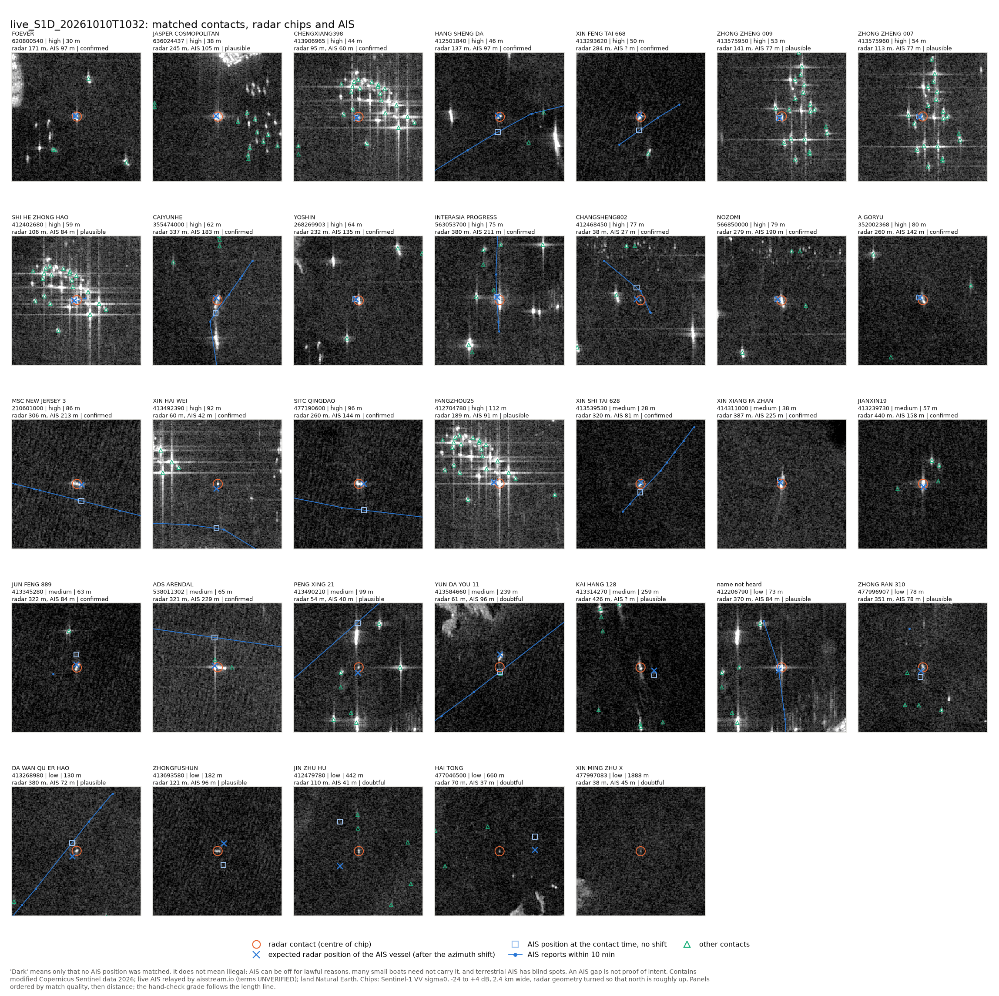
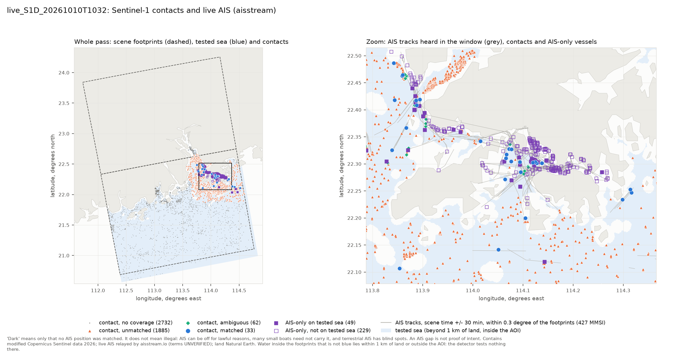
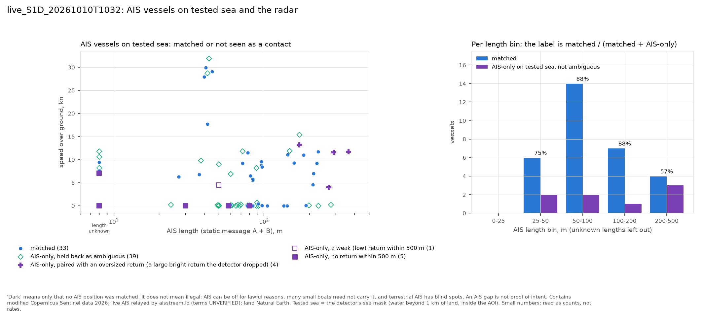

# Live passes: radar detection matched to live AIS, with identity

Updated: 2026-10-10 17:56 UTC (Pearl River pass: hand check, rule fixes, rematch, results; after review: dark caveat and identity label in the review tables, six grades revised, summary identity counts, WorldCover DOI). Code: `src/darkvessel/live/`, `src/darkvessel/ais/match.py`, `scripts/30_live_pass.py`. Tests: `tests/test_live_pass.py`, `tests/test_ais_match.py`. Products: `data/live/`.

> "Dark" means only that no AIS position was matched to a radar contact. It does not mean illegal. Many vessels are not required to carry AIS, AIS can be off for lawful reasons, and terrestrial and satellite AIS have blind spots. An AIS gap is not proof of intent. A contact in a cell where the live feed hears nothing is `no_coverage`, not dark.

## What this does

For every Sentinel-1C/1D IW scene over the South China Sea AOI that lands on the AWS mirror while the aisstream recorder (`scripts/26_ais_record.py`) is running, the pipeline writes every radar contact with one of three AIS statuses:

- `matched`: the contact was paired with an AIS vessel, and the row carries that vessel's identity (MMSI, IMO, name, call sign, flag, ship type, AIS length).
- `unmatched`: no AIS vessel could be paired, but the live feed was listening there (AIS heard in the contact's 0.25 degree cell or within 20 km during the window). For a `high` or `medium` contact this is a dark lead (`dark_lead` = true), with its evidence: nearest AIS vessel and distance, number of AIS vessels within 10 km, AIS reach of the cell, radar length estimate, detector class, CNN score. Two exceptions are never leads: a `fixed` contact (a structure that recurs on earlier passes of the same orbit) and an ambiguous contact (`match_ambiguous` = true: two or more AIS vessels, or two contacts, too close together to tell which is which; method item 11).
- `no_coverage`: no AIS vessel paired, and nothing was heard in the cell or within 20 km during the window. Terrestrial AIS does not reach there, so nothing can be said about the contact.

AIS vessels inside the scene footprint and the AOI that no contact matched go to a separate `ais_only` layer (vessels the radar did not see as a contact, with their AIS length and whether they were on water the detector tests: the recall evidence for paper 2).

The open build uses aisstream only; `research_only` is false on every row and the GFW research build never touches these files.

## Method

1. **Mirror watch.** Every 10 minutes the watcher lists the mirror's IW DV products for each UTC day since `--since` (default 2026-10-08 14:30 UTC, when the recorder first ran), keeps S1C and S1D scenes inside the AOI's time-of-day windows (09:20 to 11:53 and 21:20 to 23:53 UTC for 99 to 122E), at least 35 min old, fetches `productInfo.json` once per product (cached) and keeps scenes whose footprint overlaps the AOI by at least 300 km2 (the regional run's threshold). A day listing that fails or comes back truncated is retried up to four times inside the cycle, each time on a new connection; when it still fails, the product records already cached for that range are used, so a scene whose checkpoint says `error` is retried even on a cycle with a bad listing. The predicted passes in `data/s1_next_passes.json` are re-read each cycle for pass naming and logging; the mirror listing is the source of truth, so a pass missing from the plan is still processed.
2. **AIS coverage test.** A scene is processed only if at least one ship-station AIS position was recorded anywhere in the AOI from 30 min before to 30 min after the scene time. Otherwise it is marked `skipped_no_ais` and never retried (the recorder gap is final).
3. **Detection.** `darkvessel.regional.process_scene`, the settings of the September regional run: block streaming over AOI sea, CA-CFAR with PFA 1e-6, guard 81 px, background 161 px, 1 km shore buffer, VV/VH fusion, heuristic classes (high, medium, low). No scene download; COG tiles are read over HTTPS through `LiveGRDScene` with 4 fetch threads. Reads from this environment fail in a specific way, measured on 2026-10-09: about one new connection in five to the mirror (global or regional S3 endpoint alike) lands on a front end that answers `404 NoSuchBucket` for objects that exist (10 of 60 and 17 of 60 single-connection GETs; 0 of 60 on one kept-alive connection), a bad connection keeps answering 404, and GDAL then remembers the file as missing for the whole process (`not recognized as being in a supported file format`). Neither GDAL's HTTP retry nor `darkvessel.s1.aws._get` retries a 404, so on the first real pass 4 of 5 scenes failed on every cycle. `LiveGRDScene` therefore retries on a new connection: failed tiles are re-read in a renewed thread pool (GDAL keeps its connections per thread), single reads in a throwaway thread, the file's negative cache is dropped first, and the small files (listing, productInfo, manifest, annotation and calibration XML) are fetched again with a new requests session; up to 5 retries each with 1 to 10 s backoff. A scene whose detection still fails is tried 3 times per cycle (30 s and 90 s apart) and again on later cycles; the attempt and retry counts are stored in the checkpoint and the scenes layer (`detect_attempts`, `io_retries`).
4. **Fixed structures and clutter.** Persistence against up to two earlier passes of the same relative orbit and direction 1 to 30 days before (`data/s1_footprints.gpkg` archive; bright return within about 60 m on every pass checked = `fixed`), then the clutter-zone rule (5 or more low objects within 1 km downgrades a candidate to low) and the near-fixed rule (within 250 m of a fixed structure downgrades to low).
5. **CNN verifier.** Every object that was high or medium before the rules is scored by `verifier_v0` on a 64 x 64 px VV/VH chip read remotely (`cnn_score`, `cnn_vessel` at the model's threshold 0.6318). The model was trained on Sentinel-1A/1B labels; there is no Sentinel-1C/1D ground truth, so the score is a transfer, not a validated verdict (`docs/ml_verifier.md`).
6. **AIS used.** Ship-station MMSIs only: nine digits whose first three digits are a Maritime Identification Digits code 201 to 775 (201000000 to 775999999). Coast stations (00MID), SAR aircraft (111MID), aids to navigation (99MID), craft of a parent ship (98MID), group calls (0MID) and malformed numbers are dropped before matching, the coverage test, the evidence counts and the AIS-only layer. In the recording so far (7.9 h to 13:38 UTC on 2026-10-09) this removes 644 of 75,669 positions and 21 of 2,118 MMSI.
7. **Placing AIS vessels in time.** AIS positions in the window are projected to UTM 49N. A vessel with reports on both sides of the scene time (each within 30 min) is interpolated linearly; otherwise it is dead-reckoned from its nearest report with SOG and COG when that report is within 10 min; otherwise it is not placed and cannot be matched (it still counts as coverage). Since 2026-10-10 each contact is compared with the vessel at the contact's own zero-Doppler azimuth time, read from the annotation's geolocation grid (`az_time_utc`), not the middle of the 25 s slice: a 20 kn ship moves up to 130 m in 12.5 s. The vessel velocity is the SOG and COG of its report nearest the scene time, else the track between the two reports around it (`velocity_source`).
8. **Azimuth shift of moving ships.** A target with slant-range rate v_r is imaged displaced along the direction of satellite motion by dx = -(R / V) v_r (Raney 1971; R the slant range, V the platform speed): a ship moving away from the radar appears behind its true position, one moving towards it ahead. The pipeline takes R per contact from the annotation's slant range time (c t / 2: 790 to 960 km for this pass geometry), V from the annotation's Earth-fixed orbit state vectors (7,597 m/s for Sentinel-1D on 2026-09-28), the direction of satellite motion and the range direction per contact from the same geolocation grid (Sentinel-1 looks right: on the 2026-09-28 orbit 11 scene the ground track heads about 349 degrees and the range direction about 79 degrees, 90 degrees apart), and v_r = (vessel ground velocity . range unit vector) x sin(incidence). A ship at 10 kn straight along the range direction at 35 degrees incidence (slant range about 830 km) is shifted about 320 m, at 20 kn about 640 m. The expected radar position of a vessel is its AIS position at the contact time plus that shift; `match_dist_m` is the distance to it, `match_dist_uncorr_m` the distance without the shift and `az_shift_m` the shift. Contacts without the geometry (passes processed before 2026-10-10) get no shift. Whether the radar agrees with the shift is tested on every scene without using the pairing: for every AIS vessel with a predicted shift of 150 m or more, the median distance to the nearest contact from its expected position without the shift, with it, and with the sign flipped (`azimuth_check` in the scene record and the summary).
9. **Distance gate.** Per AIS vessel: `min(2000 m, 500 m + 125 s x SOG)`; unknown SOG (and no track speed) uses 2000 m. The 500 m base absorbs AIS position and timing error, antenna offset, track interpolation and radar geolocation error; the speed term is the uncorrected azimuth shift at R / V 110 to 135 s with the whole speed taken as radial (a 20 kn vessel gets about 1,790 m), so it also covers an error in the predicted shift. The gate is applied to the distance after the shift.
10. **Assignment.** One-to-one between contacts (high, medium, fixed) and every AIS vessel placed within 0.3 degree of the footprint, so a contact at the edge is not lost because its vessel's AIS position lies just outside. The assignment minimises the summed distance of the pairs plus the gate of every AIS vessel left unpaired (Hungarian algorithm, scipy `linear_sum_assignment`, on each connected group of feasible pairs padded with "unpaired" rows and columns). Equivalently, the assignment maximises the summed saving (gate minus distance) of the pairs. Unlike the plain most-pairs assignment used before 2026-10-10 it never prefers two pairs to one closer pair that saves more; two pairs can still win when their savings add up to more, and the ambiguity test (item 11) then holds such competing pairs back. Before the assignment, pairs that cannot be the same object are removed (item 19).
11. **Ambiguity.** Distance b is clearly worse than a when b >= max(a + 100 m, 1.5 a). A pair (contact i, vessel j) at distance d is ambiguous when contact i has another feasible vessel not clearly worse than d that has no clearly better pair of its own, or vessel j has another feasible contact not clearly worse than d that has no clearly better pair of its own. An ambiguous pair is not a match: the contact, and any unpaired contact that competed for the same vessel, stays `unmatched` with `match_ambiguous` = true and the candidate MMSIs in `ambiguous_mmsi` (`match_alt_dist_m` is the distance of the closest alternative). It is never a dark lead: it is very likely one of those vessels, but which one cannot be told. The vessel, and every other candidate vessel left unpaired, goes to the AIS-only layer with `ambiguous_det_id` and is left out of the recall counts (before 2026-10-10 15:00 UTC only the vessel of the pair was marked, so 5 candidates of the Pearl River pass were counted as radar misses). This is the dense-anchorage rule: two ships rafted alongside each other (bunkering) give one radar return and two MMSIs; the pipeline names neither.
12. **Gear beacons.** Senders that look like fishing-gear or net beacons (a name ending in a percentage such as `NET-82542-84%`, or the words NET or BUOY; `darkvessel.ais.aisstream.gear_beacon_like`, a heuristic, the percentage reading UNVERIFIED) prove that the feed hears that water and count for the coverage test, but they are not vessels: they are never paired or named, never counted in `n_ais_10km` or given as `nearest_ais_mmsi`, and never put in the AIS-only layer (`ais_gear_beacons_excluded` per scene).
13. **Match quality** (live rule since the Pearl River hand check, `darkvessel.live.rules.live_match_quality`; the September research build keeps the shared rule of `darkvessel.ais.match`). `track_m` = the vessel's speed (SOG of its report nearest the scene, else its track speed) times the time from the scene to that report: how far it moved since it was last pinned. `high` = distance <= 200 m, `track_m` <= 1,000 m, radar length 0.4 to 3.0 times the AIS length (or AIS length unknown); `medium` = <= 500 m, `track_m` <= 3,000 m, ratio 0.25 to 4.0 (or unknown); `low` = any other pair inside the gate. With the speed unknown, the time bands of the shared rule apply (300 s high, 900 s medium). The shared rule (500 m and 300 s for high, 1,000 m and 900 s for medium) graded a ship at anchor with old reports as weak and a 30 kn craft dead-reckoned for 8 min as good; the hand check confirmed pairs at 28 to 96 m. The radar length is the extent of the detected pixels, crude and upward-biased (a 2-pixel object reads 20 m; sidelobes and the smear of a moving ship add to it), hence the wide bands.
14. **Status and evidence.** As defined above. `nearest_ais_*` is the nearest AIS vessel placed at the scene time at any distance, with the time from the scene to its nearest report; `n_ais_10km` counts distinct MMSI with a report within 10 km during the window; `ais_reach` is the share of recorded hours (hours with any AIS in the AOI) in which the contact's 0.25 degree cell had at least one AIS position; `ais_footprint_positions` is the number of AIS positions heard inside the scene footprint during the window.
15. **Identity.** From the latest aisstream static message per MMSI (ITU-R M.1371 message 5 for class A, message 24 parts A and B for class B): name, call sign, IMO (class A only), ship type label, length from the hull dimensions A + B. When no static message was recorded the row keeps the MMSI, a name from the position report metadata if aisstream supplied one, and `identity_source` says so. The flag is the ITU wording for the MMSI's Maritime Identification Digits (first three digits), from the ITU table (292 codes, 201 to 775) parsed on 2026-10-08. Every identity field is a transponder self-report.
16. **Outputs.** `data/live/live_<mission>_<yyyymmddThhmm>.gpkg` per pass (layers `contacts_4326`, `contacts_utm49n`, `ais_only_*`, `scenes_*`, `about`), `data/live/live_contacts.gpkg` (all passes), `data/live/live_summary.json`. The contacts layers carry every D1 column of `docs/PROJECT_BOARD.md` in the fixed order, then detector and matching diagnostics (`dark_lead` among them), and last `review_note` (item 20). The AIS-only layer carries `on_tested_sea` from the detector's own sea mask (item 19), `ambiguous_det_id` and `oversized_det_id`; `recall_by_ais_length` in the summary counts only AIS-only vessels on tested sea that are not ambiguous. GeoPackage field types are what ArcGIS Pro expects: `mmsi`, `imo`, `nearest_ais_mmsi` and `n_ais_10km` are INTEGER, `cnn_vessel`, `research_only`, `dark_lead` and `on_tested_sea` are BOOLEAN (an empty `ais_only` layer keeps the same types). Every row of every layer, the scenes layer included, carries the caveat. The scenes layer separates AIS heard anywhere in the AOI during the window (`ais_aoi_*`, which only says the feed was up) from AIS heard inside the scene footprint (`ais_footprint_*`) and within 0.3 degree of it (`ais_near_footprint_mmsi`, what the matcher sees). The `about` layer states the gate, the window, the match-quality rule, the status rules, the dark-lead rule, the MMSI filter, the identity source, the read retries, the thread counts, the sources and the licences. Checkpoints live in `data/cache/live/scenes/`; a processed scene is never redone and a crash resumes at the next scene. The products are rewritten only when a scene was processed in that cycle or the summary file is missing, so a rerun with nothing new is a no-op and the files in `data/live/` keep their timestamps.
17. **One writer at a time.** `--once`, `--scene`, `--watch`, `--rebuild`, `--rematch` and `--weather` hold an fcntl lock on `data/cache/live/cycle.lock` (before 2026-10-10 15:00 UTC `--rebuild` and `--weather` did not, so a manual rebuild could overwrite a newer one written by the watcher). A `--once`, `--rebuild` or `--weather` beside the detached watcher exits with a message and code 2 (or waits for the lock with `--wait`); `--rematch` waits. Temporary files carry the process id, so two processes can never write the same `.tmp` path.

18. **Weather.** After each cycle the watcher writes `data/live/<run_id>_weather.parquet` (one row per contact, joined on `det_id` by the lead builder) with the sources and method of `scripts/16_weather_context.py`: the GFS 0.25 degree 10 m wind of the hour nearest the scene (UGRD and VGRD records read by byte range from the NOAA bucket on AWS) and the Himawari-9 AHI L2 cloud-top temperature of the 10-minute full disk nearest the scene, parallax corrected, within 4 km (`darkvessel.live.weather`). Tops colder than 220 K mark deep convection. The newest GFS cycle may not be posted when a pass is processed, so the previous cycles are tried with the forecast hour advanced by 6 and 12 h (`gfs_cycle_utc`, `gfs_forecast_h`). A source that cannot be read leaves its part null (unknown, never calm) with the failing URL and status in `wind_source` or `cloud_source`; such a sidecar is retried every 30 min for 48 h. A clear sky reads `ctt_k` null and `deep_convection` false. The first pass's sidecar (3,081 contacts, written 2026-10-10 03:18 UTC) used GFS 2026-10-08 18Z f005 and the Himawari-9 22:50 UTC disk: wind 0.6 to 5.5 m/s, 580 contacts under deep convection.

19. **Pairing rules and tested sea** (since the Pearl River hand check, `darkvessel.live.assign.PAIRING_RULES_TEXT`). A pair is not feasible when the radar length is less than a quarter of the AIS length, or when the contact is fixed and the vessel moves at 2 kn or more. Low objects the detector dropped for size (`oversized`, longer than 450 m; often a large ship with bright sidelobes) take part in the pairing as candidate returns but never receive an identity: a vessel paired with one stays in the AIS-only layer with `oversized_det_id`. An oversized return within 150 m of a contact is that contact's other polarisation and is left out. `on_tested_sea` is the vessel's position inside the detector's own sea mask (`darkvessel.regional.scene_mask`: ESA WorldCover water connected to the open sea, beyond 1 km of land, inside the AOI, 160 m grid), stored per scene as `data/cache/live/scenes/<product_id>.tested.wkb`; `--rematch` rebuilds it from the mirror for scenes processed before it existed; the 0.01 degree distance-to-coast layer is a fallback only (`tested_area_source` in the scenes layer).

20. **Hand check.** `--review RUN_ID` writes `data/live/<run_id>_review_matched.csv` (one row per matched contact: AIS reports either side of the contact time, expected position with and without the shift, other AIS vessels and returns within 1 km, lengths, a mechanical `check`) and `_review_unmatched.csv` (every unmatched and no_coverage contact: the three nearest AIS vessels by expected position, their gates and fates, the nearest AIS report of the window, `why_unmatched`; samples marked in `sample`: the 20 dark leads with the highest CNN score, 10 ambiguous contacts at random, 10 no_coverage contacts nearest to AIS, one per 0.05 degree box). Both tables carry, on every row, `identity_label` ('live AIS relayed by aisstream.io; terms UNVERIFIED', board D4.7: the names in them are aisstream identities) and `caveat` (the dark caveat). A reviewer fills `grade` (confirmed, plausible, doubtful) and `reason`; reruns keep them while the pairing (det_id and MMSI) or the status is unchanged. A match on a fixed return is at most plausible (the return of the earlier passes cannot be tied to the vessel without AIS from those dates). A contact without a match is graded on whether its current status is right; a former match removed by a rematch is graded the same way, and its reason names the old pairing. The products carry them as `review_note` = '<grade>: <reason>' (null elsewhere; rule in the about layer). A grade never removes or changes a match (board D6.2). `--figures RUN_ID` draws the pass map, the radar chips of every match (`darkvessel.live.review.chip_windows`, cached under `data/cache/live/chips/`) and the AIS-only panel.

Run: `python scripts/30_live_pass.py --once` (one cycle), `--watch` (detached, pid in `data/cache/live/watch.pid`, log `data/cache/live/watch.log`, stop with `--stop`), `--scene <product_id>` (one scene, `--force` to ignore the AIS test), `--dry-run` (list AOI scenes and their AIS coverage, no lock), `--rebuild` (rewrite the products from the checkpoints), `--rematch [RUN_ID ...]` (redo the pairing, status and identity from the stored objects, `data/cache/live/scenes/<product_id>.objects.parquet`, without detecting again), `--weather [--force]` (weather sidecars), `--review RUN_ID` (the hand-check tables, item 20), `--figures RUN_ID` (map, chip panels, AIS-only panel; `--map-png`, `--matches-png`, `--ais-only-png`, `--quality-png` set the paths). The process raises its niceness to at least 10 (a launcher's own `nice -n 10` is not added to), uses 2 CPU threads (CNN chips, persistence, torch and OpenMP) and 4 I/O threads for tile fetches, because the four cores are shared. `scripts/session_start.sh` restarts the watcher after a container restart.

## Preflight for the Pearl River pass (2026-10-10, before the pass)

The Sentinel-1D pass of 2026-10-10 10:32:42 UTC (ESA acquisition plan, relative orbit 11, ascending, `data/s1_next_passes.json` pass group `S1D_R011_20261010T1032`, 14.8 % of its AOI cells heard by the live feed) is the first pass over water where the free terrestrial feed is dense: the Pearl River mouth and Hong Kong.

**Processes.** At 02:46 UTC the recorder (pid 178, last message 02:45:33, 0 errors since its restart at 00:19), the watchdog (pid 3747) and the live watcher (pid 3523) were running. After the code changes below the watcher was stopped with `--stop` at 03:16:56; the watchdog started the new code at 03:17:12 (pid 11773, same command `nohup nice -n 10 python scripts/30_live_pass.py --watch`), and its first cycle at 03:17:30 listed 19 AOI scenes and wrote the first pass's weather sidecar at 03:18:47.

**Predicted footprint.** The same orbit 12 days earlier (`data/s1_footprints.gpkg`, 2026-09-28 10:32:47 and 10:33:16 UTC) gives two slices: the first covers 20.68 to 22.75N, 112.05 to 114.77E (the shelf south of the Pearl River mouth, Hong Kong and its anchorages); the second, 22.33 to 24.26N, lies over land and the inner estuary, outside the AOI's sea. The ESA plan segment runs from 10:32:42 to 10:39:03; slices north of the AOI are filtered out by the watcher's 300 km2 overlap rule.

**AIS inside that footprint (and the AOI), 2026-10-10 00:15 to 03:15 UTC** (`data/cache/ais/aisstream/`, ship stations only): 13,453 positions, 4,484 per hour, from 527 MMSI: 401 class A, 126 class B; 253 moving (median SOG over 1 kn) and 274 stationary (class A 195 moving, 206 stationary; class B 58 and 68). 437 of the 527 (82.9 %) have a static message: 432 with a name, 292 with a call sign, 404 with hull dimensions, 151 with an IMO number, 402 with a ship type. None looks like a gear beacon. In the last hour 388 vessels were inside the footprint and the AOI; 197 of them within 1 km of the coast, where the detector tests nothing (1 km shore buffer), and 58 more on cells the coast-distance layer marks as land (typhoon shelters and piers). The median distance from a vessel to its nearest neighbour was 197 m; 110 had a neighbour within 100 m (lighters and barges alongside ships, mid-stream operations). This is the dense traffic the matcher had not met before.

**Matcher review and changes** (`src/darkvessel/live/`, the shared `src/darkvessel/ais/match.py` unchanged):

| Finding | Effect in dense traffic | Change |
|---|---|---|
| The azimuth shift of moving ships was handled only by widening the gate (500 m + 125 s x SOG) | a ship under way, imaged up to a kilometre off its track, falls on anchored neighbours inside their 500 m gate | expected radar position = AIS position + predicted shift (method item 8); the wide gate stays as a bound |
| One time for the whole slice | a 20 kn ship moves up to 130 m in the 12.5 s between the slice middle and its own line | each contact compared at its own azimuth time (item 7) |
| Most-pairs assignment | pairs a contact with a far vessel to make room for a second pair: two wrong identities instead of one right one | minimum of pair distances plus the gate of each unpaired vessel (item 10) |
| No ambiguity test | two ships rafted 40 m apart and one return: one of them named at random | ambiguous pairs stay unmatched, not leads, candidates listed (item 11) |
| Gear beacons on ship-station MMSIs were usable identities | a net beacon named `NET-...-84%` could name a radar contact | gear beacons count as coverage only (item 12) |
| Vessels placed outside footprint and AOI were dropped before pairing | a contact at the AOI edge lost its vessel when the AIS point lay outside | pairs searched over every vessel placed within 0.3 degree of the footprint; only the AIS-only layer is limited to the tested area |
| Port clutter and the land mask near Hong Kong | piers, dolphins and moored hulks return like ships | unchanged and adequate: on the 2026-09-28 scene of this orbit (end-to-end dry run of the new code, 11,929 objects in 658 s) persistence against 2026-09-16 and 2026-09-04 marked 1,496 of 6,740 candidates fixed, the clutter-zone rule downgraded 1,960 and the near-fixed rule 170, leaving 4,663 contacts (1,618 high, 1,549 medium, 1,496 fixed), the same counts as the September regional run of that scene; the 1 km shore buffer removes most of Victoria Harbour, so many of the AIS vessels heard there are AIS-only with `on_tested_sea` false, not misses |

`src/darkvessel/detect/postprocess.py` was not touched (board D5.7).

**Synthetic dense anchorage** (`tests/test_live_pass.py::test_dense_anchorage_correct_or_conservative`): 60 ships anchored on a 300 m grid, 20 ships under way at 5 to 20 kn through and around it, AIS every 180 s (anchored) or 30 s (under way) with 10 m noise, 29 radar contacts from 20 anchored and 8 moving ships plus one trap (a 20 kn ship moving straight along the range direction, imaged 300 m from an undetected anchored ship), each with 50 to 150 m position noise and the azimuth shift of its motion, and 4 boats without AIS (two far from everything, two in the middle of grid squares whose four ships were not detected). The test asserts: no wrong identity; at least half of the 29 named; every ambiguous contact lists its true vessel among the candidates; the trap ship named correctly; the far boats unmatched dark leads; the boats among undetected ships ambiguous, not leads; the corrected distance shorter than the uncorrected one for every shift over 150 m; the per-scene azimuth check ordering corrected < uncorrected < sign flipped. Over 30 random seeds of the same scene (a check run once, not part of the suite): the new matcher named 475 contacts, 2 wrongly (0.4 %), and held back 453 as ambiguous; without the azimuth correction it named 370, 17 wrongly (4.4 %); the previous matcher (scene time, no shift, most pairs, no ambiguity test) named 735, 195 wrongly (21 %). Both remaining errors are coincidences the method cannot see: a return lying 24 m and 44 m from the predicted position of a ship that was not its source, with the true source at least 100 m and 1.5 times farther (once a moving ship's image on an undetected anchored ship, once an anchored ship's return under a moving ship's predicted image). With 50 to 150 m noise on a 300 m grid many contacts are truly ambiguous; the real pass measures the actual error and therefore the actual yield.

**Azimuth shift: source.** R. K. Raney, "Synthetic Aperture Imaging Radar and Moving Targets", IEEE Transactions on Aerospace and Electronic Systems AES-7(3), 499-505, May 1971, https://doi.org/10.1109/TAES.1971.310292 (resolved on 2026-10-10 to https://ieeexplore.ieee.org/document/4103740/, HTTP 202 behind the publisher's bot check; title, author, volume, issue and pages confirmed from https://api.crossref.org/works/10.1109/TAES.1971.310292, HTTP 200). The formula is used in its textbook form dx = -(R / V) v_r. The sign convention (towards the radar = ahead along the track) is derived from the zero-Doppler geometry, not quoted from the paper; it is checked on every processed scene by the `azimuth_check` (method item 8), and the Pearl River result is reported below. Orbit altitude 693 km and inclination 98.18 degrees: https://sentiwiki.copernicus.eu/web/s1-mission (HTTP 200 on 2026-10-10, Table 1). Right-looking geometry: read from the annotation of the 2026-09-28 scene itself (ground track about 349 degrees, range direction about 79 degrees).

## Pearl River pass results: S1D 2026-10-10 10:32 UTC

Numbers from `data/live/live_summary.json`, the layers of `data/live/live_S1D_20261010T1032.gpkg`, the review tables `data/live/live_S1D_20261010T1032_review_matched.csv` and `_review_unmatched.csv`, the checkpoints in `data/cache/live/scenes/` and `data/cache/live/watch.log`, read on 2026-10-10 between 14:30 and 15:40 UTC, after the rematch of 15:02 UTC, and again after the review fixes of 17:40 to 17:56 UTC (six hand-check grades revised, products rebuilt at 17:51 UTC; statuses, pairings and identities unchanged). Every name, call sign, IMO number, ship type, length and flag below is a transponder self-report: **live AIS relayed by aisstream.io; terms UNVERIFIED** (board D4.7).

> "Dark" is not illegal. An unmatched contact is a vessel the radar saw and the live feed did not place. AIS can be off for lawful reasons, many small boats need not carry AIS, and terrestrial AIS has blind spots (here: everything north of 22.6N in the estuary, and most water more than a few tens of kilometres offshore). An AIS gap is not proof of intent.

**What was processed.** Sentinel-1D, relative orbit 11, absolute orbit 4952, ascending: two IW GRDH slices, `44B5` (10:32:47 to 10:33:16 UTC: the shelf south of the Pearl River mouth and the Hong Kong waters; 109 of 130 blocks, 33,670.7 km2 tested of 36,236.7 km2 of AOI overlap) and `BFB9` (10:33:16 to 10:33:41: land and the inner estuary; 5 of 117 blocks, 116.8 km2 tested). The watcher saw both on the mirror at 13:51 UTC, 3 h 18 min after sensing, and processed them in 656 s and 55 s with no read retries. 12,677 objects, 7,965 of them low; 4,712 contacts (1,335 high, 2,048 medium, 1,329 fixed), 1,658 above the CNN threshold (a transferred score, see Limits). Weather sidecar: GFS 2026-10-10 06Z f005 10 m wind 1.9 to 8.8 m/s over the contacts; the Himawari-9 10:20 UTC full disk shows no deep convection over any contact.

**AIS during the pass.** In the window 10:03 to 11:03 UTC the feed delivered 8,570 ship-station positions from 931 MMSI in the AOI; 4,907 positions from 426 MMSI fell inside the footprint of `44B5` and 427 MMSI within 0.3 degree of it. None fell inside `BFB9`: in the whole recording, 1 of 17,327 positions between 113.3 and 114.0E lies north of 22.6N, so the inner estuary is silent to this feed. The 16 gear beacons of the window (15 of them at 109.06E, 14.57N off central Vietnam, one at 104.92E, 2.35S) were far from the pass.

**Result.** After the hand check and the rule fixes below (rematch from the stored objects, no new detection):

| | 14:03 UTC run | after the rematch (15:02 UTC) |
|---|---|---|
| matched | 35 (18 high, 8 medium, 9 low) | **33** (18 high, 8 medium, 7 low) |
| unmatched | 1,945 | **1,947** |
| of which ambiguous (never leads) | 66 | 62 |
| dark leads (unmatched high or medium, not ambiguous) | 1,360 | **1,364** (501 high, 863 medium) |
| no_coverage | 2,732 | **2,732** |
| AIS-only | 276 | 278 |
| AIS-only on tested sea | 73 (distance-to-coast layer) | 49 (the detector's own sea mask) |
| AIS-only held back as ambiguous | 45 | 51 |
| AIS-only paired with an oversized return | (rule did not exist) | 4 |
| median match distance (p90) | 79.1 m (402.8 m) | 74.7 m (255.2 m) |

The 33 matched contacts carry 32 names (30 from a static message, 2 from position-report metadata) and 31 AIS lengths; 31 take their identity from a static message (`matched_with_static_identity`; one of them, MMSI 412206790, has no name in it) and 2 from the MMSI alone (`matched_with_name` = 32). Of the 1,947 unmatched, 533 are fixed returns (structures or long-moored hulls; never leads). Fourteen contacts changed class in the rematch: the 4 former matches CESI QINGDAO, PANCON BRIDGE, SHENSHE5069 and WAN HAI 523 became unmatched (3 dark leads and one fixed return; kept visible and graded on their current status in the unmatched review table, board D6.2: `10892` and `10172` confirmed, `08663` and `08794` doubtful); ADS ARENDAL and INTERASIA PROGRESS, held back as ambiguous before, are now matched; 4 faint returns that had been ambiguous with a vessel they cannot be (too short, or that vessel's return is an oversized object) became dark leads (`06718`, `06719`, `08795`, `10831`, CNN 0.001 to 0.13); one fixed return stopped being ambiguous (`11373`); 3 dark leads became ambiguous (`10169`, `10280`, `10881`) because the vessels freed by the rules now compete for them. **R3-T8 must rebuild the leads from `data/live`: statuses and `dark_lead` changed.**

**Why 33 of 426.** Every MMSI heard inside the footprint during the window, by its fate (`scripts/30_live_pass.py --review` tables, the AIS-only layer and the detector's sea mask of `44B5`; the causes are exclusive and checked in this order):

| fate of the 426 MMSI | MMSI | note |
|---|---|---|
| matched | 33 | every matched vessel was heard inside the footprint |
| held back as ambiguous | 51 | two or more vessels or returns too close to tell apart; 39 of them on tested sea; 23 under way at more than 1 kn |
| on tested sea, paired with an oversized return | 4 | PANCON BRIDGE (172 m, 13.2 kn), CESI QINGDAO (290 m, 11.6 kn), WAN HAI 523 (269 m, 4.0 kn), MSC VALENTINA (366 m, 11.7 kn): large ships whose returns spread beyond 450 m and were dropped by the detector as low |
| on tested sea, no contact: radar misses | 6 | VINCENT (30 m, at rest), YUE RUN ZE 666 (58 m, at rest), YUEGUANGZHOUHUO 2833 (80 m, at rest), ZHUCHUAN2003 (50 m, 4.5 kn, a weak low return within 500 m), CHAI WAN (no length, at rest), 477997162 (no static message, 7.1 kn); all six lie 1.0 to 1.3 km from land, at the inner edge of the tested sea |
| within the 1 km shore buffer, not tested | 163 | 22.23 to 22.51N, 113.84 to 114.27E; median AIS length 49 m; 60 under way |
| on land cells of the detector's mask, not tested | 54 | cells that ESA WorldCover maps as land or inland water; median length 50 m |
| inside the footprint, outside the AOI polygon at the scene time | 42 | 22.35 to 22.39N, 113.91 to 114.12E: inner Hong Kong waters that the Natural Earth marine polygon of the AOI leaves out |
| not placed at the scene time | 73 | 46 with reports only before the scene time and 27 only after; their nearest report lies a median 21 min from the scene, beyond the 10 min dead-reckoning limit, and no report on the other side allows interpolation |
| gear beacons | 0 | |
| **total** | **426** | |

So 259 of the 426 vessels (61 %) were never on water the detector tests, 73 (17 %) could not be placed in time, 51 (12 %) were held back as ambiguous, and only 43 (10 %) were placed on tested sea without ambiguity: 33 matched, 4 on an oversized return, 6 missed. Of those 43 the radar produced a contact for 33 and a return for 4 more. Recall over AIS vessels on tested sea, ambiguous ones left out (`recall_by_ais_length`, AIS length known): 25 to 50 m 6 of 8, 50 to 100 m 14 of 16, 100 to 200 m 7 of 8, 200 to 500 m 4 of 7 (the 3 misses there are the oversized returns of CESI QINGDAO, WAN HAI 523 and MSC VALENTINA). The 14:03 UTC summary gave 6 of 97, 14 of 79, 8 of 24 and 4 of 20, because it counted all 231 unpaired AIS-only vessels not marked ambiguous as radar misses, most of them in the shore buffer or on land cells; that was a bug (fixed, see below). The counts are small: read them as counts, not rates.

**Azimuth check.** For the 74 vessels of `44B5` with a predicted shift of 150 m or more (median 306.6 m), the median distance from the expected position to the nearest contact is 441.7 m with the shift, 528.6 m without it and 668.2 m with its sign flipped; 20, 8 and 5 of them have a contact within 200 m. The new paired reading (`azimuth_check`, vessels with a contact within 2 km under all three versions): of 46 vessels, the shifted position is the closest for 28, the unshifted for 9 and the flipped for 9 (one-sided binomial test against one in three, p = 1.2e-4); the shifted position beats the flipped one for 36 of 46 (sign test p = 7.8e-5) and the unshifted one for 28 of 46 (p = 0.09). The check uses no pairing, so it cannot favour the correction the matcher used. **Reading: the sign of the shift is supported** (a ship moving away from the radar is imaged behind its track, one moving towards it ahead); the gain over no correction is clear in the medians and the 200 m counts but not significant on its own in the paired test. The chips confirm it one ship at a time: for MSC NEW JERSEY 3, SITC QINGDAO, XIN HAI WEI, ADS ARENDAL, HANG SHENG DA, CAIYUNHE and XIN FENG TAI 668 the vessel's AIS position at the contact time lies 237 to 831 m from the return and the predicted shift brings the expected position to 46 to 96 m from it (`docs/figures/live_pearl_river_matches.png`). The scene 2 (`BFB9`) check reports 75 vessels and null medians because none of the 75 has a contact within 2 km under any version: its 255 contacts lie at 22.63 to 22.81N, 113.60 to 113.78E in the inner estuary, every placed vessel lies south of 22.51N, and the nearest contact to any of the 75 is 20.3 km from its expected position (20.5 km unshifted, 20.7 km flipped); over all 351 placed vessels, without the shift, the nearest contact is 15.6 km away, still far beyond the 2 km comparison limit. Nulls there mean "no comparison possible", not a failed check.

**Hand check of every match.** For each matched contact (`--review` table, and `--figures` for the chips): the vessel's AIS reports either side of the contact's azimuth time from `data/cache/ais/aisstream/`, its expected radar position with and without the shift, the other AIS vessels whose expected position lies within 1 km of the contact, the other returns within 1 km of the vessel, the radar length against the AIS length, and the VV and VH radar chip (2.4 km window read from the GRD on the mirror by `darkvessel.live.review.chip_windows`, the same calibrated reader as the CNN chips). Grades: **confirmed** (the track passes through or next to the return at the contact time, nothing competes, the lengths fit the bands), **plausible** (the best pairing available but one part is weak) or **doubtful** (probably not this vessel). The grade and a one-line reason are in the review table and in the new contacts column `review_note`; a grade never removes a match (D6.2). A match on a fixed return is at most plausible: the earlier passes' return cannot be tied to the vessel without AIS from those dates. Result for the 33: **18 confirmed, 11 plausible, 4 doubtful** (revised after review: JASPER COSMOPOLITAN confirmed to plausible under the fixed-return rule, so all four fixed-return matches are plausible; YUN DA YOU 11 plausible to doubtful, because the chip shows the tanker's bright image at its expected position inside the shore buffer, 239 m from the paired contact; the first reading was 19, 11 and 3). Every confirmed pair lies 28 to 96 m from its expected position. Commands: `python scripts/30_live_pass.py --review live_S1D_20261010T1032` (the two tables) and `python scripts/30_live_pass.py --figures live_S1D_20261010T1032 --map-png docs/figures/live_pearl_river_map.png --matches-png docs/figures/live_pearl_river_matches.png --ais-only-png docs/figures/live_pearl_river_ais_only.png` (the three figures; the zoom panel of the map is the default box around the matched and AIS-only vessels).

| det_id | name | MMSI | type | radar / AIS length, m | distance, m (without shift) | quality | grade | reason |
|---|---|---|---|---|---|---|---|---|
| `10272` | FOEVER | 620800540 | cargo | 171 / 97 | 30 (31) | high | confirmed | at anchor (0.1 kn), last report 7.4 min before the scene 54 m from the return; 30 m from the expected position; next AIS vessel 759 m away |
| `11061` | JASPER COSMOPOLITAN | 636024437 | pilot vessel | 245 / 105 | 38 (38) | high | plausible | at rest on an isolated bright return, reports 13 s before and 2.8 min after within 42 m; no other AIS vessel within 1 km; but the return is fixed (bright here on the two earlier passes) and those passes cannot be tied to this vessel, so a structure cannot be ruled out |
| `10412` | CHENGXIANG398 | 413906965 | cargo | 95 / 60 | 44 (46) | high | confirmed | at anchor at the edge of an anchorage; 44 m from the return, the next AIS vessel 205 m and the next return 167 m away; 95 m against 60 m |
| `10358` | HANG SHENG DA | 412501840 | cargo | 137 / 97 | 46 (292) | high | confirmed | the track passes the return and the 313 m shift brings the expected position to 46 m; 137 m against 97 m |
| `10429` | XIN FENG TAI 668 | 413293620 | n/a | 284 / n/a | 50 (260) | high | confirmed | the track passes the return and the 301 m shift brings the expected position to 50 m; no AIS length to compare |
| `10980` | ZHONG ZHENG 009 | 413575950 | dredging or underwater ops | 141 / 77 | 53 (53) | high | plausible | dredger at rest on a fixed return inside a cluster of dredging returns (18 within 1 km); 53 m, and its sister ZHONG ZHENG 007's AIS position 160 m away |
| `11417` | ZHONG ZHENG 007 | 413575960 | dredging or underwater ops | 113 / 77 | 54 (54) | high | plausible | dredger at rest on a fixed return inside the dredging cluster; 54 m, the next AIS vessel 249 m away |
| `10369` | SHI HE ZHONG HAO | 412402680 | cargo | 106 / 84 | 59 (59) | high | plausible | at anchor on a fixed return (bright at the same spot on the two earlier passes) among 23 AIS vessels within 1 km; 59 m against 227 m for the next vessel; a long stay at one berth fits, a structure cannot be ruled out |
| `10378` | CAIYUNHE | 355474000 | cargo | 337 / 183 | 62 (237) | high | confirmed | the track crosses the return and the 286 m shift brings the expected position to 62 m; 337 m against 183 m |
| `10273` | YOSHIN | 268269903 | cargo | 232 / 135 | 64 (64) | high | confirmed | at anchor, reports 25 min before and 1.6 min after both within 74 m of the return; next AIS vessel 748 m away |
| `10880` | INTERASIA PROGRESS | 563053700 | cargo | 380 / 211 | 75 (76) | high | confirmed | the track passes through a bright return 75 m from the expected position; the 24 m return 138 m away is too short to be a 211 m ship (held back as ambiguous before the length rule) |
| `10398` | CHANGSHENG802 | 412468450 | tug | 38 / 27 | 77 (249) | high | confirmed | tug at 6 to 8 kn, track next to the return; 77 m after a 216 m shift; 38 m against 27 m |
| `10397` | NOZOMI | 566850000 | cargo | 279 / 190 | 79 (79) | high | confirmed | at anchor (0 kn), reports 20 min before and 28 min after both 75 to 85 m from the return; next AIS vessel 384 m away |
| `10387` | A GORYU | 352002368 | cargo | 260 / 142 | 80 (80) | high | confirmed | at anchor, reports 12 min before and 34 s after within 80 m of the return; no other AIS vessel within 1 km |
| `08736` | MSC NEW JERSEY 3 | 210601000 | cargo | 306 / 213 | 86 (332) | high | confirmed | the AIS track runs 330 m from the return and the predicted 308 m azimuth shift puts the vessel 86 m from it; isolated return; 306 m against 213 m |
| `10362` | XIN HAI WEI | 413492390 | high speed craft | 60 / 42 | 92 (831) | high | confirmed | high-speed craft at 18 to 26 kn: the 744 m shift moves the expected position from 831 m to 92 m from the return; next AIS vessel 585 m away |
| `08742` | SITC QINGDAO | 477190600 | cargo | 260 / 144 | 96 (505) | high | confirmed | the track runs 505 m from the return and the 498 m shift brings the expected position to 96 m; isolated return; 260 m against 144 m |
| `10364` | FANGZHOU25 | 412704780 | cargo | 189 / 91 | 112 (109) | high | plausible | at anchor in a dense anchorage (15 AIS vessels within 1 km); 112 m from a bright return while the next AIS vessel lies 238 m and the next return 278 m away: inside the ambiguity margin, not by much |
| `10178` | XIN SHI TAI 628 | 413539530 | cargo | 320 / 81 | 28 (158) | medium | confirmed | the AIS track passes through the return and the expected position lies 28 m from it after a 186 m shift; radar 320 m against 81 m is the smeared extent of a moving ship |
| `07981` | XIN XIANG FA ZHAN | 414311000 | cargo | 387 / 225 | 38 (72) | medium | confirmed | isolated bright return 38 m from the expected position, dead-reckoned 5.6 min from one report at 9.2 kn; nothing else within 1 km; its VH half is an oversized object 49 m away |
| `10782` | JIANXIN19 | 413239730 | cargo | 440 / 158 | 57 (49) | medium | confirmed | dead-reckoned 8.7 min from one report at 9.3 kn yet only 57 m from a bright return; next return 296 m away; 440 m against 158 m |
| `10426` | JUN FENG 889 | 413345280 | cargo | 322 / 84 | 63 (246) | medium | confirmed | dead-reckoned 3.4 min from one report at 5.5 kn to 63 m from an isolated return; radar 322 m against 84 m is the smeared extent |
| `08837` | ADS ARENDAL | 538011302 | cargo | 321 / 229 | 65 (562) | medium | confirmed | the track runs 562 m from the return and the 531 m shift puts the vessel 65 m from it; the two small returns 117 m and 322 m away are too short to be a 229 m ship (held back as ambiguous before the length rule) |
| `10888` | PENG XING 21 | 413490210 | high speed craft | 54 / 40 | 99 (833) | medium | plausible | a 28 kn craft: the 932 m shift brings the expected position to 99 m from the return, but a 30 % error in that shift would reach other returns 315 m away |
| `08819` | YUN DA YOU 11 | 413584660 | tanker | 61 / 96 | 239 (85) | medium | doubtful | a faint VH-only return (4 px, CNN 0.02) 3 m inside the tested sea, 85 m from the unshifted AIS position; the chip shows a bright return (VV +6 dB) at the expected position after the 324 m shift, about 130 m inside the shore buffer where nothing is tested: that is the tanker's image, and this contact is probably its wake or smear |
| `10709` | KAI HANG 128 | 413314270 | n/a | 426 / n/a | 259 (295) | medium | plausible | dead-reckoned 8.6 min from one report at 9.4 kn (2.5 km); 259 m from an elongated return, the only one within 1 km; no AIS length to compare |
| `10884` | (no name heard) | 412206790 | cargo | 370 / 84 | 73 (48) | low | plausible | the track passes through a bright return 73 m from the expected position; the radar extent 370 m against 84 m is sidelobe spread; no name heard |
| `08604` | ZHONG RAN 310 | 477996907 | tanker | 351 / 78 | 78 (187) | low | plausible | 78 m from the expected position, dead-reckoned 2.6 min from one report at 11.5 kn; the radar extent 351 m against 78 m is azimuth smear (outside the length bands) |
| `10873` | DA WAN QU ER HAO | 413268980 | passenger | 380 / 72 | 130 (165) | low | plausible | the AIS track passes through the return and the expected position lies 130 m from it, but the radar extent 380 m against 72 m (5.3 times) is far outside the bands: a smeared or merged return |
| `08287` | ZHONGFUSHUN | 413693580 | cargo | 121 / 96 | 182 (283) | low | plausible | the only return within 1 km and the lengths agree (121 m against 96 m), but the track is interpolated across 18 min either side with no SOG near the scene and the expected position is 182 m off |
| `10720` | JIN ZHU HU | 412479780 | code 0 | 110 / 41 | 442 (651) | low | doubtful | dead-reckoned 7.9 min back from a single report at 29.9 kn (7.3 km); the return lies 442 m from that estimate, well inside its error; the pairing cannot be told from chance |
| `10277` | HAI TONG | 477046500 | towing | 70 / 37 | 660 (715) | low | doubtful | a 37 m tug interpolated across gaps of 27 and 23 min with no SOG near the scene; no return at its expected position, the paired return lies 660 m away; the return is not tied to this vessel |
| `10270` | XIN MING ZHU X | 477997083 | high speed craft | 38 / 45 | 1888 (1921) | low | doubtful | a 29 kn craft interpolated across a 43 min gap with no SOG near the scene; the return lies 1,888 m from that estimate; the pairing is a coincidence of the 2 km gate |

The four matches of the 14:03 UTC run that the rematch removed, graded in the unmatched review table on their current status (the reason names the old pairing; before the review fix all four carried 'doubtful', which graded the removed pairing, not the status):

| det_id | was matched to | grade | reason |
|---|---|---|---|
| `08663` | CESI QINGDAO, 477584200 (low, 178 m) | doubtful | the dark-lead status is probably wrong: a faint 3 px VH-only return (CNN 0.0001) in the faint smear that trails CESI QINGDAO's bright oversized return along track (33 lines along, 15 columns across, 371 m), probably part of that tanker's image and not a second vessel |
| `08794` | PANCON BRIDGE, 441420000 (low, 308 m) | doubtful | the dark-lead status is probably wrong: a faint 4 px VH-only return (CNN 0.05) on the faint streak that runs along track from PANCON BRIDGE's bright oversized return (31 lines along, 5 columns across, 322 m), probably part of that ship's image and not a second vessel |
| `10172` | SHENSHE5069, 412536055 (high, 370 m) | confirmed | unmatched and never a lead is right: a fixed return (bright here on the two earlier passes, CNN 0.22) that no vessel at rest explains; a fixed return cannot be a vessel under way at 8.2 kn, and SHENSHE5069 is now held back as ambiguous with another return |
| `10892` | WAN HAI 523, 563131800 (high, 424 m) | confirmed | the dark lead is right: a compact bright ship (VV+VH, 63 px, CNN 0.99) with its own sidelobe cross, 492 m from WAN HAI 523's oversized return, with which that vessel now pairs (246 m); no other placed AIS vessel within its gate |

*Figure: radar chips (Sentinel-1 VV, 2.4 km) of the 33 matched contacts with the AIS reports within 10 min, the AIS position at the contact time and the expected radar position after the azimuth shift. "Dark" means only that no AIS position was matched; it does not mean illegal; an AIS gap is not proof of intent.*

**What the hand check changed.** The doubtful pairs of the 14:03 UTC run had causes in the rules, so the rules were fixed (`src/darkvessel/live/`, tests in `tests/test_live_pass.py`) and the pass was rematched from its stored objects:

1. *Length.* A pair is not feasible when the radar length is less than a quarter of the AIS length (CESI QINGDAO, 290 m, had been given a 41 m VH-only return with CNN 0.0001; PANCON BRIDGE, 172 m, a 20 m return). The pixel-extent length is biased long, so no upper bound is set. The same rule removed two false ambiguities (ADS ARENDAL and INTERASIA PROGRESS each had a 20 to 24 m return beside them).
2. *Oversized returns.* The detector drops objects longer than 450 m as low (`oversized`; 162 in `44B5`), and in a port these are often large ships with bright sidelobes. They now take part in the pairing as candidate returns without ever receiving an identity: a vessel paired with one stays in the AIS-only layer with `oversized_det_id`, and a faint return nearby cannot inherit its name (PANCON BRIDGE, CESI QINGDAO, WAN HAI 523, MSC VALENTINA). An oversized return within 150 m of a contact is that contact's other polarisation (XIN XIANG FA ZHAN appears as a VV-only contact and a VH-only oversized object 49 m apart) and is left out.
3. *Fixed returns and moving vessels.* A fixed contact (bright at the same place on the earlier passes) is never paired with a vessel moving at 2 kn or more (SHENSHE5069 at 8.2 kn had been given a fixed return 370 m away, graded high).
4. *Match quality.* The shared rule graded the time to the nearest report, which marked a ship at anchor with reports 20 and 28 min either side of the scene (NOZOMI) low and a 30 kn craft dead-reckoned for 8 min (JIN ZHU HU) medium. The live rule grades the distance the vessel moved since it was last pinned (speed x time): high = within 200 m, at most 1 km moved, length ratio 0.4 to 3.0; medium = within 500 m, at most 3 km moved, ratio 0.25 to 4.0; low otherwise; with the speed unknown the old time bands apply. Changes: NOZOMI low to high, FOEVER and ZHONG ZHENG 009 medium to high, YUN DA YOU 11 and PENG XING 21 high to medium, JIN ZHU HU medium to low. The `high` at 424 m with a length ratio of 0.63 (WAN HAI 523) is gone twice over: the vessel now pairs with its oversized return, and 424 m would be medium.
5. *Tested sea.* `on_tested_sea` of the AIS-only layer came from the 0.01 degree distance-to-coast layer, which disagreed with the detector for most vessels near the shore (of its 73 "tested" vessels, 24 lie in the detector's shore buffer and 4 on its land cells; 5 of the 6 radar misses were marked untested). It now comes from the detector's own sea mask, stored per scene as a polygon (`<product_id>.tested.wkb`), and `recall_by_ais_length` counts only AIS-only vessels on tested sea.
6. *Ambiguity candidates.* Only the vessel of an ambiguous pair was marked held back; the other candidates stayed in the recall as radar misses (5 vessels in this pass). Every unpaired candidate now carries `ambiguous_det_id`.

**Named identifications.** Examples (all self-reported, live AIS relayed by aisstream.io; terms UNVERIFIED):

- MSC NEW JERSEY 3, MMSI 210601000, IMO 9571301, call sign 5BNY6, cargo, 213 m (radar 306 m), flag claimed Cyprus: 86 m after a 308 m azimuth shift, high, confirmed.
- SITC QINGDAO, MMSI 477190600, IMO 9610547, cargo, 144 m (radar 260 m), Hong Kong: 96 m after a 498 m shift, high, confirmed.
- XIN HAI WEI, MMSI 413492390, IMO 9834686, high-speed craft, 42 m (radar 60 m), China: 92 m after a 744 m shift (831 m without it), high, confirmed.
- NOZOMI, MMSI 566850000, IMO 9558701, cargo, 190 m (radar 279 m), Singapore, at anchor: 79 m, high, confirmed.
- CAIYUNHE, MMSI 355474000, IMO 9228758, cargo, 183 m (radar 337 m), Panama: 62 m after a 286 m shift, high, confirmed.
- INTERASIA PROGRESS, MMSI 563053700, IMO 9316335, cargo, 211 m (radar 380 m), Singapore: 75 m, high, confirmed (ambiguous before the length rule).
- ADS ARENDAL, MMSI 538011302, IMO 9652507, cargo, 229 m (radar 321 m), Marshall Islands: 65 m after a 531 m shift, medium (reports 7.0 min before and 5.8 min after, at 11.7 kn), confirmed.

**Dark leads: examples with their evidence.** 1,364 leads; 492 of them pass the CNN threshold; their nearest placed AIS vessel is a median 8.2 km away and 53 of them have one within 1 km. Wind at all of them 1.9 to 8.8 m/s, no deep convection. No VIIRS light evidence is joined to live passes yet.

- `08722` (114.447E, 22.098N): high, 411 m, CNN 0.998, VV+VH, not on the earlier passes (persistence checked on 2); nearest AIS vessel PANCON BRIDGE placed 812 m away, which pairs with its own oversized return; 9 MMSI within 10 km; the feed heard this cell in 97 % of recorded hours; wind 7.1 m/s. A second large ship that no placed AIS vessel explains.
- `10892` (113.889E, 22.426N): high, 170 m, CNN 0.993; the former WAN HAI 523 match. WAN HAI 523 lies 428 m away and pairs with the oversized streak 246 m from its expected position; 85 MMSI within 10 km; reach 100 %; wind 3.3 m/s.
- `10151` (113.800E, 22.269N): high, 440 m, CNN 0.996; nearest placed vessel 4.9 km away; 11 MMSI within 10 km; reach 100 %.
- `06376` (113.871E, 21.947N): medium (VH only), 420 m, CNN 0.998; nearest placed vessel 17.8 km away; no MMSI within 10 km; reach 3 % (the feed rarely hears this water, so the AIS gap says little).

**Status rules in dense traffic (unmatched review table, 40 hand-checked samples plus the 4 former matches above: 38 confirmed, 4 plausible, 2 doubtful in all).** The 20 dark leads with the highest CNN score are all compact bright ship-like returns with no AIS vessel within their gate (nearest placed vessel 0.7 to 21.8 km away): unmatched is right in all 20, which says nothing about why they are unmatched. Of 10 ambiguous contacts drawn at random (seed 0), 6 are clearly right (rafted or nested ships in the anchorage, or two returns for one vessel) and 4 plausible (candidates 0.6 to 1.5 km away inside wide gates, or a faint return beside a matched ship, where the return may be neither). The 10 no_coverage contacts nearest to a placed vessel (one per 0.05 degree box) all have their nearest AIS report of the window 20.0 to 21.5 km away and a silent cell, so no_coverage follows the 20 km rule; the nearest placed vessel (18.4 to 20.3 km) is nearer only because interpolation carried it there. Four of them sit in an anchorage of the inner estuary (22.65N, 113.70E) that the feed does not hear at all.

*Figure: contacts by AIS status, AIS-only vessels, the scene footprints and the detector's tested sea (water beyond 1 km of land, inside the AOI). "Dark" means only that no AIS position was matched; it does not mean illegal; an AIS gap is not proof of intent.*

*Figure: AIS vessels on tested sea, matched or not, by AIS length and speed, and per length bin. The same caveat applies.*

**Watcher.** The round 3 code (reviewed here) runs in the detached watcher: stopped with `--stop` at 15:01:21 UTC and started by the watchdog at 15:01:52 (pid 6455), first cycle clean at 15:01:53 (24 AOI scenes, 0 new); stopped again with `--stop` at 15:21:55 after the last code change, started by the watchdog at 15:22:51 (pid 9408), first cycle clean at 15:22:56 (24 AOI scenes, 0 new; the products and the complete weather sidecars were not rewritten). After the review fixes (`src/darkvessel/live/review.py` and `outputs.py` changed), stopped with `--stop` at 17:51:37 UTC and started by the watchdog at 17:51:58 (pid 17989), first cycle clean at 17:52:01 (24 AOI scenes, 0 new; products not rewritten). The recorder (pid 26544) and the watchdog (pid 25918) were not touched.

**Limits of this pass.**

- The identification covers 43 vessels the method could test. 259 of the 426 heard vessels were in the shore buffer, on land cells or outside the AOI polygon, so this pass says nothing about the harbour itself.
- 4 of the 33 matches are doubtful and 11 only plausible. The product shows a pairing as an identification only when it is high or medium and not graded doubtful (D6.2): 25 of the 33 (26 before YUN DA YOU 11 was regraded); `review_note` carries the grade.
- A doubtful pairing still takes its contact out of the dark-lead pool, because `dark_lead` is false for every matched contact: HAI TONG (`10277`, high, CNN 0.96), JIN ZHU HU (`10720`, high, CNN 0.99) and XIN MING ZHU X (`10270`, high, CNN 0.75) are strong ship returns that are unexplained ships if their pairings are wrong; YUN DA YOU 11 (`08819`, medium, CNN 0.02) is a weak one. D6.2 keeps the pairings visible; the leads queue does not yet list them (follow-up for the leads builder, R3-T8: flag low or doubtful matches as lead candidates).
- A moving ship whose image falls in the 1 km shore buffer is not detected there, but its vessel can still pair with a faint return on the tested side: YUN DA YOU 11's image lies about 130 m inside the buffer. 2 of the 33 matches have their expected position outside the tested sea, and both are doubtful (YUN DA YOU 11 and XIN MING ZHU X). Keeping such vessels out of the pairing is a rule candidate for round 4.
- Faint returns on the sidelobe lines and smears of bright ships become contacts and, unpaired, dark leads: 51 of the 1,350 dark leads of `44B5` lie within 500 m of an oversized return, 29 of them with a CNN score below 0.1. Examples: `08663` and `08794` above, and `08547` (high, 2 px) and `08661` (medium, 3 px), 35 lines either side of CESI QINGDAO's return along track. A sidelobe guard is a detector question (`src/darkvessel/detect/postprocess.py`, frozen this round, D5.7).
- Fast craft (up to 30 kn) on ferry routes have shifts up to 930 m; a 30 % error in SOG or COG moves the expected position by 300 m. Of the four fast craft (three report ship type high-speed craft; JIN ZHU HU, 29.9 kn, reports `code 0`, no type), one is confirmed, one plausible and two doubtful.
- The radar length is the pixel extent and reads long: median radar/AIS 1.76 for the 31 matches with an AIS length (0.64 to 5.28); sidelobes and the smear of moving ships give 3 to 5 times for small ships. Lengths are evidence, not measurements.
- Oversized returns are counted as missed contacts in the recall. Whether to promote them to contacts is a detector question (`src/darkvessel/detect/postprocess.py`, frozen this round, D5.7).
- The hand check is one reviewer reading chips, tracks and tables, without optical imagery or a second source of identity.

## First pass results: S1D 2026-10-08 22:58 UTC, Gulf of Thailand

Numbers from `data/live/live_summary.json`, the `scenes_4326` layer of `data/live/live_S1D_20261008T2258.gpkg`, the checkpoints in `data/cache/live/scenes/` and `data/cache/live/watch.log`, read on 2026-10-09 at 13:40 UTC.

**What was processed.** Relative orbit 164, absolute orbit 4930, descending: the five IW GRDH scenes of 23:00:43 to 23:02:48 UTC that overlap the AOI (the plan's 22:58 to 23:05 segment, `run_id` `live_S1D_20261008T2258`). The footprints run from 14.0N down to 6.0N between 99.7 and 103.5E, the east side of the Gulf of Thailand from the Cambodian coast past the Malay peninsula. The scenes were listed on the mirror at 05:10 UTC on 2026-10-09, about 6 h after sensing. AOI overlap 148,137 km2; sea tested 143,755 km2.

| scene | tested km2 | objects | low | contacts (high / medium / fixed) | CNN vessel | runtime s | detection attempts | retried tile reads |
|---|---|---|---|---|---|---|---|---|
| B8C6 (23:00:43) | 3,162 | 872 | 592 | 280 (131 / 107 / 42) | 92 | 84 | 1 | 0 |
| 78A4 (23:01:08) | 39,095 | 49,455 | 48,657 | 798 (287 / 459 / 52) | 210 | 547 | 1 | 5 |
| 4DFE (23:01:33) | 42,174 | 50,716 | 50,222 | 494 (87 / 278 / 129) | 198 | 618 | 2 | 9 |
| 1808 (23:01:58) | 40,626 | 13,351 | 12,375 | 976 (313 / 411 / 252) | 413 | 659 | 1 | 81 |
| F8E9 (23:02:23) | 18,699 | 13,970 | 13,437 | 533 (165 / 252 / 116) | 150 | 283 | 1 | 3 |
| all | 143,755 | 128,364 | 125,283 | 3,081 (983 / 1,507 / 591) | 1,063 | 2,191 | | 98 |

Scenes are named by the last four characters of the product id (`S1D_IW_GRDH_1SDV_20261008T2300xx_..._004930_0094A6_xxxx`). Runtime covers detection, persistence, rules, CNN and matching; detection alone took 58 to 436 s per scene. B8C6 is mostly land and water outside the AOI (22 of 117 blocks tested).

**Detection.** 7,827 objects were vessel candidates (high or medium) before the rules. Persistence against the September passes of relative orbit 164 (two to four earlier scenes per candidate) marked 591 of them `fixed`; the clutter-zone and near-fixed rules downgraded 4,746 to low, 1,738 of them in 78A4 alone, where 48,657 of the 49,455 objects were weak VV-only returns in dense clusters, the pattern the clutter-zone rule exists for. 3,081 contacts remain, 1,063 of which pass the CNN threshold 0.6318 (a transferred score, see Limits). Radar length bins of the contacts: 15 to 25 m 1,036; 25 to 50 m 549; 50 to 100 m 746; 100 to 200 m 570; 200 to 500 m 180. The length estimate is the extent of the detected pixels and reads high.

**AIS during the pass.** The feed was up: during each scene's window (22:30 to 23:33 UTC in all) it delivered 8,812 to 9,074 ship-station positions from 995 to 1,012 MMSI somewhere in the AOI. None of them fell inside any of the five footprints and none within 0.3 degree of them. The nearest AIS heard during the windows was a cluster of 26 MMSI at 100.55 to 100.59E, 13.57 to 13.71N, at the head of the Gulf of Thailand, 0.5 degree west of the northern footprint; everything else was 1 degree or more away. For every contact `n_ais_10km` = 0 and `ais_reach` = 0.0 (the feed never heard the contact's 0.25 degree cell in any recorded hour), and the nearest placed vessel (`nearest_ais_mmsi`: two MMSI with the Thai MID 567, as self-reported) was 93 to 412 km away, median 226 km. Over the whole recording the feed heard 46 MMSI in the upper Gulf of Thailand box (99.5 to 102E, 12 to 14N), all of them west of the footprints, and nothing on the water the scenes cover.

**Result.** 0 matched, 0 unmatched, 3,081 `no_coverage`, 0 dark leads, 0 AIS-only vessels. The pass shows detection and the whole pipeline running on Sentinel-1D data (CNN scores, persistence from the archive, status assignment, evidence columns, products with every D1 column in EPSG:4326 and UTM 49N), but it does not show identification: there was no AIS to match, so no contact could be named and none can be called a lead. That is a statement about the shore receivers behind aisstream, not about the 3,081 contacts. Identification on a real pass is still pending.

**Cost of the mirror's bad connections.** Before the retry layer existed, 4 of the 5 scenes failed on three consecutive cycles (05:10, 05:25 and 05:48 UTC) with `TIFFFillTile: Read error ... got 0 bytes` on tile reads that a direct range request served correctly. With retried reads all five went through between 05:22 and 07:37 UTC on 2026-10-09, with 98 retried tile reads in all and one scene (4DFE) needing a second detection attempt.

**Passes since, and the next chances.** The S1D pass of 2026-10-09 11:22 to 11:35 UTC (relative orbits 171 and 172: the Bangka strait, then the Malay peninsula and the Gulf of Thailand) fell in a recorder gap: the container was down from 08:21 to 13:33 UTC, so no AIS exists for its window and the watcher will mark its scenes `skipped_no_ais` when they land (at 13:38 UTC they were not yet on the mirror). What the recording so far says about the planned footprints in `data/s1_next_passes.json` (distinct MMSI heard inside each repeat-cycle box over the 7.9 h recorded): S1D 2026-10-09 22:05 (113.6 to 116.4E, 3.4 to 7.0N, off Sabah) 0; S1C 2026-10-09 22:50 (102.7 to 106.6E, 10.6 to 19.2N, Cambodia and the south and central Vietnamese coast) 0; S1D 2026-10-10 10:32 (111.7 to 114.8E, 20.7 to 24.3N, the Pearl River mouth and Hong Kong) 808 MMSI, by far the best chance; S1C 2026-10-10 11:19 (101.6 to 104.5E, 10.2 to 13.8N) 0; S1C 2026-10-10 21:51 (117.9 to 122.0E, 14.8 to 24.1N, Luzon) 0, because Manila Bay's 52 MMSI sit at 14.0 to 14.8N, just south of the planned box; S1D 2026-10-10 22:42 (104.2 to 108.5E, 8.0 to 18.6N, the Vietnamese coast and Ca Mau) 0; S1D 2026-10-11 21:44 (118.7 to 123.5E, 8.5 to 21.1N, Manila Bay included) 52; S1C 2026-10-11 22:35 (106.7 to 110.1E, 10.2 to 16.2N) 35, all at one spot at 109.07E, 14.57N. The planned boxes are predictions; the mirror listing decides what is processed. The recorder and its watchdog must stay up through 2026-10-10 10:32 UTC for the Pearl River pass to count, and a container outage stops them both.

## Limits

- **Terrestrial reach.** aisstream relays shore receivers. By 13:38 UTC on 2026-10-09 the recorder had run about 7.9 h in four segments (2026-10-08 14:31 to 15:19, 22:38 to 02:19, 04:59 to 08:21 and from 13:33 UTC; the gaps are container outages, which stop the recorder, its watchdog and the live watcher together, so no software watchdog covers them) and heard 75,025 ship-station positions from 2,097 MMSI (1,751 class A, 346 class B). They sit where the receivers are: 1,126 MMSI in the Singapore and Bangka straits (103 to 106.5E, 3S to 2N), 801 at Hong Kong and the Pearl River mouth (113 to 115E, 21.5 to 23N), 52 in Manila Bay (120 to 121.5E, 14 to 15.5N), 46 in the upper Gulf of Thailand (99.5 to 102E, 12 to 14N). Off Vietnam (105 to 110E, 8 to 20N) it heard 32 MMSI, all of them inside a 2 km box at 109.07E, 14.57N (one anchorage or one receiver's relayed positions; not checked); off Ca Mau (104 to 106E, 7 to 10N) none. Most contacts over the open sea and off Vietnam are therefore `no_coverage`. That is a statement about the receivers, not about the vessels.
- **Class B and small boats.** Class B transponders are heard less far than class A (346 of the 2,097 ship-station MMSI heard so far are class B), and most small fishing boats in the region carry no AIS at all (in Vietnam the compliance stream for boats of 15 m and more is VMS, which is not open; `docs/data_landscape.md`). An `unmatched` contact near the coast is often a lawful boat without AIS.
- **MMSI, name and dimensions are self-reported.** They can be mistyped, reused or spoofed; the MID flag is only the flag the transponder claims. A static message may not have been heard yet, so `vessel_name` can be null for a real match. Of the 2,097 ship-station MMSI heard so far, 1,371 have a static message, 1,348 a name and 1,231 a length.
- **Azimuth shift and gate.** A fast vessel can be displaced more than a kilometre along track; the speed-aware gate allows for it but a vessel whose SOG field is unset gets the full 2 km gate and can be mis-assigned in dense traffic. Hungarian assignment reduces but does not remove this.
- **Interpolation.** A vessel whose nearest report is more than 10 min from the scene time is not placed, so a contact it caused is `unmatched` (if other AIS was heard nearby) with that vessel as `nearest_ais_mmsi`.
- **CNN transfer.** `verifier_v0` was trained on Sentinel-1A/1B scenes of 2020 to 2022 and applied to Sentinel-1C/1D without ground truth. `cnn_vessel` is a transferred score, not a validated verdict.
- **Fixed structures.** Platforms, wrecks and aquaculture that recur on earlier passes are kept in the contacts layer as `confidence` = `fixed` so the map shows them, but they are never leads (`dark_lead` is false whatever their AIS status) and the summaries count them separately (`ais_status_by_class`).
- **Low objects.** Weak VV-only returns, oversized objects and rule downgrades are not in the contacts layer; they stay in the per-scene cache and serve only as "a weak return was there" evidence for `ais_only` vessels (`nearest_object_m`).
- **Persistence archive.** Earlier passes come from `data/s1_footprints.gpkg`, which ends on 2026-10-02; a relative orbit whose last archived pass is more than 30 days old gets no persistence check (`persist_dates_checked` = 0) and its fixed structures stay high or medium.
- **Mirror lag, partial uploads and bad connections.** Scenes appear on the mirror hours after sensing (the 22:58 UTC pass of 2026-10-08 was listed at 05:10 UTC on 2026-10-09, about 6 h later; earlier planning assumed about 3 h). A product whose files are still uploading fails detection and is retried on the next cycle. The spurious 404s described in the Method (about one connection in five) are a property of the path from this container to S3, not of the data; the retries cost time (a 42,000 km2 scene took 618 s with 2 detection attempts and 9 retried tile reads against 58 to 436 s of detection proper) and a run on another network may never see them. The retry counts are in the scenes layer.
- **aisstream terms.** The documentation page (fetched 2026-10-09) has no terms of service or data licence text, only connection limits and a no-SLA statement. Redistribution and commercial use of the relayed AIS are UNVERIFIED; the recording is research input until the owner has written confirmation.

## Sources (resolved with curl in this session, 2026-10-09)

- Sentinel-1 GRD mirror: https://sentinel-s1-l1c.s3.amazonaws.com (HTTP 200 on the day listing; productInfo.json and COG tile reads worked).
- Copernicus Sentinel Data Legal Notice: https://sentinels.copernicus.eu/documents/247904/690755/Sentinel_Data_Legal_Notice (HTTP 200, 2-page PDF: "free, full and open access", reproduction and distribution permitted, credit line "Contains modified Copernicus Sentinel data [Year]").
- Sentinel-1 orbit (693 km altitude): https://sentiwiki.copernicus.eu/web/s1-mission (HTTP 200; the page text contains "693 km").
- Azimuth shift of moving targets: R. K. Raney, Synthetic Aperture Imaging Radar and Moving Targets, IEEE Transactions on Aerospace and Electronic Systems, vol. AES-7, no. 3, pp. 499-505, May 1971, https://doi.org/10.1109/TAES.1971.310292 (the DOI resolved to https://ieeexplore.ieee.org/document/4103740/, HTTP 202 behind IEEE's bot check; title, authors, volume and pages confirmed from https://api.crossref.org/works/10.1109/TAES.1971.310292). The formula is quoted in its textbook form (R / V) v_r.
- ITU Table of Maritime Identification Digits: https://www.itu.int/en/ITU-R/terrestrial/fmd/Pages/mid.aspx, which embeds https://www.itu.int/gladapp/Allocation/MIDs (both HTTP 200; 292 codes parsed into `src/darkvessel/live/mid.py` on 2026-10-08).
- aisstream documentation: https://aisstream.io/documentation (HTTP 200: "Connections per account: 3 subscribed connections", "no SLA or uptime guarantee"; no terms or licence text on the page).
- CNN training data: AI2 Skylight Sentinel-1 point labels (Apache-2.0), see `docs/ml_verifier.md`.

Resolved again with curl on 2026-10-10 (15:15 UTC) for the Pearl River section:

- Raney 1971: https://doi.org/10.1109/TAES.1971.310292 redirects to https://ieeexplore.ieee.org/document/4103740/ (HTTP 202, the publisher's bot check); https://api.crossref.org/works/10.1109/TAES.1971.310292 (HTTP 200: "Synthetic Aperture Imaging Radar and Moving Targets", Raney, AES-7, issue 3, pages 499-505, May 1971).
- Sentinel-1 GRD mirror: https://sentinel-s1-l1c.s3.amazonaws.com/?list-type=2&max-keys=1 (HTTP 200); the two Pearl River products were read from it for the chips.
- Sentinel-1 mission page: https://sentiwiki.copernicus.eu/web/s1-mission (HTTP 200).
- aisstream documentation: https://aisstream.io/documentation (HTTP 200). No terms or licence: the relayed AIS stays UNVERIFIED for redistribution and commercial use.
- ESA WorldCover 2021 v200 (the detector's land and water mask, so the tested sea): https://esa-worldcover.org/en (HTTP 200) and the tile the Pearl River mask reads, https://esa-worldcover.s3.eu-central-1.amazonaws.com/v200/2021/map/ESA_WorldCover_10m_2021_v200_N21E114_Map.tif (HTTP 200). The dataset DOI https://doi.org/10.5281/zenodo.7254221 answered HTTP 504 at 15:15 UTC; resolved again at 17:44 UTC: HTTP 200 at https://zenodo.org/records/7254221, and the Zenodo record API (https://zenodo.org/api/records/7254221) gives the title 'ESA WorldCover 10 m 2021 v200', publication date 2022-10-28 and licence cc-by-4.0.
- ITU-R M.1371 (the AIS message definitions behind the static fields): https://www.itu.int/rec/R-REC-M.1371 (HTTP 200).
