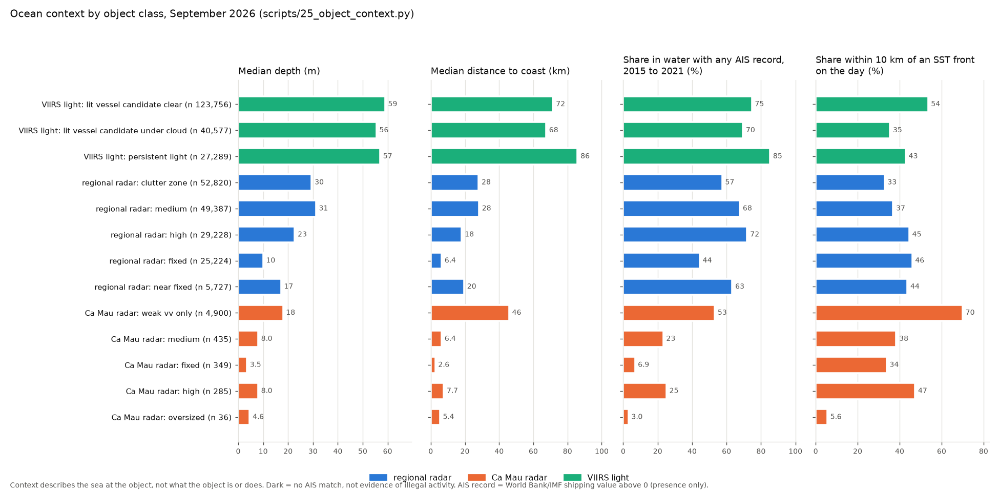
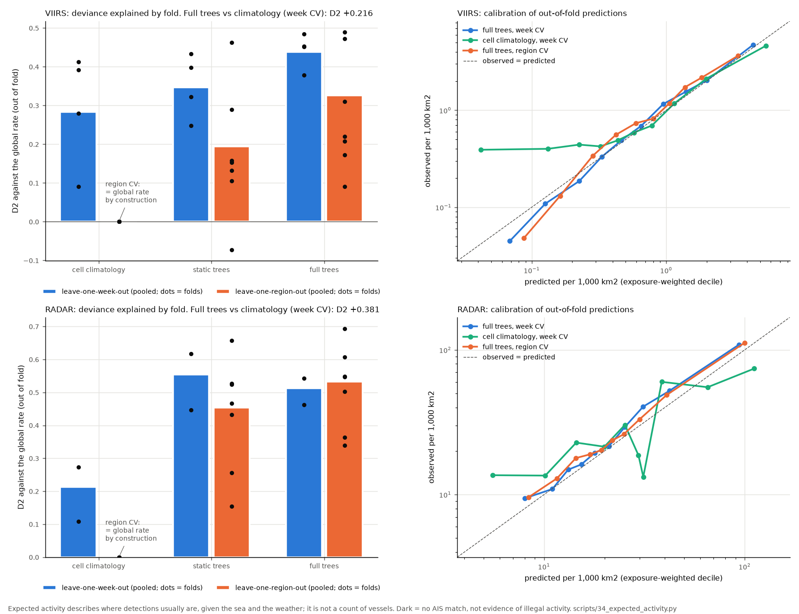

# Ocean context layers, context at each object, and the expected-activity model

Date: 2026-10-10 (UTC). Code: `src/darkvessel/ocean/grid.py`, `static.py`, `daily.py`, `fronts.py`, `context.py`, `model.py`; `scripts/22_static_layers.py`, `scripts/23_daily_ocean.py`, `scripts/25_object_context.py`, `scripts/34_expected_activity.py`. Products: `data/outputs/small/*_{4326,utm49n}.tif` (listed below), `data/ocean_context.gpkg`, `data/eez_marineregions.gpkg`, `data/ocean_fronts.gpkg`, `data/ocean_static_cells.parquet`, `data/ocean_daily_cells.parquet`, `data/ocean_radar_pass_cells.parquet`, `data/ocean_static_summary.json`, `data/ocean_daily_summary.json`, `data/ocean_context_objects.parquet`, `data/ocean_context_objects.json`, `data/expected_activity.parquet`, `data/expected_activity.json`, `data/expected_activity_anomalies.gpkg`, `docs/figures/ocean_static.png`, `docs/figures/ocean_showcase_fronts.png`, `docs/figures/ocean_context_classes.png`, `docs/figures/expected_activity.png`. Plan: `docs/ocean_context_plan.md`.

> **"Dark" does not mean illegal.** "Dark" means only that no AIS position was matched to a radar contact. Many vessels are not required to carry AIS, AIS can be off for lawful reasons, and satellite and terrestrial AIS have blind spots. An AIS gap is not proof of intent. The ocean layers describe the sea, not what any vessel does: a contact in deep water, near a front or far from port is context for an analyst, never evidence of anything. An activity anomaly is a difference between a count of detections and a model's expectation, not a count of vessels and not evidence of wrongdoing.

## 1. Purpose and status

These layers say what the sea was like where and when a radar contact, a VIIRS light or a dark lead was seen: depth, distance to coast and to a major port, whether AIS traffic was ever recorded there (2015 to 2021), sea surface temperature and fronts, chlorophyll, currents, sea level, mixed layer, waves and wind. In the product they are context on the Contact and Lead pages and optional map layers (priority P2, after detection and identification). In paper 2 they are the covariates of the expected-activity model.

Status on 2026-10-10: all static and daily layers are built, checked and documented here (sections 2 to 7). The context at every radar object and VIIRS light is built (section 8), and the expected-activity model is fitted, cross-validated against two baselines and used for activity-anomaly cells (section 9). Both read the files described in sections 3 to 6.

## 2. Grids, CRS and file conventions

| Grid | Resolution | Origin (north-west corner) | Shape (rows x columns) | Used for |
|---|---|---|---|---|
| Fine | 0.01 degree (about 1.1 km) | 99.16 E, 23.76 N | 2,698 x 2,311 | depth, distances, shipping density, SST, fronts |
| 0.05 degree | 0.05 degree (about 5.6 km) | 99.15 E, 23.80 N | 541 x 463 | chlorophyll, RTOFS currents, mixed layer, SSH gradient |
| Model | 0.25 degree (about 28 km) | 99.0 E, 24.0 N | 109 x 94 | cell tables, waves, wind; the cell-night grid of `scripts/15_viirs_lights.py` |

All three come from `darkvessel.coverage.grid_for` over the bounds of the AOI polygon (Natural Earth 10 m marine areas South China Sea, Gulf of Tonkin and Gulf of Thailand; bounds 99.16 E to 122.27 E, 3.22 S to 23.76 N). Model-cell edges are whole multiples of 0.01 degree, so every fine cell lies in exactly one model cell (625 fine cells per full model cell). Rasters cover the whole bounding box (sea only); tables and key numbers use the sea inside the AOI polygon.

Every raster is a COG (deflate, internal overviews), written twice by `darkvessel.ocean.grid.write_dual_cog`: EPSG:4326 on its native grid (`*_4326.tif`) and UTM 49N, EPSG:32649 (`*_utm49n.tif`, bilinear, cell size 1,113 m, 5,566 m or 27,830 m). Nodata is -9999 (land, no data or outside the AOI). Every COG carries tags for units, source, licence, licence URL, version, access date, method, the ocean caveat and the dark caveat, so the files explain themselves in ArcGIS Pro. Every GeoPackage holds each layer twice (`_4326` and `_utm49n`, `darkvessel.io.write_dual_crs`) plus an `about` table with source, version, licence, access date, method, the ocean caveat and the full dark caveat (`dark_caveat`). All files are under 20 MB (largest: `ship_density_all_utm49n.tif`, 16.6 MB; `eez_marineregions.gpkg`, 15.0 MB).

## 3. Static layers (`scripts/22_static_layers.py`)

Downloads on 2026-10-08; rebuilt from the caches on 2026-10-09. No keys are needed.

### 3.1 Depth and depth contours

| | |
|---|---|
| Source | GEBCO_2026 Grid, netCDF held at CEDA/BODC: https://dap.ceda.ac.uk/bodc/gebco/global/gebco_2026/ice_surface_elevation/netcdf/GEBCO_2026.nc (resolved, HTTP 206 on a range request) |
| Version | GEBCO_2026, file attribute `date_created` 2026-04-17, doi:10.5285/4f68d5c7-45eb-f999-e063-7086abc036fa (https://doi.org/10.5285/4f68d5c7-45eb-f999-e063-7086abc036fa resolves to the BODC catalogue page) |
| Licence as published | GEBCO terms of use (https://www.gebco.net/data-products/gridded-bathymetry/terms-of-use, resolved): "The GEBCO Grid is placed in the public domain and may be used free of charge." Users may copy, adapt and commercially exploit it and must acknowledge the source. "The GEBCO Grid should NOT be used for navigation or for any other purpose involving safety at sea." |
| Resolution | 15 arc-second source (about 460 m), averaged to the 0.01 degree fine grid |
| Method | The file is one contiguous int16 array, so the AOI rows (bounds plus 0.5 degree) are fetched as one byte range and cached as a compressed array. Depth of a fine cell = mean of the source cells below sea level whose centres fall in it, metres positive down. Sea mask = fine cell centre not on Natural Earth 10 m land and GEBCO mean below sea level. Slope = magnitude of the depth gradient in m per km (dx scaled by the cosine of latitude). Contours at 50, 200 and 1,000 m after a gaussian smoothing of one cell, simplified at 0.003 degree, lines shorter than 0.1 degree dropped, lengths on the WGS 84 ellipsoid. |
| Files | `depth_m_{4326,utm49n}.tif` (11.1 and 14.4 MB); `ocean_context.gpkg` layers `depth_contours_4326`, `depth_contours_utm49n` |
| Result | AOI sea 3.56 million km2; 52.1 % shallower than 200 m, 25.6 % shallower than 50 m, 40.8 % deeper than 1,000 m; median depth 138 m, maximum 5,217 m. Contours: 627 lines at 50 m (52,916 km), 168 at 200 m (24,330 km), 194 at 1,000 m (26,511 km). |
| Limits | GEBCO states that the grid "is created by interpolating, applying algorithms and mathematical techniques to bathymetric data" and does not ship the underlying soundings, so its local accuracy cannot be judged here. Not for navigation. |

### 3.2 Distance to coast

| | |
|---|---|
| Source | Natural Earth 10 m land: https://raw.githubusercontent.com/nvkelso/natural-earth-vector/master/geojson/ne_10m_land.geojson (resolved) |
| Version | natural-earth-vector master branch, VERSION file "5.2.0-pre" (https://raw.githubusercontent.com/nvkelso/natural-earth-vector/master/VERSION, resolved) |
| Licence as published | Public domain: "All versions of Natural Earth raster + vector map data found on this website are in the public domain" (https://raw.githubusercontent.com/nvkelso/natural-earth-vector/master/LICENSE.md and https://www.naturalearthdata.com/about/terms-of-use/, both resolved) |
| Method | Great-circle distance from each sea fine-cell centre to the nearest vertex of the coastline, densified to 0.002 degree (about 220 m), by nearest neighbour on 3-D unit vectors (no projection distortion). Coast taken within the AOI bounds plus 1 degree. |
| Files | `dist_coast_km_{4326,utm49n}.tif` (8.7 and 11.5 MB) |
| Result | 11.2 % of AOI sea lies within 20 km of the coast, 27.0 % within 50 km; the farthest point is 427 km from land. |
| Limits | Distances are to Natural Earth 10 m land only; reefs and islets that the layer does not hold do not count (how many are missing was not checked). |

### 3.3 Ports and distance to the nearest major port

| | |
|---|---|
| Sources | NGA World Port Index (Pub 150) through the MSI API: https://msi.nga.mil/api/publications/world-port-index?output=csv (resolved). Natural Earth 10 m ports: https://raw.githubusercontent.com/nvkelso/natural-earth-vector/master/geojson/ne_10m_ports.geojson (resolved) |
| Version | WPI as served on the access date (the API output carries no edition number); Natural Earth 5.2.0-pre |
| Licence as published | MSI "Commercial Use Warning" (https://msi.nga.mil/api/pageContent/getByTitle?pageTitle=Commercial%20Use%20Warning, resolved): "NGA claims no copyright or other intellectual property right in the nautical products posted on this website for public use"; the NGA name, seal or initials may not be used to imply endorsement (10 U.S.C. 425). Natural Earth: public domain. |
| Method | Ports within the AOI bounds plus 1 degree. Major = WPI harbour size L (Large) or M (Medium), or any Natural Earth port; WPI S and V stay in the layer but do not count for distance. Distance as in 3.2. |
| Files | `ocean_context.gpkg` layers `ports_4326`, `ports_utm49n`; `dist_port_km_{4326,utm49n}.tif` (6.5 and 9.2 MB) |
| Result | 236 ports (WPI 195: Large 9, Medium 24, Small 39, Very Small 123; Natural Earth 41), 74 major. 11.0 % of AOI sea lies within 100 km of a major port; the farthest point is 742 km away. |
| Limits | The major-port rule is this project's choice. WPI Small and Very Small harbours and harbours absent from both sources do not count, so distance to a major port is not distance to the nearest harbour or fishing base. |

### 3.4 Shipping density (World Bank / IMF)

| | |
|---|---|
| Source | World Bank Data Catalog, Global Shipping Traffic Density, dataset 0037580: https://datacatalog.worldbank.org/search/dataset/0037580 (resolved); files `https://datacatalogfiles.worldbank.org/ddh-published/0037580/5/DR00454xx/*.zip` (resolved) |
| Version | Catalogue version 5, metadata last updated 2023-01-18; zips listed as last updated 2021-05-03 on the catalogue page; HTTP Last-Modified 2025-02-27 on the file server |
| Licence as published | "This dataset is licensed under Creative Commons Attribution 4.0" (catalogue page; licence page https://datacatalog.worldbank.org/public-licenses?fragment=cc, resolved). Classification: Public. |
| What the values are | Readme (https://datacatalogfiles.worldbank.org/ddh-published/0037580/5/DR0084213/readme.txt, resolved): "The raster layers were created using IMF's analysis of hourly AIS positions received between Jan-2015 and Feb-2021 and represent the total number of AIS positions that have been reported by ships in each grid cell with dimensions of 0.005 degree by 0.005 degree ... The AIS positions may have been transmitted by both moving and stationary ships within each grid cell, therefore the density is analogous to the general intensity of shipping activity." Vessel types per layer (https://datacatalogfiles.worldbank.org/ddh-published/0037580/5/DR0045407/readme_ddh.txt, resolved): all; commercial (cargo, tankers, tugs, supply, research, patrol and other working ships); fishing (FISHING VESSEL, TRAWLER); oil and gas (PLATFORM, FLOATING STORAGE/PRODUCTION, DRILLING JACK UP, DRILLING RIG, WELL STIMULATION VESSEL); passenger (PASSENGER SHIP, RO-RO/PASSENGER SHIP); leisure, called Pleasure in the readme (YACHT, SAILING VESSEL). The values check below shows that most of the values do not fit this description. |
| Method | Each zip is opened through GDAL `/vsizip/`, the AOI window is read, the four 0.005 degree source cells whose centres fall in a fine cell are summed, and the zip is deleted. Land cells are NaN. The COGs keep these sums of the values as published, with the warning below in their tags. The cell table holds only presence: `ship_presence_share_<type>` = share of a model cell's AOI sea fine cells whose value is above 0. |
| Files | `ship_density_{all,commercial,fishing,oilgas,passenger,leisure}_{4326,utm49n}.tif` (all 12.6 and 16.6 MB, commercial 12.5 and 16.6, fishing 1.7 and 2.4, oil and gas 1.9 and 2.4, passenger 3.4 and 5.5, leisure 1.4 and 1.8) |
| Values check (why the magnitudes are not used) | In five of the six layers a large share of the values cannot be counts of AIS positions. (1) Raw leisure GeoTIFF (`ShipDensity_Leisure.zip`, downloaded again on 2026-10-09; int32, 0.005 degree, nodata 2147483647), window 103.5 to 104.5 E, 1.0 to 1.5 N (Singapore Strait): all 1,857 nonzero cells lie between 151,669 and 430,408, every value is distinct and none is below 100,000. The file's own histogram (`.aux.xml`, 256 buckets of 11,706 from 0 to 2,996,838) has two flat plateaus, about 19,000 cells per bucket up to 0.69 million and about 10,100 per bucket up to 2.29 million, then almost none; counts would thin out as the value rises. (2) Over AOI sea fine cells the nonzero values form two modes with a gap between them: values above 10,000 are 50 % of the nonzero cells in `all` and `commercial` and 100 % in `oilgas` (minimum 23,514) and `leisure` (minimum 138,549); `all` has 155 of 1,976,693 nonzero cells between 10^2.5 and 10^4; `fishing` has 158 of 22,317 nonzero cells above 10^5.5 and none between 10^3 and 10^5.5. Only `passenger` has a continuous tail (1 to 133,847). (3) Along the fine row 11.99 to 12.00 N, 111.0 to 112.5 E of `all`, 97 of 150 cells hold 1 to 10, while 15 separate cells hold near-identical values from 10,709,621 to 10,711,838 and one holds 21,423,646, exactly 2 x 10,711,823. Counts cannot repeat the same 8-digit value in separate cells. (4) 46 % of the nonzero `all` cells more than 100 km from a major port exceed 54,024, the number of hours from January 2015 to February 2021; at one position per ship per hour that needs more than one ship in that 1 km cell for every hour of six years. The diagnostics are recomputed by the script and stored in `data/ocean_static_summary.json` (`ship_values_*`). |
| Result (presence) | Share of AOI sea fine cells with any value above 0: all 66.9 % (2.38 million km2), commercial 66.5 %, passenger 3.5 %, fishing 0.75 %, oil and gas 0.65 %, leisure 0.25 %. |
| Limits | Only presence (value above 0) is used, for every layer. The magnitude, its rank and its log are not usable, and the encoding is UNVERIFIED until the World Bank data team confirms it (an email to them is the way to settle it). Presence itself assumes that a zero means no AIS record of that type in 2015 to 2021. The fishing layer is above 0 in only 0.75 % of AOI sea cells, so it cannot stand for fishing activity in this sea; the source does not say why it is so sparse here (UNVERIFIED). The data end in February 2021. The open build must not show these layers as traffic intensity or vessel counts. |

### 3.5 EEZ and maritime boundaries (Marine Regions), own file, off by default

| | |
|---|---|
| Source | Flanders Marine Institute (VLIZ), Marine Regions Maritime Boundaries Geodatabase, WFS https://geo.vliz.be/geoserver/MarineRegions/wfs (GetCapabilities resolved): layers `MarineRegions:eez`, titled "Exclusive Economic Zones (200 NM) (v12, world, 2023)", and `MarineRegions:eez_boundaries`, titled "Maritime Boundaries (v12, world, 2023)". The two GetFeature requests are stored in the `about` table. |
| Version | Version 12; dataset record (https://doi.org/10.14284/632, resolved to the VLIZ record) dated 2023-10-25 |
| Licence as published | Dataset record: "This dataset is licensed under a Creative Commons Attribution 4.0 International License." Terms on https://www.marineregions.org/disclaimer.php (resolved): products licensed CC-BY since version 11; "We kindly request our users not to make our products available for download elsewhere"; "Marine Regions is not meant to be used for legal, economical (in the sense of exploration of natural resources) or navigational purposes"; "VLIZ expresses no opinion about the legal state neither of any country, territory or area nor concerning its delimitation, frontier or borders. The data has no legal value whatsoever."; where these terms differ from the CC licence, the CC licence prevails. |
| Citation | Flanders Marine Institute (2023). Maritime Boundaries Geodatabase: Maritime Boundaries and Exclusive Economic Zones (200NM), version 12. Available online at https://www.marineregions.org/. https://doi.org/10.14284/632 |
| Method | Features clipped to the raster box (the AOI bounds); every published attribute kept (MRGID, geoname, pol_type, line_type, territories, sovereigns, sources) plus `source`, `version`, `licence`, `access_date`. Boundary lines keep every published vertex (28,916). The clipped published polygons hold 948,627 vertices, which in two CRS would exceed 30 MB, so polygons are simplified at 10 m in UTM 49N (425,671 vertices; largest relative area change 2.5 x 10^-5). The per-cell lookup in the static table uses the unsimplified published polygons. |
| Files | `data/eez_marineregions.gpkg` (15.0 MB): `eez_4326`, `eez_utm49n` (12 polygons: 9 with pol_type 200NM, 3 Overlapping claim), `eez_boundaries_4326`, `eez_boundaries_utm49n` (77 lines: Connection line 19, Straight baseline 15, Median line 14, Treaty 13, Unsettled (land) 5, Archipelagic baseline 4, Unsettled median line (land) 4, Unsettled (maritime) 3), `about` |
| Published overlaps | The published polygons overlap in four places; they are reported, not resolved: Malaysian EEZ and "Overlapping claim: South China Sea" 67.5 km2, Malaysian and Bruneian EEZ 4.5 km2, Indonesian and Malaysian EEZ 0.4 km2, Thailand and Malaysian EEZ 0.1 km2. |

**EEZ statement.** The lines and polygons are shown as Marine Regions publishes them, with its own labels. In this sea many zones overlap or are disputed; the source marks them with `pol_type` and `line_type`. This project takes no position on any boundary or claim. The product shows the layer off by default, with its source in the legend. The straight edges of the clipped polygons are clip edges, not boundaries. The EEZ fields in the cell table are for display and lookup only; they are not a model feature. No other layer in this build carries any boundary; region names are reporting boxes.

## 4. Daily layers (`scripts/23_daily_ocean.py`)

Window: the 27 VIIRS nights 2026-09-05 to 2026-10-01 (a night is the local evening date in Vietnam, UTC+7; the VIIRS passes fall near 18 UTC) and the 11 UTC dates with a regional Sentinel-1 scene (2026-09-20 to 2026-10-01 except 09-25), 27 dates in all. Every source was found for every date: MUR 27 of 27, gap-filled chlorophyll 27, daily chlorophyll 27, RTOFS 27, GFS-Wave 27 plus 28 scene hours, GFS wind 27. The RTOFS file for 2026-09-18 answered 404 on 2026-10-08 and was fetched on 2026-10-09.

### 4.1 Sea surface temperature (SST)

| | |
|---|---|
| Source | MUR v4.1 analysed_sst through NOAA CoastWatch ERDDAP, dataset `jplMURSST41`: https://coastwatch.pfeg.noaa.gov/erddap/info/jplMURSST41/index.json (resolved) |
| Version | MUR-JPL-L4-GLOB-v04.1, product_version 04.1, doi:10.5067/GHGMR-4FJ04 (https://doi.org/10.5067/GHGMR-4FJ04 resolves to the NASA Earthdata catalogue page); daily analysis valid 09 UTC; the dataset notes that the most recent 7 days are usually revised every day |
| Licence as published | ERDDAP `license` attribute: "These data are available free of charge under the JPL PO.DAAC data policy. The data may be used and redistributed for free but is not intended for legal use, since it may contain inaccuracies." Acknowledgement requested: "These data were provided by JPL under support by NASA MEaSUREs program." |
| Method | ERDDAP axis values are cell centres on whole hundredths; the fine grid has centres on half hundredths, so each fine cell is the mean of the 2 x 2 MUR cells on its corners. Sea = all four MUR cells open sea (mask bit 1 without the land bit 2 or the lake bit 4); ice = bit 8 or 16. Fallback for a missing day: NOAA OISST v2.1 (https://noaa-cdr-sea-surface-temp-optimum-interpolation-pds.s3.amazonaws.com/?list-type=2&prefix=data/v2.1/avhrr/202609/, resolved); not needed in this window. |
| Files | `sst_mean_c_{4326,utm49n}.tif` (window mean, 3.9 and 7.1 MB), `sst_showcase_c_{4326,utm49n}.tif` (2026-09-29, 5.4 and 8.5 MB) |
| Result | AOI sea pixels 25.65 to 32.15 C over all days, daily mean 29.58 C; window mean per pixel 26.9 to 30.9 C. |

### 4.2 SST fronts

| | |
|---|---|
| Method (`src/darkvessel/ocean/fronts.py`) | 3 x 3 median filter (NaN filled from the nearest valid pixel first; every pixel whose 3 x 3 window touched NaN is dropped again). Gradient magnitude in C per km with dy = 0.01 degree x 111.32 km and dx scaled by the cosine of latitude. Hysteresis mask: a pixel is a front if its gradient exceeds the high threshold, or exceeds the low threshold and is 8-connected to one above the high threshold; components under 3 pixels dropped; nothing within 2 km of Natural Earth land or on MUR land or ice. Thresholds are the 90th and 97th percentiles of the pooled gradient of every fifth AOI sea pixel on all 27 days: low 0.0393, high 0.0578 C per km. Distance to front is great-circle distance to the nearest front pixel centre. Lines: skeleton of the mask, 8-neighbour pixels joined and merged, lines under 10 km dropped. |
| References | Belkin, I. M. and O'Reilly, J. E. (2009). An algorithm for oceanic front detection in chlorophyll and SST satellite imagery. Journal of Marine Systems 78, 319-326. https://doi.org/10.1016/j.jmarsys.2008.11.018 (resolved; title, journal, volume and pages checked in the Crossref record https://api.crossref.org/works/10.1016/j.jmarsys.2008.11.018). Cayula, J.-F. and Cornillon, P. (1992). Edge detection algorithm for SST images. Journal of Atmospheric and Oceanic Technology 9, 67-80. https://doi.org/10.1175/1520-0426(1992)009<0067:EDAFSI>2.0.CO;2 (resolved; Crossref record checked). The full texts were not read in this session; the method here is a plain gradient and hysteresis rule in the spirit of those papers, not either published algorithm. |
| Files | `sst_grad_mean_c_per_km_{4326,utm49n}.tif` (11.1 and 11.4 MB), `front_freq_{4326,utm49n}.tif` (share of days a pixel is a front; 6.1 and 11.1 MB), `data/ocean_fronts.gpkg` (`fronts_4326`, `fronts_utm49n`: the 2,823 front lines, 57,452 km, of 2026-09-29, the VIIRS night with the most clear sea; `about`), `docs/figures/ocean_showcase_fronts.png` |
| Result | On average 8.3 % of AOI sea pixels are front pixels on a day; 4.2 % of pixels are fronts on at least a quarter of the days. Median window-mean gradient 0.0186 C per km. Median distance from a cell centre to the nearest front 20 km. |
| Limits | The thresholds are relative: they mark the strongest tenth of the gradients in this sea in this month, not an absolute oceanographic front strength. MUR is a merged multi-sensor analysis (ERDDAP summary; comment: "Multi-Resolution Variational Analysis (MRVA) method for interpolation"), so where cloud hides the sea the 1 km detail is interpolated and fronts on such days are likely smoother than reality (not quantified here). |

### 4.3 Chlorophyll-a

| | |
|---|---|
| Sources (all NOAA CoastWatch ERDDAP, info pages resolved) | Gap-filled (DINEOF): `noaacwNPPN20S3ASCIDINEOF2kmDaily` (2 km, science quality, VIIRS S-NPP, NOAA-20 and Sentinel-3A OLCI; used 2026-09-05 to 09-27), `nesdisNPPN20S3ASCIDINEOFDaily` (9 km science quality; fallback, not used), `nesdisVHNnoaaSNPPnoaa20NRTchlaGapfilledDaily` (9 km near-real-time; used 2026-09-28 to 10-01). Not gap-filled, for the valid-day share: `nesdisVHNSQchlaDaily` (4 km science quality, 2026-09-05 to 09-29) and `nesdisVHNchlaDaily` (4 km near-real-time, 2026-09-30 and 10-01). The script takes the science-quality day when ERDDAP serves it: the rebuild of 2026-10-09 14:00 UTC found 09-29 in science quality, which the run at 01:00 UTC had taken from near-real-time. Info URLs: https://coastwatch.pfeg.noaa.gov/erddap/info/<dataset>/index.json |
| Licence as published | 2 km and 9 km science quality: "These data were produced by NOAA and are not subject to copyright protection in the United States. NOAA waives any potential copyright and related rights in these data worldwide through the Creative Commons Zero 1.0 Universal Public Domain Dedication (CC0-1.0)". 9 km near-real-time: "The data may be used and redistributed for free but is not intended for legal use". 4 km daily: the attribute points to the NASA Earth science data policy (the URL it gives, https://science.nasa.gov/earth-science/earth-science-data/data-information-policy/, answered 404 on 2026-10-09; the NASA Earthdata page https://www.earthdata.nasa.gov/engage/open-data-services-software-policies/data-information-guidance resolves and states "NASA promotes the full and open sharing of data") and asks for the acknowledgement "These data were provided by NOAA's Center for Satellite Applications and Research (STAR) and the CoastWatch program." |
| Method | log10 of chlor_a (mg m-3). Onto the 0.25 degree cells: mean of the log values of the source pixels in the cell. Window raster: 10 to the mean log over the days with a value (geometric mean) on the 0.05 degree grid (2 km days bin-averaged, 9 km days sampled). Valid-day share: share of days with a direct retrieval, counted only over retrieval pixels whose centre is AOI sea outside the 2 km coast buffer. |
| Files | `chl_mean_mg_m3_{4326,utm49n}.tif` (0.4 MB each), `chl_valid_share_{4326,utm49n}.tif` (0.3 and 0.4 MB) |
| Result | Cell-day values 0.045 to 32 mg m-3, median 0.18 mg m-3; the distribution is close to log-normal (skewness 7.6 on the raw values, 1.7 on log10, the remaining tail being coastal plumes). Regional medians: Gulf of Tonkin 0.55, Southern sea 0.30, Gulf of Thailand 0.29, South Vietnam shelf 0.28, Central sea 0.15, North shelf 0.14 mg m-3. The mean daily share of a cell's sea pixels with a direct retrieval was 15 %. |
| Limits | The DINEOF product is gap-filled (dataset title); on most days most of its pixels are not anchored by a direct retrieval (valid-day share above). Window means up to 70 mg m-3 at river mouths are far above the open-sea values; they are kept as published and should not be read as chlorophyll without a check (their cause was not verified in this session). |

### 4.4 Currents, sea level and mixed layer (RTOFS)

| | |
|---|---|
| Source | NOAA Global RTOFS nowcast diagnostics on AWS, bucket `noaa-nws-rtofs-pds`, files `rtofs.YYYYMMDD/rtofs_glo_2ds_nHHH_diag.nc` (listing https://noaa-nws-rtofs-pds.s3.amazonaws.com/?list-type=2&prefix=rtofs.20260921/rtofs_glo_2ds_n resolved); the record nHHH of folder D is the nowcast valid at HHH UTC of D minus one day, checked against each file's `Date` variable |
| Licence as published | Registry of Open Data on AWS (https://registry.opendata.aws/noaa-rtofs/, resolved): "NOAA data disseminated through NODD are open to the public and can be used as desired." NOAA requests attribution, no implied endorsement, and modified data may not be presented as original. |
| Variables | `ssh` (m), `u_barotropic_velocity` and `v_barotropic_velocity` (m/s, depth-averaged), `mixed_layer_thickness` and `surface_boundary_layer_thickness` (m); SSH gradient magnitude in m per km computed on the native 1/12 degree grid; SSH anomaly = SSH minus the window mean of the cell |
| Method | Valid 18 UTC each date. Only the AOI rows and columns are read (HTTP ranges). Onto 0.25 degree cells: mean of the native cells inside; onto the 0.05 degree rasters: nearest native cell. Each window raster pixel is averaged over the days it has a value. |
| Files | `current_speed_mean_ms_{4326,utm49n}.tif`, `mld_mean_m_{4326,utm49n}.tif`, `ssh_grad_mean_{4326,utm49n}.tif` (0.2 to 0.4 MB each) |
| Result | Cell-day current speed 0.001 to 0.84 m/s, median 0.048; mixed layer 1.4 to 77 m, median 19 m; SSH anomaly standard deviation 0.046 m. |
| Limits | The currents are depth-averaged (barotropic), not surface currents, and are model output. The SSH gradient is a proxy for eddy edges, not an eddy detection. |

### 4.5 Waves and wind (GFS-Wave, GFS)

| | |
|---|---|
| Sources | NOAA GFS-Wave global 0.25 degree, significant height of combined wind waves and swell (HTSGW), bucket `noaa-gfs-bdp-pds` (example index https://noaa-gfs-bdp-pds.s3.amazonaws.com/gfs.20260920/18/wave/gridded/gfswave.t18z.global.0p25.f000.grib2.idx, resolved), fetched by byte range and decoded with ecCodes (Python package `eccodes` 2.49.0, Apache License 2.0, https://pypi.org/project/eccodes/, resolved). NOAA GFS 0.25 degree 10 m wind through `darkvessel.weather.gfs_wind`. |
| Licence as published | NODD text as in 4.4 (https://registry.opendata.aws/noaa-gfs-bdp-pds/, resolved) |
| Method | The 18 UTC analysis (f000) for each date; for each radar scene the cycle and step nearest the scene start. Model-cell centres sit on the shared corner of four GFS cells, so the value is the bilinear (here the plain mean of the four), with NaN neighbours (land) dropped. |
| Files | `wave_hs_mean_m_{4326,utm49n}.tif`, `wind_mean_ms_{4326,utm49n}.tif` (0.25 degree, under 0.1 MB) |
| Result | Cell-night Hs 0.01 to 3.23 m, median 0.67 m; wind 0.1 to 15.4 m/s, median 4.5 m/s. |
| Limits | Model fields at 0.25 degree; sheltered bays and the lee of islands are not resolved. |

## 5. Value checks (rebuilt tables, 2026-10-09)

| Field | Found (cell level, all 27 dates) | Physical expectation | Null share | Verdict |
|---|---|---|---|---|
| `sst_mean_c` | 25.8 to 31.9 C (pixels 25.65 to 32.15) | 20 to 32 C (task check range) | 0 | in range; a few pixels exceed 32 C by up to 0.15 C on single days |
| `wave_hs_m` | 0.01 to 3.23 m | 0 to 8 m (task check range) | 0.06 % | in range |
| `chl_log10_mean` | -1.35 to 1.51 (0.045 to 32 mg m-3) | log-normal (task check) | 0 | close to log-normal: skewness 7.6 raw, 1.7 in log10 |
| `current_speed_ms` | 0.001 to 0.84 m/s | under 3 m/s (task check range) | 0.27 % | in range |
| `mld_m` | 1.4 to 77 m | positive, tens of metres | 0.27 % | plausible |
| `ssh_grad` | 0.00001 to 0.0124 m per km | small and positive | 0.92 % | plausible; null next to the coast by construction |
| `wind_ms` | 0.1 to 15.4 m/s | non-negative | 0 | plausible |
| `chl_valid_share` | 0 to 1 per cell-day; window maximum 0.63 per 0.05 degree pixel | 0 to 1 | 0.02 % | in range |

Fixed in this round (the earlier build had these errors): the window mean of the SSH gradient was 0 instead of NaN on coastal pixels (one count was shared by three fields); the chlorophyll valid-day share counted land pixels as "no retrieval"; the MUR open-lake flag counted as sea; distance to front used one local plane for the whole AOI (up to 7 % error east-west); daily SST cell statistics included fine pixels outside the AOI polygon; waves and wind took one of four equidistant GFS cells (now the mean of the four, which also cut empty wave values from 2.95 % to 0.06 % of cell-nights); RTOFS for 2026-09-18 was missing; the daily COGs had no licence tags; contour lengths were measured in an equal-area projection (now geodesic).

## 6. Cell tables

All three tables use the 0.25 degree model grid; join them on `row`, `col` (and the date). Parquet metadata carries the ocean caveat, the dark caveat and the grid.

### 6.1 `data/ocean_static_cells.parquet`

5,116 rows: every model cell that holds a fine cell inside the AOI polygon or whose centre lies in it (4,778 with the centre in the AOI, 5,095 with AOI sea, 21 all land). Every row of the daily table has a static row.

| Column | Meaning |
|---|---|
| `row`, `col` | model-grid indices, row 0 at the north |
| `lon`, `lat` | cell centre, degrees |
| `region` | reporting box of the cell centre (`scripts/21_viirs_regions.py`), `other` outside every box; not a boundary |
| `aoi_centre` | the cell centre lies in the AOI polygon (the definition of a cell in the daily table) |
| `aoi_share` | share of the cell's 625 fine cells whose centres lie in the AOI polygon |
| `n_sea`, `sea_share`, `sea_area_km2` | number, share (of 625) and spherical area of fine cells that are sea and inside the AOI |
| `depth_mean_m`, `depth_median_m`, `depth_min_m`, `depth_max_m`, `depth_std_m` | GEBCO_2026 depth over those sea cells, m positive down |
| `share_shallower_50m`, `share_shallower_200m`, `share_shelf_break_150_250m` | share of those sea cells in each depth class |
| `slope_mean_m_per_km` | mean depth-gradient magnitude |
| `dist_coast_km`, `dist_coast_min_km` | mean and minimum great-circle distance to the coast, km |
| `dist_port_km`, `dist_port_min_km` | mean and minimum distance to the nearest major port, km |
| `ship_presence_share_all`, `_commercial`, `_fishing`, `_oilgas`, `_passenger`, `_leisure` | share of the cell's AOI sea fine cells whose World Bank/IMF value for that vessel type is above 0 (any AIS record of that type, 2015 to 2021); presence only, because many of the published values cannot be counts (3.4); NaN where the cell has no AOI sea |
| `marineregions_mrgid`, `marineregions_geoname`, `marineregions_pol_type` | as published, the Marine Regions v12 EEZ polygon that covers most of the cell's AOI sea (unsimplified polygons; where two published polygons overlap, the later in the published order); empty where none covers the sea; display and lookup only, not a model feature |
| `marineregions_share`, `marineregions_n` | that polygon's share of the cell's AOI sea; number of distinct polygons in the cell |
| `marineregions_overlap_share` | share of the cell's AOI sea covered by two or more published polygons (the published overlaps of 3.5, reported, not resolved); display only |

Column changes against the earlier draft of `scripts/22_static_layers.py`: `dist_port_km` is now the mean (it was the minimum) and `dist_port_mean_km` became `dist_port_min_km`, so coast and port follow one naming rule; `region`, `aoi_centre`, `aoi_share` and the `marineregions_*` columns are new; `ship_density_<type>` (mean of the published values) and `ship_fishing_share` are gone and `ship_presence_share_<type>` (six types, leisure included) replaces them, because the published magnitudes are not usable (3.4). The EEZ columns are prefixed `marineregions_`, not `eez_`, because `src/darkvessel/ocean/model.py` treats any column starting with `eez` as a static model feature.

### 6.2 `data/ocean_daily_cells.parquet`

128,979 rows: 27 dates x 4,777 cells (model cells whose centre is in the AOI and that hold MUR sea outside the 2 km coast buffer).

| Column | Meaning |
|---|---|
| `night` | date key: the local evening date for VIIRS nights; daily layers of that UTC date |
| `row`, `col`, `lon`, `lat`, `region` | as above |
| `is_viirs_night`, `is_s1_date` | the date is a VIIRS night of the window / a UTC date with a regional Sentinel-1 scene |
| `sst_mean_c`, `sst_sd_c` | mean and spatial standard deviation of SST over the cell's AOI pixels, C |
| `sst_grad_mean` | mean SST gradient magnitude, C per km |
| `front_share` | share of the cell's valid pixels that are front pixels |
| `dist_front_km` | great-circle distance from the cell centre to the nearest front pixel of that day, km |
| `chl_log10_mean` | mean log10 chlorophyll-a (mg m-3), gap-filled product |
| `chl_valid_share` | share of the cell's sea retrieval pixels with a direct (not gap-filled) retrieval that day |
| `ssh_m`, `ssh_anom_m`, `ssh_grad` | RTOFS sea surface height (m), its anomaly against the window mean of the cell (m), its gradient magnitude (m per km) |
| `current_speed_ms` | RTOFS depth-averaged current speed, m/s |
| `mld_m`, `sbl_m` | RTOFS mixed-layer and surface boundary-layer thickness, m |
| `wave_hs_m`, `wind_ms` | GFS-Wave significant wave height (m) and GFS 10 m wind (m/s) at 18 UTC |
| `moon_illum_pct` | median moon illumination of the night's VIIRS lights, percent (NaN for dates that are not VIIRS nights) |
| `sst_source`, `sst_date`, `chl_dataset`, `chl_date`, `chl_obs_dataset`, `rtofs_valid_utc`, `wave_valid_utc`, `wind_valid_utc` | provenance and valid time of each field |
| `caveat` | the ocean caveat with the dark caveat |

### 6.3 `data/ocean_radar_pass_cells.parquet`

4,407 rows: the sea cells of the daily table touched by each of the 119 regional Sentinel-1 scene footprints (`all_touched`). Columns: `scene_id`, `mission`, `acq_utc`, `utc_date`, `row`, `col`, `lon`, `lat`, `region`; `wave_hs_m`, `wave_valid_utc`, `wind_ms`, `wind_valid_utc` at the GFS cycle and step nearest the scene start; and the daily fields of the scene's UTC date from 6.2 (`sst_mean_c`, `sst_sd_c`, `sst_grad_mean`, `front_share`, `dist_front_km`, `chl_log10_mean`, `chl_valid_share`, `ssh_m`, `ssh_anom_m`, `ssh_grad`, `current_speed_ms`, `mld_m`, `sst_source`, `chl_dataset`, `rtofs_valid_utc`); `caveat`.

## 7. How the layers serve radar contacts and dark leads

The layers add context to a contact; none of them makes a contact dark, suspicious or innocent.

- **Is this a plausible place for a vessel of this size?** Depth and distance to coast separate inshore small-boat water from the open sea. A 15 m contact in 20 m of water 10 km from shore is ordinary; the same contact 300 km offshore is worth a closer look at its length estimate and the radar clutter rules.
- **Did AIS traffic ever use this water?** The World Bank/IMF layers can say only whether any AIS record of a vessel type touched the contact's 0.01 degree cell in 2015 to 2021 (value above 0); they cannot say how busy the cell was, because the published values do not behave like counts (section 3.4). So there is no "dense lane" test in this build. The round-1 draft of the object context had one (the 90th percentile of `ship_density_all`); it was replaced by presence fields in round 2 (section 8.2). An unmatched contact in water that AIS traffic used may be a vessel the AIS feed missed (the live terrestrial feed is thin off Vietnam, `docs/PROJECT_BOARD.md`); an unmatched contact in water with no AIS record at all is a different kind of lead. Neither is proof of anything.
- **Is it near a port, a front or productive water?** Distance to a major port marks approaches and anchorages. Fronts and chlorophyll are the plan's candidate covariates of fishing activity (`docs/ocean_context_plan.md`); whether they predict where contacts and lights are in this sea is what the expected-activity model will test, so for now they are descriptions, not explanations.
- **What was the weather?** Wind and waves at the pass hour sit next to each contact. In this project's VIIRS record the lit fleet in the Gulf of Tonkin all but vanished from 10 to 15 September 2026, and the mean 18 UTC wind over the gulf's sea was 7.3 to 9.7 m/s on 10 to 13 September (`docs/viirs_lights.md`); weather is therefore a first check when a pass or a night shows few vessels. These fields also feed the detection side of paper 2.
- **What is expected here?** The expected-activity model (section 9) turns these layers into an expected number of lit vessel candidates per cell-night and of radar candidates per cell-pass; a cell far above expectation is a lead for review, not evidence.

## 8. Context at each object (`scripts/25_object_context.py`)

Code: `src/darkvessel/ocean/context.py`. Run on 2026-10-10 with `--fetch` (3 minutes). Outputs: `data/ocean_context_objects.parquet` (360,013 rows, 15.9 MB, caveat on every row), `data/ocean_context_objects.json` (fill rates, class comparisons with denominators, rules, sources, caveat), `docs/figures/ocean_context_classes.png`.

### 8.1 Objects

| Object type | Source | Rows | Classes (group) |
|---|---|---|---|
| `radar` | `data/detections_regional_all.gpkg`, September regional run (119 Sentinel-1C/1D scenes, 2026-09-20 to 2026-10-01) | 162,386 | high 29,228; medium 49,387; fixed 25,224; clutter_zone 52,820; near_fixed 5,727 |
| `radar_detail` | `data/detections_baseline.gpkg`, Ca Mau detail scene (S1D, 2026-09-29 11:10 UTC) | 6,005 | high 285; medium 435; fixed 349; weak_vv_only 4,900; oversized 36 |
| `viirs` | `data/viirs_lights_all.gpkg`, 27 nights 2026-09-05 to 2026-10-01 | 191,622 | lit_vessel_candidate_clear 123,756; lit_vessel_candidate_under_cloud 40,577; persistent_light 27,289 |

The 759,790 weak_vv_only low objects of the regional run are not included (they are not vessel candidates and would triple the table).

### 8.2 Fields and rules

| Field | Meaning and rule |
|---|---|
| `object_type`, `object_id`, `group`, `time_utc`, `lat`, `lon`, `length_est_m`, `mission`, `day` | the object as published by its producer; `object_id` is `det_id` or `light_id` and joins `data/weather_context.parquet` and the GeoPackages; `day` is the UTC date |
| `cell_id`, `region` | `r<row>c<col>` on the 0.25 degree model grid (the Cell record of `app/CONTRACT.md` 3.7) and the reporting box of the object; boxes are not boundaries |
| `depth_m`, `dist_coast_km`, `dist_port_km` | value of the object's 0.01 degree cell in the static COGs (section 3) |
| `ship_presence_all`, `_commercial`, `_fishing`, `_oilgas`, `_passenger`, `_leisure` | presence rule below; nullable boolean |
| `in_aoi_grid` | False when the object lies outside the static rasters (no object did) |
| `sst_c`, `sst_time`, `sst_source` | MUR SST of the object's 0.01 degree cell on its UTC date; the analysis is valid at 09:00 UTC of that date |
| `sst_grad` | SST gradient magnitude of the same cell and day, C per km (cache of `scripts/23_daily_ocean.py`) |
| `dist_front_km` | great-circle distance to the nearest front pixel of that day (section 4.2) |
| `chl_log10`, `chl_time`, `chl_dataset` | log10 chlorophyll-a of the day and the ERDDAP dataset it came from |
| `current_speed_ms`, `mld_m`, `current_time` | RTOFS hourly nowcast nearest to the object's whole hour within 2 h; value of the nearest RTOFS sea cell within 10 km |
| `wave_hs_m`, `wave_time` | GFS-Wave significant wave height nearest to the object's whole hour within 3 h, bilinear with land neighbours dropped (as in the daily cell table) |
| `caveat` | `OCEAN_CAVEAT` plus: the context fields describe the sea at an object's position and time, not what the object is or does |

**Presence rule (as written into the JSON).** `ship_presence_<type>` is True when the World Bank/IMF Global Shipping Traffic Density layer of that vessel type holds a value above 0 in the object's 0.01 degree cell (the sum of the four 0.005 degree source cells), January 2015 to February 2021; False when it holds 0; null on land, outside the rasters or when the layer is missing. Only presence is read. Many published values cannot be counts of AIS positions (section 3.4), so no magnitude, rank, percentile, lane or busy-water threshold is derived from them. Presence assumes that a 0 means no AIS record of that type in that period; it says that AIS traffic of that type touched the water, nothing about the object.

The draft of round 1 had `ship_density_all` and `ship_density_fishing` (the published magnitudes) and `in_shipping_lane` (above the 90th percentile of `ship_density_all`). All three are gone. `tests/test_ocean_context.py::test_no_shipping_magnitude_threshold_can_return` multiplies every positive shipping value by a random factor between 10^-4 and 10^4 and fails if any output changes, if any field name implies a count, density, lane or intensity, or if a lane threshold returns to the module. EEZ attributes are not object context: the product reads them from the Cell record, under its separate `eez` object, only while the EEZ layer is on (contract 3.7).

**Time matching.** The daily build cached RTOFS at 18 UTC only. Radar scenes start between 09:58 and 11:35 UTC (ascending) and between 21:51 and 23:10 UTC (descending), so the first run with `--fetch` read the 20 missing hourly nowcasts of the radar pass hours from the anonymous NOAA bucket and cached them (a rerun fetches nothing and reproduced the same table) (listing https://noaa-nws-rtofs-pds.s3.amazonaws.com/?list-type=2&prefix=rtofs.20260921/rtofs_glo_2ds_n, resolved on 2026-10-10: hourly files n000 to n023 per folder); 47 RTOFS hours were used in all. VIIRS lights (16:47 to 19:42 UTC) take the 18 UTC nowcast. Waves used 55 cached valid times; no wave file was missing.

### 8.3 Fixes to the round-1 draft

1. Shipping magnitudes and the lane rule replaced by presence (board decision D4.3); field names changed so none implies a count or intensity; the script docstring no longer calls the values "AIS positions".
2. RTOFS: the draft took the nearest native cell among all cells, land included, so a coastal object could take the empty value of a land cell; now the nearest RTOFS sea cell within 10 km.
3. RTOFS time window: the draft accepted the cached hour within 12 h, so a 10:48 UTC radar contact took the 18 UTC field, 7 h later, and 22:30 UTC contacts the field 4.5 h earlier; now the hourly nowcast within 2 h, with the missing pass hours fetched.
4. Waves: the draft took the containing GFS-Wave cell (no value where that cell is land); now the bilinear value with land neighbours dropped, the rule of the daily cell table.
5. Valid times are null where the value is null (the draft wrote a valid time for every object of the hour).
6. `cell_id` and `region` added, so the product can join the Cell record; fill rates per field and per object type, and every class share with its denominator, added to the JSON.
7. The SST cache of a day is read once instead of twice; `pd.Timestamp.utcnow` (deprecated in pandas 3) replaced.

### 8.4 Fill rates

| Field | All objects | Regional radar | Ca Mau radar | VIIRS lights |
|---|---|---|---|---|
| `cell_id` | 100.0 % | 100.0 % | 100.0 % | 100.0 % |
| `depth_m`, `dist_coast_km`, `dist_port_km`, every `ship_presence_*` | 98.8 % | 97.6 % | 99.0 % | 99.7 % |
| `sst_c` | 98.2 % | 97.0 % | 97.3 % | 99.3 % |
| `sst_grad` | 93.5 % | 87.6 % | 93.0 % | 98.6 % |
| `dist_front_km` | 100.0 % | 100.0 % | 100.0 % | 100.0 % |
| `chl_log10` | 100.0 % | 99.9 % | 99.9 % | 100.0 % |
| `current_speed_ms`, `mld_m` | 97.5 % | 94.9 % | 100.0 % | 99.7 % |
| `wave_hs_m` | 98.7 % | 97.4 % | 97.6 % | 99.9 % |

Missing values are coastal: an object whose 0.01 degree cell is land in Natural Earth or GEBCO has no static value (2.4 % of regional radar objects); the SST gradient is undefined where the 3 x 3 filter window touched land; RTOFS and GFS-Wave have coarse land masks.

### 8.5 Class comparison

Medians and shares are over the rows of the class with a value; n in brackets is that denominator. No test is applied: the table describes where each sensor's objects are, not what they are.

| Class | n | Depth median, m (n) | Coast median, km | Port median, km | Any AIS record, % (n) | Fishing AIS record, % | Within 10 km of a front, % (n) | SST median, C | Hs median, m (n) |
|---|---|---|---|---|---|---|---|---|---|
| VIIRS: lit vessel candidate, clear | 123,756 | 59.0 (123,558) | 71.5 | 174 | 74.7 (123,558) | 1.1 | 53.6 (123,756) | 29.56 | 0.56 (123,706) |
| VIIRS: lit vessel candidate, under cloud | 40,577 | 55.5 (40,560) | 67.5 | 210 | 69.5 (40,560) | 0.5 | 35.4 (40,577) | 29.56 | 0.60 (40,575) |
| VIIRS: persistent light | 27,289 | 57.0 (26,999) | 85.9 | 126 | 85.3 (26,999) | 1.4 | 42.9 (27,289) | 29.69 | 0.58 (27,167) |
| Regional radar: clutter zone | 52,820 | 29.5 (51,131) | 28.0 | 113 | 57.5 (51,131) | 0.4 | 32.8 (52,820) | 29.71 | 0.37 (50,885) |
| Regional radar: medium | 49,387 | 31.2 (49,012) | 28.2 | 132 | 67.8 (49,012) | 1.4 | 36.9 (49,387) | 29.59 | 0.43 (49,116) |
| Regional radar: high | 29,228 | 22.7 (29,051) | 18.2 | 108 | 72.0 (29,051) | 2.4 | 44.6 (29,228) | 29.53 | 0.37 (29,079) |
| Regional radar: fixed | 25,224 | 10.0 (23,734) | 6.4 | 75 | 44.4 (23,734) | 0.9 | 46.0 (25,224) | 29.48 | 0.35 (23,368) |
| Regional radar: near fixed | 5,727 | 17.2 (5,631) | 19.5 | 96 | 63.3 (5,631) | 0.8 | 43.7 (5,727) | 29.03 | 0.39 (5,673) |
| Ca Mau radar: weak VV only | 4,900 | 18.0 (4,880) | 45.9 | 263 | 53.1 (4,880) | 0.0 | 70.0 (4,900) | 30.11 | 0.21 (4,805) |
| Ca Mau radar: medium | 435 | 8.0 (417) | 6.4 | 240 | 23.3 (417) | 0.0 | 38.4 (435) | 29.84 | 0.15 (398) |
| Ca Mau radar: fixed | 349 | 3.5 (336) | 2.6 | 243 | 6.9 (336) | 0.0 | 33.8 (349) | 29.55 | 0.14 (348) |
| Ca Mau radar: high | 285 | 8.0 (279) | 7.7 | 246 | 25.1 (279) | 0.0 | 47.4 (285) | 29.85 | 0.15 (279) |
| Ca Mau radar: oversized | 36 | 4.6 (33) | 5.4 | 224 | 3.0 (33) | 0.0 | 5.6 (36) | 29.55 | 0.13 (33) |



What the table shows, and what it does not:

- **Two sensors, two seas.** Clear-sky lit vessel candidates sit in deeper water and farther out (median 59 m, 72 km from the coast) than regional radar vessel candidates (high: 22.7 m, 18 km; medium: 31.2 m, 28 km). VIIRS sees the whole AOI every night; the regional radar run sees only the swaths of its 119 scenes (`docs/scs_regional.md` section 2). The difference is coverage and sensor, not a finding about vessels.
- **Fixed structures are coastal.** Regional fixed objects have a median depth of 10 m and lie 6.4 km from the coast, consistent with structures close to the coast.
- **AIS presence is common, fishing presence is not.** 72.0 % of high and 67.8 % of medium radar candidates, and 74.7 % of clear lit candidates, lie in a 0.01 degree cell with any World Bank/IMF AIS record of 2015 to 2021; 44.4 % of fixed objects do. The fishing layer is above 0 for at most 2.4 % of any class, which mirrors its 0.75 % of AOI sea cells (section 3.4): that layer cannot describe fishing grounds in this sea. Presence in water with an AIS history is context for an unmatched contact; it is neither evidence of a vessel nor of intent.
- **Fronts and cloud are confounded.** 53.6 % of clear lit candidates but 35.4 % of lit candidates under cloud are within 10 km of a front. MUR resolves fronts best under clear sky (section 4.2), so this difference says more about cloud than about boats at fronts. The expected-activity model (section 9) gives the SST and front group almost no predictive weight.
- **The Ca Mau scene is a different sea.** Its objects are in shallow (median 8 m for candidates), calm (Hs 0.15 m) water about 240 km from a major port, and its weak VV-only objects sit near fronts (70.0 %): the scene is a coastal shelf with river plumes, not a sample of the region.

## 9. Expected-activity model (`scripts/34_expected_activity.py`)

Code: `src/darkvessel/ocean/model.py`. Plan: `docs/ocean_context_plan.md` section 2. Run on 2026-10-10 (6 minutes with `nice -n 10` and 2 threads; joined tables are checkpointed in `data/cache/ocean/model/`). Outputs: `data/expected_activity.parquet` (133,386 rows, 5.9 MB), `data/expected_activity.json` (metrics, folds, calibration, importance, partial dependence, rules, sources, caveat), `data/expected_activity_anomalies.gpkg` (35 E15 events, 0.4 MB), `docs/figures/expected_activity.png`. Model id `expected_activity_v1_5bae587d` (hash of features, tree parameters and anomaly rules).

### 9.1 Question, units and targets

Given the sea and the weather, how many detections should a 0.25 degree cell hold on a night or a radar pass, and where do the observations depart from that? Two targets, each modelled as a rate per 1,000 km2 of exposure:

| Target | Unit | Count | Exposure | Rows (tested) |
|---|---|---|---|---|
| `viirs` | cell-night, 27 nights | clear-sky lit vessel candidates (recurring lights and lights under cloud left out), all passes of S-NPP, NOAA-20 and NOAA-21 | clear searched sea: per satellite pass (granules less than 30 min apart; 153 passes from 904 granules), the cloud-mask share of clear pixels over the cell's searched sea (sea beyond about 2 km of land), times the cell's searched sea area, summed over the night's passes | 128,979 (82,751 with at least 25 km2) |
| `radar` | cell-scene, 118 scenes | radar vessel candidates (high and medium, after the clutter rules) | AOI sea of the cell inside the scene footprint, scaled per scene by the detector's tested sea over the footprint's AOI sea when that ratio is below 1 (median ratio 0.975); one scene (S1D 2026-09-28 10:33 UTC) tested only 10 % of its footprint's AOI sea and is left out | 4,407 (4,149 with at least 25 km2) |

Tested rows hold 122,273 clear lit candidates over 107.8 million km2 of clear sea seen (1.13 per 1,000 km2 per pass; 69.3 % of cell-nights have none) and 73,736 radar candidates over 2.28 million km2 imaged (32.3 per 1,000 km2; 5.5 % of cell-scenes have none). A lit boat seen by three satellites in one night counts three times, and so does its cell's exposure; the rate is per pass.

### 9.2 Features

| Group | Features |
|---|---|
| position | `lon`, `lat` of the cell centre |
| region | reporting box, categorical (not a boundary) |
| static | `depth_mean_m`, `depth_std_m`, `share_shallower_50m`, `share_shallower_200m`, `slope_mean_m_per_km`, `dist_coast_km`, `dist_port_km`, `ship_presence_share_all`, `_fishing`, `_oilgas`, `_passenger` |
| sst | `sst_mean_c`, `sst_sd_c`, `sst_grad_mean`, `front_share`, `dist_front_km` |
| chl | `chl_log10_mean` |
| dynamics | `ssh_anom_m`, `ssh_grad`, `current_speed_ms`, `mld_m` |
| weather | `wind_ms`, `wave_hs_m` (18 UTC for VIIRS; the scene hour for radar) |
| moon (VIIRS) | `moon_illum_pct` |
| radar geometry (radar) | `pass_dir`, `mission`, `inc_angle_cell_deg` (a plane fitted per scene to every detected object's incidence angle, all classes, evaluated at the cell centre; median residual 0.09 degree; so cells without objects get an angle and the count does not leak into the feature) |

Never features: the Marine Regions EEZ attributes and any shipping magnitude. `model.check_features` refuses any name that matches `marineregions`, `eez`, `density`, `lane` or `ship_` other than `ship_presence_share_`, and `RateTrees` calls it; `tests/test_ocean_model.py::test_forbidden_features_are_refused` guards it.

### 9.3 Models and baselines

| Model | What it is |
|---|---|
| Global rate | total count over total exposure of the training rows |
| Cell climatology | each cell's rate from the training rows, shrunk towards its region's rate by exposure-weighted empirical Bayes (Marshall 1991); the region rate for cells without training exposure, the global rate for regions without any |
| Static trees | histogram gradient boosting (scikit-learn 1.9.1 `HistGradientBoostingRegressor`, Friedman 2001) with a Poisson loss on the rate, exposure as sample weight, on position, region and static features |
| Full trees | the same on every feature group |

Fitting the rate with the exposure as weight minimises the same Poisson deviance as a count model with a log-exposure offset (the construction of scikit-learn's Poisson regression example, which models "the frequency y = ClaimNb / Exposure ... and use[s] Exposure as sample_weight"; checked numerically in `tests/test_ocean_model.py`). Tree settings: learning rate 0.05, 300 iterations, at most 15 leaves, at least 40 rows per leaf, L2 1.0, no early stopping, seed 0.

### 9.4 Cross-validation design

- **Leave-one-week-out**: blocks of 7 dates from the first date. VIIRS: 4 folds (19,269 to 22,236 rows); radar: 2 folds (09-20 to 09-26, 2,430 rows; 09-27 to 10-01, 1,719 rows). The model predicts nights it has not seen.
- **Leave-one-region-out**: the six reporting boxes plus `other`, 7 folds. The model predicts seas it has not seen. The held-out region's category is unseen in the fit and is treated as missing ("When predicting, categories that were not seen during fit time will be treated as missing values", scikit-learn user guide), so the region feature carries nothing in this design and its permutation importance is 0 by construction. The cell climatology has no training cell in the held-out region and equals the global rate, so its D2 against the global rate is 0 by construction.
- **Score**: D2 = 1 - Poisson deviance(model) / deviance(baseline), with every model's and baseline's own out-of-fold prediction, on the rows every model predicts; pooled and per fold.

### 9.5 Results

**VIIRS lit vessel candidates** (out-of-fold D2; folds as mean, standard deviation, minimum to maximum):

| Model | Against | Week CV: pooled D2 | Week CV: folds | Week folds above 0 | Region CV: pooled D2 | Region CV: folds | Region folds above 0 |
|---|---|---|---|---|---|---|---|
| Cell climatology | global rate | 0.283 | 0.294, 0.147, 0.091 to 0.412 | 4 of 4 | 0 (by construction) | | |
| Static trees | global rate | 0.347 | 0.350, 0.083, 0.248 to 0.434 | 4 of 4 | 0.194 | 0.175, 0.166, -0.073 to 0.462 | 6 of 7 |
| Static trees | cell climatology | 0.089 | 0.070, 0.072, 0.010 to 0.173 | 4 of 4 | 0.194 | as above | 6 of 7 |
| Full trees | global rate | 0.439 | 0.442, 0.045, 0.378 to 0.484 | 4 of 4 | 0.326 | 0.280, 0.152, 0.091 to 0.490 | 7 of 7 |
| Full trees | cell climatology | 0.216 | 0.194, 0.102, 0.098 to 0.316 | 4 of 4 | 0.326 | as above | 7 of 7 |

**Radar vessel candidates**:

| Model | Against | Week CV: pooled D2 | Week CV: folds | Week folds above 0 | Region CV: pooled D2 | Region CV: folds | Region folds above 0 |
|---|---|---|---|---|---|---|---|
| Cell climatology | global rate | 0.213 | 0.191, 0.117, 0.108 to 0.274 | 2 of 2 | 0 (by construction) | | |
| Static trees | global rate | 0.554 | 0.532, 0.121, 0.446 to 0.618 | 2 of 2 | 0.454 | 0.431, 0.172, 0.154 to 0.657 | 7 of 7 |
| Static trees | cell climatology | 0.434 | 0.426, 0.067, 0.379 to 0.473 | 2 of 2 | 0.454 | as above | 7 of 7 |
| Full trees | global rate | 0.512 | 0.502, 0.057, 0.462 to 0.542 | 2 of 2 | 0.532 | 0.514, 0.127, 0.339 to 0.693 | 7 of 7 |
| Full trees | cell climatology | 0.381 | 0.383, 0.019, 0.369 to 0.396 | 2 of 2 | 0.532 | as above | 7 of 7 |



Reading the numbers:

- **The model beats both baselines out of sample, for both targets and both designs.** For VIIRS the full trees explain 44 % of the global rate's deviance on unseen weeks and 33 % on unseen regions, and 22 % of the cell climatology's deviance on unseen weeks (every week fold above 0, range 0.10 to 0.32). For radar the full trees explain 51 % (weeks) and 53 % (regions) of the global rate's deviance and 38 % of the climatology's.
- **The daily layers earn their place for VIIRS, not yet for radar.** For VIIRS the full trees beat the static trees in every design (D2 0.439 against 0.347 on weeks, 0.326 against 0.194 on regions). For radar the static trees are better on unseen weeks (0.554 against 0.512) and worse on unseen regions (0.454 against 0.532). Eleven dates in two week folds are too few to show a daily effect on radar counts either way.
- **Calibration.** By exposure-weighted decile of the predicted rate, the VIIRS full trees (week CV) stay within 0.82 to 1.22 of the observed rate from the third decile up, and over-predict the emptiest decile (observed 0.65 of predicted). The cell climatology is badly calibrated at the low end (its lowest decile observes 9.3 times its prediction), because a cell that was empty in the training weeks is shrunk towards its region but still predicted too low. The radar full trees under-predict in nine of ten deciles on unseen weeks (observed 0.99 to 1.30 of predicted) and in every decile on unseen regions (1.05 to 1.24). Out of fold the full trees under-predict the totals by 6 % (VIIRS) and 16 % (radar) while over-predicting the typical cell (median observed over expected 0.69 and 0.84 where the expectation is above 5): the counts come in clusters that no feature here predicts.
- **What carries the prediction** (grouped permutation importance: rise of the held-out mean deviance when a group is shuffled within the test fold, as a share of the unshuffled deviance, mean over folds, 3 repeats). VIIRS, week CV: static 0.458, position 0.399, chlorophyll 0.200, moon 0.151, region 0.066, weather 0.045, dynamics 0.025, SST and fronts 0.004. VIIRS, region CV: static 0.102, moon 0.098, chlorophyll 0.061, position 0.037, dynamics 0.022, weather 0.008, SST 0.002. Radar, week CV: chlorophyll 0.448, static 0.415, position 0.248, region 0.112, dynamics 0.050, radar geometry 0.046, weather 0.018, SST 0.006; region CV: chlorophyll 0.546, static 0.220, position 0.089, radar geometry 0.059, weather 0.030, SST 0.019, dynamics 0.017. Groups are correlated (depth, coast distance, position and chlorophyll all describe the shelf), so a shuffled group's loss is partly covered by the others; the shares are not additive and not causal. Chlorophyll here mostly marks turbid, productive shelf water (Gulf of Tonkin, Gulf of Thailand, the Mekong plume); its partial dependence for radar rises from 22 to 50 candidates per 1,000 km2 between log10 chlorophyll -1.0 and 0.6.
- **Weather and moon.** At 18 UTC in September 2026 the wind was below 12 m/s in all but 185 of 82,751 tested cell-nights, and the weather group adds little (0.045 and 0.008). The partial dependence of the VIIRS rate on wind is flat over the whole sea (1.06 to 1.14 per 1,000 km2 from 1 to 9 m/s) and falls by 17 % in the Gulf of Tonkin (3.91 to 3.24 from 1.2 to 9.4 m/s), consistent in direction with the fleet's absence on the windy nights of 10 to 15 September (`docs/viirs_lights.md`) but small. The moon group matters for VIIRS, but the window spans one lunar cycle: with 27 nights, moon illumination is close to a night identifier, so the model cannot separate a lunar effect (on detection or on fishing with lights) from anything else that changed from night to night. Under region CV the night-level signal is learned from the other regions on the same night.
- **SST and fronts carry almost nothing** in either target (at most 0.019), although the plan listed them as the main candidate covariates of fishing. At this resolution (0.25 degree cell means, one month) they do not predict where the detections are once depth, position and chlorophyll are known.

### 9.6 Anomalies (E15)

Rule (`model.gated_anomalies`, written into the JSON and the GeoPackage): the observed count of a tested cell-night (cell-scene) against the full trees' leave-one-week-out expectation; Poisson upper and lower tails; two-sided p = twice the smaller tail, capped at 1; Benjamini-Hochberg false-discovery control at 0.01 (Benjamini and Hochberg 1995) over every tested row in calm weather (wind below 12 m/s); flags only if the full model beats the cell climatology out of sample (pooled week-CV D2 above 0 and above 0 in more than half of the week folds). Both targets pass the gate (VIIRS 0.216, folds 0.122, 0.098, 0.241, 0.316; radar 0.381, folds 0.369, 0.396). With a model that loses to the climatology, nothing is flagged (`tests/test_ocean_model.py::test_no_anomalies_when_the_model_loses_to_the_climatology`).

| | VIIRS | Radar |
|---|---|---|
| Tested rows in the family (calm) | 82,566 (185 windy rows left out) | 4,147 (2 left out) |
| Uncontrolled one-sided tails below 0.01 (high / low) | 4,209 / 1,515 | 656 / 551 |
| Poisson two-sided, BH q below 0.01 (`flag`, high / low) | 1,862 / 254 | 513 / 270 |
| Pearson dispersion of counts against the expectation (1 for Poisson) | 3.82 | 19.24 |
| Negative binomial alpha, moment estimate (Cameron and Trivedi 1990) | 1.35 | 0.81 |
| Also BH q below 0.01 under the negative binomial tail (`flag_robust`, high / low) | 22 / 0 | 13 / 0 |

**The Poisson flags do not carry their 1 % false-discovery statement.** The counts are three to nineteen times more variable around the model than Poisson noise, because lit boats and radar contacts come in fleets and the model's own error is large. A Poisson tail then calls ordinary clusters significant. Benjamini-Hochberg controls the false-discovery rate only when the null p-values are valid, and here they are too small. The 35 cells that stay significant under a negative binomial tail with the estimated dispersion (`flag_robust`) are the set to review; they are the only events in `data/expected_activity_anomalies.gpkg` (`--events all` writes all 2,899 Poisson flags, 24 MB, over the size limit). Every row of `data/expected_activity.parquet` keeps both flags and both p-values.

The 35 robust events are all excesses, with z between 16 and 66: for example 295 radar candidates where 28.4 were expected (Gulf of Tonkin, S1C 2026-09-20 10:48 UTC, cell r15c41), 275 against 27.9 (South Vietnam shelf, the Ca Mau scene of 2026-09-29, r62c29) and 49 clear lit candidates against 0.54 (South Vietnam shelf, night of 2026-09-14, r69c43). An excess of radar candidates can be a fleet, a cluster of fixed structures the clutter rules missed, or sea clutter; an excess of lights can be a light-fishing fleet or a lit installation the persistence rule did not catch in 27 nights. None of the 35 was checked by hand in this round.

Each event follows the Event record of `app/CONTRACT.md` 3.4: `event_id` (`E15-model-<hash>`), `code` E15, `event_type` ACTIVITY_ANOMALY, `direction`, `start_utc` and `end_utc` (the night's VIIRS passes or the scene), the cell polygon, `cell_id`, `region`, `observed`, `expected`, `expected_rate_per_1000km2`, `expected_climatology`, `exposure_km2`, `z`, `p_two_sided`, `q_bh`, `p_two_sided_nb`, `q_bh_nb`, `robust`, `wind_ms`, `params` (JSON), `rule_text`, `model_id`, `source` app, `research_only` false, and `caveat` = `PRODUCT_CAVEAT` plus: "An activity anomaly is a difference between a count of detections in a cell and a model's expectation for that cell, night or pass. It is not a count of vessels and not evidence of wrongdoing: model error, weather, cloud, moonlight, fleet movements and the sensors' limits (unlit boats for VIIRS, small boats for radar) all produce it. A lead for review only." Layers `expected_activity_anomalies_4326` and `expected_activity_anomalies_utm49n` (EPSG:32649), plus `about`.

`data/expected_activity.parquet` columns: `target`, `night`, `unit_id` (night or scene id), `row`, `col`, `cell_id`, `lon`, `lat`, `region`, `time_start_utc`, `time_end_utc`, `exposure_km2`, `wind_ms`, `calm`, `tested`, `observed`, `expected` (leave-one-week-out count), `expected_rate_per_1000km2`, `expected_climatology`, `expected_rate_all_per_1000km2` (the full trees fitted on all tested rows, for every row, including the 46,228 VIIRS cell-nights with less than 25 km2 of clear sea seen and the central sea that Sentinel-1 left unimaged, `docs/scs_regional.md` section 2), `z`, `p_high`, `p_low`, `p_two_sided`, `q_bh`, `p_two_sided_nb`, `q_bh_nb`, `flag`, `flag_robust`, `caveat`.

### 9.7 Limits

- **One month.** 27 nights and 11 radar dates of September 2026. The model says nothing about other months or seasons, and the week folds are four (VIIRS) and two (radar) blocks of the same month.
- **Expected is not true.** The targets are detections, not vessels: unlit boats are invisible to VIIRS, and small boats are hard for the radar (`docs/ml_verifier.md`: the CNN verifier accepts 0.9 % of regional contacts under 25 m; the model counts high and medium contacts, not CNN-accepted ones). The model learns where the sensors see things.
- **Overdispersion.** The Poisson model is the right loss for counts but not the right null for anomalies here (9.6). A count model with an explicit dispersion term, or a spatial random effect, is the next step if anomalies are to carry a calibrated error rate.
- **Moon and night are confounded** in a one-cycle window (9.5).
- **Radar exposure is approximate.** The footprint's AOI sea is scaled per scene to the detector's tested area; where the 1 km land buffer and the tested blocks sit inside a cell is not known.
- **Shipping presence is 2015 to 2021** and only presence (section 3.4).
- **Regions are reporting boxes**, used for folds and as a feature, never boundaries.

### 9.8 What it means for paper 2 and for lead type L6

- **Paper 2** (`docs/paper2_design.md`) gets an expected-activity term with a measured out-of-sample skill: a lit-boat rate per 1,000 km2 of clear sea for every cell-night of the window, including cloud-covered nights and the central sea that Sentinel-1 left unimaged in 90 days (`docs/scs_regional.md` section 2), with D2 0.44 (unseen weeks) and 0.33 (unseen regions) against a constant rate. The radar model (D2 0.51 and 0.53) is the natural comparison for the miss budget: where VIIRS expects lit boats and the radar expects few candidates, small or unlit boats and the radar's look gaps are the candidates for the difference. The finding that SST and fronts add nothing at this scale, while depth, coast distance and chlorophyll carry most of the signal, is itself a result for the paper, with the caveat of one month.
- **Lead type L6** (activity anomaly cell, `docs/product_design.md`): use only `robust` events (35 in September: 22 VIIRS, 13 radar, all excesses). The product brief's rule, E15 z at least 3 in calm weather, is met by all 2,375 Poisson high flags and would flood the queue with clusters the model simply cannot predict. The robust events stay leads for review with the anomaly caveat, never evidence. Low anomalies (fewer detections than expected) are not robust in this window; a "missing fleet" lead needs a better model first.
- **Product context**: `expected_rate_all_per_1000km2` per cell-night and the cell climatology can be shown on the Cell page as "usually seen here", always with the caveat.

## 10. Licences and the open build

No source in this build restricts commercial use in its published terms: public domain (GEBCO, which also says users may commercially exploit it; Natural Earth), no copyright claimed (NGA WPI), CC0 or NODD "can be used as desired" (CoastWatch science-quality chlorophyll, RTOFS, GFS), CC BY 4.0 (World Bank, Marine Regions). Two notes: the MUR and near-real-time chlorophyll texts say the data "may be used and redistributed for free" without addressing commercial use, and the Marine Regions terms describe the data as developed for scientific, educational and research purposes while stating that the CC licence prevails. No Global Fishing Watch data are used here; GFW stays in the research build under `data/research/`. Attribution lines for the product footer: GEBCO Compilation Group (2026) GEBCO_2026 Grid; Natural Earth; NGA World Port Index; World Bank and IMF Global Shipping Traffic Density; Flanders Marine Institute (2023) Maritime Boundaries v12; JPL MUR (NASA MEaSUREs); NOAA CoastWatch, NOAA RTOFS and GFS.

Marine Regions asks users "not to make our products available for download elsewhere". The CC BY 4.0 licence permits redistribution and, by Marine Regions' own text, prevails; still, committing `data/eez_marineregions.gpkg` to a public repository or offering it as a download from the shareable page goes against that request. The PM decides whether the file is committed or rebuilt from the WFS by the script.

## 11. Known limits

- Different dates: shipping presence covers 2015 to 2021, GEBCO and Natural Earth are static, the daily layers cover 2026-09-05 to 2026-10-01 only. Each field carries its date or valid time.
- The daily window is one month in one monsoon season; nothing here describes other seasons.
- Fronts are relative to this month's gradient distribution (section 4.2).
- Many World Bank/IMF shipping values cannot be counts, so only presence (value above 0) is used, and its encoding is UNVERIFIED until the World Bank confirms it; the fishing layer is almost empty in this sea (section 3.4).
- Waves and wind are 0.25 degree model fields; RTOFS currents are depth-averaged model output.
- The EEZ polygons are simplified at 10 m for size; the boundary lines and the per-cell lookup use the published vertices. Where two published polygons overlap, the per-cell label takes the later one in the published order; `marineregions_overlap_share` shows where that happens.

## 12. Sources resolved in this session

Every URL below was requested on 2026-10-09 (curl, and again by the build scripts, whose results with HTTP status and time are stored in the `sources` lists of `data/ocean_static_summary.json` and `data/ocean_daily_summary.json`). Status 206 is a successful range request.

| Source | URL | HTTP |
|---|---|---|
| GEBCO_2026 netCDF | https://dap.ceda.ac.uk/bodc/gebco/global/gebco_2026/ice_surface_elevation/netcdf/GEBCO_2026.nc | 206 |
| GEBCO DOI | https://doi.org/10.5285/4f68d5c7-45eb-f999-e063-7086abc036fa | 206 (BODC page) |
| GEBCO terms of use | https://www.gebco.net/data-products/gridded-bathymetry/terms-of-use | 200 |
| Natural Earth land, ports, licence, version | https://raw.githubusercontent.com/nvkelso/natural-earth-vector/master/geojson/ne_10m_land.geojson, .../ne_10m_ports.geojson, .../LICENSE.md, .../VERSION | 206 |
| Natural Earth terms | https://www.naturalearthdata.com/about/terms-of-use/ | 200 |
| NGA World Port Index API | https://msi.nga.mil/api/publications/world-port-index?output=csv | 206 |
| NGA commercial use warning | https://msi.nga.mil/api/pageContent/getByTitle?pageTitle=Commercial%20Use%20Warning | 206 |
| Marine Regions WFS | https://geo.vliz.be/geoserver/MarineRegions/wfs?service=WFS&version=2.0.0&request=GetCapabilities | 200 |
| Marine Regions DOI | https://doi.org/10.14284/632 | 200 (VLIZ record) |
| Marine Regions licence and terms | https://www.marineregions.org/disclaimer.php | 206 |
| World Bank dataset page, licence page | https://datacatalog.worldbank.org/search/dataset/0037580, https://datacatalog.worldbank.org/public-licenses?fragment=cc | 200 |
| World Bank readmes | https://datacatalogfiles.worldbank.org/ddh-published/0037580/5/DR0084213/readme.txt, .../DR0045407/readme_ddh.txt | 206 |
| World Bank zips | https://datacatalogfiles.worldbank.org/ddh-published/0037580/5/DR0045406/shipdensity_global.zip, .../DR0045401/ShipDensity_Leisure.zip | 206 |
| MUR on ERDDAP | https://coastwatch.pfeg.noaa.gov/erddap/info/jplMURSST41/index.json | 200 |
| MUR DOI | https://doi.org/10.5067/GHGMR-4FJ04 | 200 (NASA Earthdata) |
| Chlorophyll on ERDDAP (5 datasets) | https://coastwatch.pfeg.noaa.gov/erddap/info/{noaacwNPPN20S3ASCIDINEOF2kmDaily, nesdisNPPN20S3ASCIDINEOFDaily, nesdisVHNnoaaSNPPnoaa20NRTchlaGapfilledDaily, nesdisVHNSQchlaDaily, nesdisVHNchlaDaily}/index.json | 200 |
| NASA data policy (as cited by the 4 km chlorophyll) | https://science.nasa.gov/earth-science/earth-science-data/data-information-policy/ | 404 (UNVERIFIED as cited; replaced by the next row) |
| NASA Earthdata data and information guidance | https://www.earthdata.nasa.gov/engage/open-data-services-software-policies/data-information-guidance | 200 |
| OISST bucket listing | https://noaa-cdr-sea-surface-temp-optimum-interpolation-pds.s3.amazonaws.com/?list-type=2&prefix=data/v2.1/avhrr/202609/ | 200 |
| RTOFS bucket listing | https://noaa-nws-rtofs-pds.s3.amazonaws.com/?list-type=2&prefix=rtofs.20260921/rtofs_glo_2ds_n | 200 |
| GFS-Wave index | https://noaa-gfs-bdp-pds.s3.amazonaws.com/gfs.20260920/18/wave/gridded/gfswave.t18z.global.0p25.f000.grib2.idx | 206 |
| NODD licence text | https://registry.opendata.aws/noaa-cdr-oceanic/, https://registry.opendata.aws/noaa-rtofs/, https://registry.opendata.aws/noaa-gfs-bdp-pds/ | 206 |
| Belkin and O'Reilly (2009) | https://doi.org/10.1016/j.jmarsys.2008.11.018; https://api.crossref.org/works/10.1016/j.jmarsys.2008.11.018 | 200 |
| Cayula and Cornillon (1992) | https://doi.org/10.1175/1520-0426(1992)009<0067:EDAFSI>2.0.CO;2; Crossref record | 200 |
| ecCodes (PyPI) | https://pypi.org/project/eccodes/ (JSON https://pypi.org/pypi/eccodes/json) | 206 |

Requested on 2026-10-10 for sections 8 and 9 (curl, following redirects; titles, journals, volumes and pages checked in the Crossref records at https://api.crossref.org/works/<DOI>, all HTTP 200):

| Source | URL | HTTP |
|---|---|---|
| Marshall, R. J. (1991). Mapping disease and mortality rates using empirical Bayes estimators. Applied Statistics 40(2), 283 (Crossref gives the first page only) | https://doi.org/10.2307/2347593 | 200 (JSTOR) |
| Friedman, J. H. (2001). Greedy function approximation: a gradient boosting machine. The Annals of Statistics 29(5) | https://doi.org/10.1214/aos/1013203451 | 200 (Project Euclid) |
| Breiman, L. (2001). Random forests. Machine Learning 45, 5-32 (permutation importance) | https://doi.org/10.1023/A:1010933404324 | 200 (Springer) |
| Benjamini, Y. and Hochberg, Y. (1995). Controlling the false discovery rate: a practical and powerful approach to multiple testing. Journal of the Royal Statistical Society Series B 57, 289-300 | https://doi.org/10.1111/j.2517-6161.1995.tb02031.x | 403 at the publisher after the DOI redirect; Crossref record 200 |
| Cameron, A. C. and Trivedi, P. K. (1990). Regression-based tests for overdispersion in the Poisson model. Journal of Econometrics 46, 347-364 | https://doi.org/10.1016/0304-4076(90)90014-K | 200 (Elsevier) |
| scikit-learn Poisson regression example (frequency with exposure as sample weight) | https://scikit-learn.org/stable/auto_examples/linear_model/plot_poisson_regression_non_normal_loss.html | 200 |
| scikit-learn `HistGradientBoostingRegressor` reference | https://scikit-learn.org/stable/modules/generated/sklearn.ensemble.HistGradientBoostingRegressor.html | 200 |
| scikit-learn user guide, ensembles (unseen categories treated as missing) | https://scikit-learn.org/stable/modules/ensemble.html | 200 |
| RTOFS hourly nowcast listing (n000 to n023 per folder) | https://noaa-nws-rtofs-pds.s3.amazonaws.com/?list-type=2&prefix=rtofs.20260921/rtofs_glo_2ds_n | 200 |

## 13. Rebuild

```
python scripts/22_static_layers.py     # about 3 minutes from the caches; a first run reads about 2.4 GB (GEBCO rows 1.2 GB, World Bank zips 1.2 GB)
python scripts/23_daily_ocean.py       # about 5 minutes from the caches; a first run reads about 1 GB
```

Both scripts are checkpointed (`data/cache/ocean/`): finished downloads, fine-grid layers, SST days, gradients and front masks are reused. The proposed Makefile target is `ocean` (section in the task report). The daily build needs the `eccodes` Python package (not yet in `environment.yml`).

```
python scripts/25_object_context.py --fetch       # about 3 minutes; --fetch reads the RTOFS nowcasts of the radar pass hours once (20 hours, cached)
python scripts/34_expected_activity.py            # about 6 minutes with 2 threads; --events all writes every Poisson flag (24 MB)
```

Script 25 redraws its figure alone with `--figure-only`; script 34 with `--figure-only`, and rebuilds its checkpointed tables (`data/cache/ocean/model/`) with `--rebuild`. Both were run with `nice -n 10`. Makefile targets proposed: `object-context` and `expected`.
