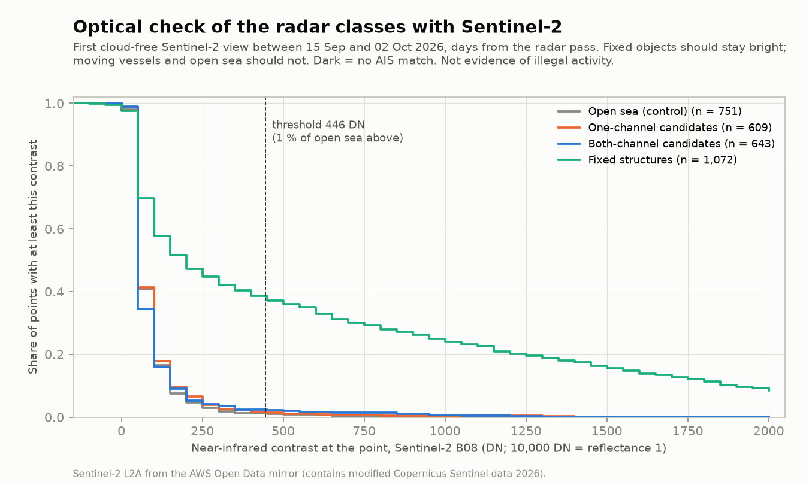
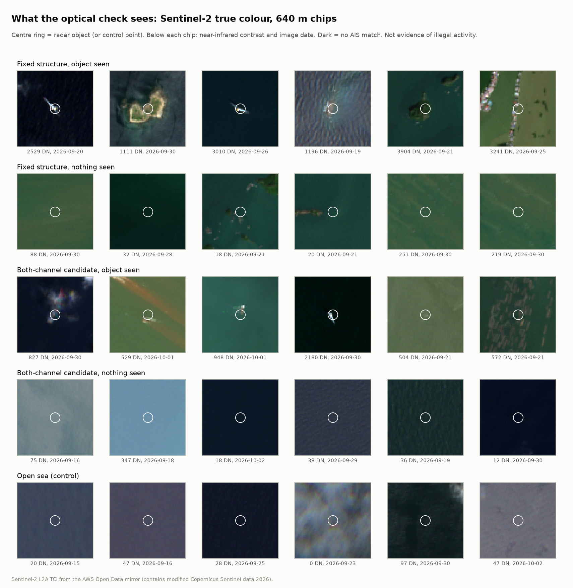

# Optical check of the radar classes with Sentinel-2

Date: 2026-10-03 (UTC). Script: `scripts/19_optical_check.py`; access code: `src/darkvessel/s2.py`. Products: `data/optical_check.gpkg`, `data/optical_check.json`, `docs/figures/optical_check.png`, `docs/figures/optical_examples.png`.

> **"Dark" does not mean illegal.** This check says nothing about AIS or conduct. It only asks whether a bright object sits at a radar object's position in a daytime optical image taken days from the radar pass.

## Question

The persistence test calls 25,224 regional objects fixed structures, and the radar classes call 78,615 objects vessel candidates (`docs/scs_regional.md`). Without AIS or labels there is no truth for either. Sentinel-2 gives an independent look: a platform, turbine or aquaculture frame stays put and should show in a cloud-free Sentinel-2 image days later; a vessel moves on and usually should not; open sea should not show anything.

## Data

Sentinel-2 L2A Cloud-Optimized GeoTIFFs on the AWS Open Data mirror (bucket `sentinel-cogs`, prefix `sentinel-s2-l2a-cogs/<zone>/<band>/<square>/<year>/<month>/<item>/`), read anonymously with HTTP range requests through GDAL. Each item holds B08 (near infrared, 10 m), SCL (scene classification, 20 m), TCI (true colour, 10 m) and a STAC item JSON with the tile cloud percentage. Access and licence: `docs/data_landscape.md`, row B01 (Copernicus terms; commercial use allowed). Sentinel-2A, 2B and 2C items are all present for September 2026; one tile off Ca Mau holds 9 items between 15 September and 2 October.

## Method

1. **Sample.** A fixed random sample per class, chosen by a hash of the object id (`sha1("optical:" + det_id)`): 1,500 fixed structures, 800 both-channel and 800 one-channel vessel candidates. Controls: 1,000 random open-sea points inside the radar footprints of the regional run, at least 2 km from land and 1 km from any radar candidate or fixed structure.
2. **Find a clear view.** For each point, the Sentinel-2 tile is its MGRS 100 km square. Items acquired from 15 September to 2 October 2026 (the radar window of 20 September to 1 October, plus or minus five days) are tried from the least cloudy up, at most four. A view is clear when no pixel within 170 m is no data, saturated, cloud shadow, cloud or cirrus in the scene classification.
3. **Measure.** In the first clear view: near-infrared contrast = the brightest B08 pixel within 20 m of the point minus the median of the 310 m window, in DN (10,000 DN = reflectance 1; the L2A offset cancels in the difference). At that brightest pixel, NDVI from B08 and B04 tells vegetation (islet, shore; NDVI of 0.3 or more) from steel, concrete or a hull. NDVI needs reflectance, so the offset is applied as the item metadata states it (`raster:bands`: scale 0.0001, offset -0.1 for processing baseline 05.13, read in this session).
4. **Threshold from the data.** An optical object is present when the contrast reaches the 99th percentile of the control contrasts, so 1 % of open-sea points pass by construction. No hand-set brightness value.
5. **Report.** Share of clear views with an optical object per class, with Wilson 95 % intervals.

## Results

4,100 points in 296 Sentinel-2 tiles. Threshold: 446 DN of near-infrared contrast (reflectance 0.045), the 99th percentile of 751 clear control views (`data/optical_check.json`).

| Group | Sampled | Clear view | Bright object at the spot | Median contrast |
|---|---|---|---|---|
| Fixed structures | 1,500 | 1,072 (71 %) | 37.1 % [34.3, 40.1] | 160 DN |
| Both-channel candidates | 800 | 643 (80 %) | 2.2 % [1.3, 3.6] | 32 DN |
| One-channel candidates | 800 | 609 (76 %) | 1.5 % [0.8, 2.8] | 40 DN |
| Open sea (control) | 1,000 | 751 (75 %) | 1.1 % (1 % by construction) | 40 DN |

Split by distance to the nearest Satlas platform or turbine (AI2 predictions; `src/darkvessel/satlas.py`):

| Group | Within 1 km of a Satlas point | Farther |
|---|---|---|
| Fixed structures | 54.2 % [48.9, 59.4] of 345 | 29.0 % [25.8, 32.4] of 727 |
| Both-channel candidates | 11.8 % of 17 | 1.9 % of 626 |
| One-channel candidates | 4.3 % of 23 | 1.4 % of 586 |

What the bright objects are, from NDVI at the brightest pixel: of the 398 fixed structures with an optical object, 78 % are not vegetated (platforms, hulls, rafts, rock) and 22 % are (small islets and shore missing from the land mask). The vessel-candidate and control objects are too few (14, 9 and 8) for a split.

What the numbers say:
- **The fixed class holds things that stay put.** A fixed structure shows in an optical image days later 17 times as often as a both-channel candidate. Near Satlas platforms the rate is 54 %. Away from them it is 29 %, where the class holds aquaculture, stake nets and other gear that Sentinel-2 often cannot see at 10 m.
- **The vessel classes are not structures in disguise.** Their rate is close to open sea. Most are gone days later, as moving vessels should be. Rain-cell clutter would also be gone, so this check cannot separate vessels from clutter; the labels and the CNN do that (`docs/paper1_design.md`).
- **"Fixed" is not only "structure".** The example chips (`docs/figures/optical_examples.png`) show three kinds of optical object at fixed positions: platforms, small vegetated islets missing from the land mask, and ships at anchorages, where a ship sits on every pass checked. The islets are correctly fixed; the anchored ships are the moored-vessel case listed in the limits of the regional report.

## Limits

- **Sentinel-2 sees objects of roughly 10 m and up, in daylight.** Bamboo stake nets, low rafts and small buoys can stay below the threshold, so the fixed-class share is a lower bound on its precision, not an estimate of it.
- **Days apart.** The optical view is up to 16 days from the radar pass (radar 20 September to 1 October, optical 15 September to 2 October). A vessel candidate with an optical object may be an anchored ship, a ship that came back, or a structure in the wrong class; the check cannot tell which.
- **Cloud.** Points with no clear view in the window drop out. If cloud is not random with respect to class (for example, rain-cell clutter under cloud), the clear subsample differs from the class as a whole.
- **Bright neighbours.** A bright object within 20 m that is not the radar object (a second platform leg, a moored boat) counts as a hit.
