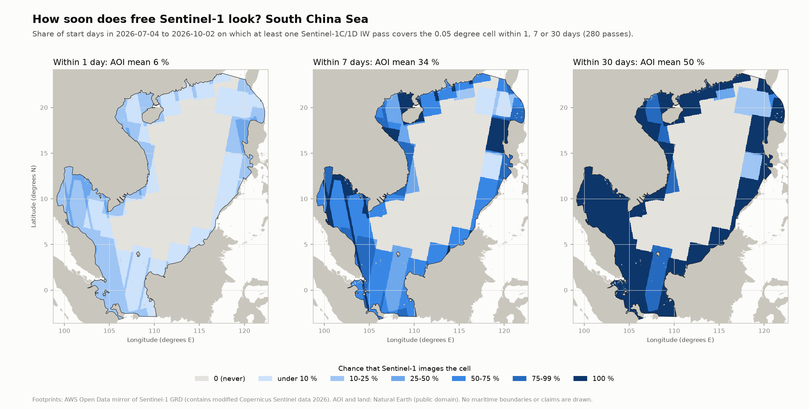
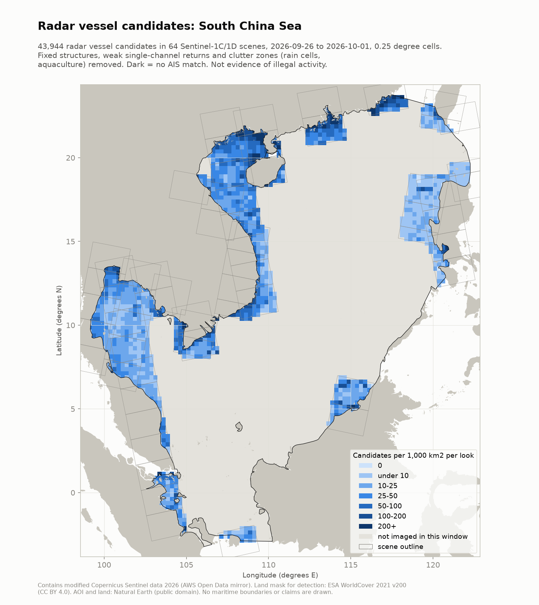

# South China Sea: Sentinel-1 coverage and regional detection

> **"Dark" does not mean illegal.** A dark detection only means no AIS position was matched to it. Many vessels are not required to carry AIS, AIS can be off for lawful reasons, and satellite AIS misses messages in busy coastal waters. No AIS is connected yet, so nothing in this product is labeled dark.

Run date: 2026-10-02. Scripts: `scripts/01_make_aoi.py`, `02_search_scenes.py`, `08_coverage.py`, `09_run_regional.py`.

## 1. Area of interest

The AOI is the union of three Natural Earth 10 m marine areas: "South China Sea", "Gulf of Tonkin" and "Gulf of Thailand" (public domain; `data/aoi.gpkg`). Area 3,583,486 km2 (EPSG:6933, equal area); extent 99.2 to 122.3 E, 3.2 S to 23.8 N. Natural Earth was chosen over a hand-drawn box because it is a citable, neutral definition; no claim lines or maritime boundaries are drawn in any product. Regional layers are delivered in EPSG:4326 and UTM 49N (EPSG:32649, the zone at the centre of the sea); Vietnamese coastal detail stays in UTM 48N.

## 2. Where Sentinel-1 looked, 4 July to 2 October 2026

Source: AWS Open Data mirror of Sentinel-1 GRD, all IW products of Sentinel-1C and 1D whose footprint touches the AOI (`data/s1_footprints.gpkg`, `data/s1_scenes.csv`). Slices of one acquisition are merged into one pass before counting (`src/darkvessel/coverage.py`), on a 0.05 degree grid with exact spherical cell areas.

| Item | Result |
|---|---|
| IW GRD products | 1,042 (Sentinel-1D 835, Sentinel-1C 207), all dual VV + VH |
| Passes (merged acquisitions) | 280 (1D 190, 1C 90); 139 ascending, 141 descending |
| AOI imaged at least once | 55 % |
| AOI imaged 3 / 6 / 10 or more times | 49 % / 42 % / 25 % |
| AOI never imaged | 1,605,966 km2 (45 %) |
| Where imaged: mean passes, typical revisit | 10.3 passes, about one every 8.8 days (maximum 38) |
| Share of the AOI imaged on an average day | 6.3 % (pass area summed over the window, divided by 90 days and by the AOI area) |

Rasters: `data/outputs/small/s1_passes_4326.tif` and `s1_passes_utm49n.tif` (COG, passes per cell; 65535 = outside AOI). Statistics: `data/s1_coverage.json`.

How soon a look comes (`scripts/17_look_probability.py`): for each cell and each start day of the window, did any pass cover the cell within the next 1, 7 or 30 days? The share of start days is the chance of a look.

| Window | AOI mean chance | AOI with an even chance or better | AOI looked at in every window |
|---|---|---|---|
| 1 day | 6.3 % | 0 % | 0 % |
| 7 days | 34 % | 42 % | 7.9 % |
| 30 days | 50 % | 49 % | 42 % |

The 1-day mean equals the average daily share above, as it should. In the coastal ring the 7-day chance runs from under 10 % to 100 % depending on the cell; in the central sea it is zero at every horizon.

Rasters: `data/outputs/small/s1_look_prob_{1,7,30}d_4326.tif` and `_utm49n.tif` (COG, uint8 percent; 255 = outside AOI). Statistics: `data/s1_look_probability.json`.

What the map shows: Sentinel-1 images a coastal ring (Vietnam, Gulf of Thailand, Malaysia, Borneo, Palawan, Luzon, south China) and leaves the central South China Sea, including the Spratly Islands area, unimaged in IW mode for the whole 90 days. A 12-day check (18 to 29 September) found no EW-mode and no stripmap products over the AOI either. The bucket holds GRD products only, so ocean wave-mode (WV) vignettes, which are not usable for ship detection, are not counted.

Why it matters:
- For the flagship paper, "how many vessels does SAR miss" has a spatial term before any detector term: nearly half of the sea is never looked at by free wide-swath SAR.
- For the product pitch, open Sentinel-1 cannot monitor the central sea at all. Covering it needs tasked SAR (commercial, or a national satellite). This is the strongest argument for a sensor-agnostic pipeline.
- Sentinel-1C does image parts of this AOI (90 passes), even though it took none over Ca Mau. 1C imagery for the transfer letter can come from inside the region.

Verification status: counts come from the AWS mirror and were not cross-checked against Copernicus Data Space (blocked from this environment). Whether the gap reflects the Sentinel-1 observation scenario is UNVERIFIED until the ESA scenario page can be opened.

## 3. Regional detection, 20 September to 1 October 2026 (one 12-day repeat cycle)

Scripts: `scripts/09_run_regional.py --days 12` (detection, checkpointed per scene), `--merge` (products, persistence, clutter rules), `scripts/10_regional_density.py` (density raster and map), `scripts/11_clutter_zone_check.py` (cost of the clutter rule), `scripts/14_cnn_shared_cells.py` (1C against 1D).

**Input.** Every Sentinel-1C/1D IW product of the last 12 days of the search window whose footprint holds at least 300 km2 of the AOI: 119 of the 124 products that touch it (93 Sentinel-1D, 26 Sentinel-1C; 62 ascending, 57 descending). The five skipped slivers hold 0 to 287 km2 of the AOI each.

**Method.** The detector is the Ca Mau baseline (`docs/gis_baseline.md`), run over whole scenes:
- Each scene is read in place over HTTPS in 2048-pixel blocks. Only blocks holding testable sea are read: WorldCover water inside the AOI, beyond a 1 km shore buffer.
- CA-CFAR runs on calibrated VV and VH: false-alarm rate 1e-6, guard 81 px, background 161 px, one ENL per scene and channel. VV and VH objects within 30 m are fused.
- Classes:
  - high = both channels.
  - medium = VH only, or strong VV only.
  - low = weak VV only, or longer than 450 m.
- Persistence: each high or medium object is checked on up to two earlier passes of the same orbit, 1 to 30 days before (20 m overview, contrast of at least 7 dB within about 60 m). A return on every pass checked makes it "fixed".
- Two clutter rules then move remaining high or medium objects to low:
  - clutter zone: 5 or more low objects within 1 km in the same scene;
  - near fixed: within 250 m of a fixed structure of the same scene.

Median processing time was 216 s per scene on a shared 4-core machine.

| Item | Result |
|---|---|
| Sea tested (sum over scenes) | 2,380,852 km2 (Sentinel-1D 2,011,473; Sentinel-1C 369,379) |
| CFAR objects | 927,124 |
| Vessel candidates | **78,615**: 29,228 in both channels (high), 49,387 in one channel (medium) |
| Fixed structures | 25,224 |
| Low | 823,285: 759,790 weak VV only, 52,820 clutter zone, 5,727 near fixed, 4,948 longer than 450 m |
| Candidates per 1,000 km2 tested | 33.0 (Sentinel-1D 32.5, Sentinel-1C 36.0) |
| Estimated length of candidates | median 40 m; 37 % at 25 m or less, 22 % 25 to 50 m, 22 % 50 to 100 m, 19 % over 100 m |
| Persistence | 98.1 % of high, medium and fixed objects checked on 2 earlier passes, 1.7 % on none |

**Density.**
- Candidates per 1,000 km2 of sea per look, on a 0.25 degree grid (`data/outputs/small/vessel_density_regional_4326.tif` and `_utm49n.tif`, `data/regional_density.json`).
- Median over the 2,162 observed cells: 17.6. 90th percentile: 80. 99th percentile: 262.
- The densest cells:
  - off Beihai, Guangxi (21.4 N, 109.1 to 109.4 E; 424 to 573);
  - the Vung Tau and Can Gio anchorages (10.4 N, 106.9 E; 412);
  - the Pearl River mouth (22.4 to 22.6 N, 113.6 to 113.9 E; 358 to 388);
  - the Shantou coast (23.4 N, 117.1 E; 377).
- A quicklook of the Beihai cell shows separate point targets spread over open water north of the Beihai peninsula, consistent with a fishing fleet. Not verified: no AIS.
- One look is a 25-second snapshot, so a boat seen on two passes counts twice, against two looks of area.

**Hot spots that were not vessels.** Quicklooks of the densest cells before the clutter rules showed four false sources:
- Convective rain cells off Brunei (6.4 N, 114.5 E; one scene, 3,307 candidates in a 0.85 x 0.6 degree box).
- Rain cells in the central Gulf of Thailand (10.5 N, 101.8 E).
- Aquaculture rafts and stake lines in Zhanjiang Bay (20.9 N, 110.4 E).
- An offshore wind farm off Shanwei, Guangdong (22.6 N, 116.1 E). The persistence test marked 512 turbines in one scene as fixed, but about 800 candidates on the same rows were turbines it missed, or sidelobes.

The clutter-zone rule targets the first three; the near-fixed rule the fourth.

The clutter-zone rule was measured on the AI2-labelled Sentinel-1A/1B candidates of the ML stage (`data/clutter_zone_check.json`). The 1 km and 5 rule:
- flags 16 % of candidates;
- removes 26 % of clutter candidates;
- loses 2.3 % of candidates within 50 m of a labelled vessel;
- raises the share of both-channel candidates near a labelled vessel from 51 % to 54 %, and of one-channel candidates from 14 % to 17 %.

On this regional run it flagged 52,820 of 137,162 candidates left after persistence (39 %), because late-September storms covered large parts of the scenes. It can also flag a very dense fleet of small boats with weak returns, and the AI2 labels hold few such fleets.

The near-fixed rule flagged 5,727 candidates (7 %); in the Shanwei wind farm it took 797 of 1,621 candidates in a 0.5 x 0.4 degree box. Its cost in real vessels (moored at, or passing close to, a structure) is not measured. Masking a buffer around known infrastructure is the usual practice; here the infrastructure layer is the project's own fixed class.

Both rules keep their rows in the full product (`data/detections_regional_all.gpkg`, low_reason `clutter_zone` or `near_fixed`, columns n_low_1km and near_fixed_m). Run `09_run_regional.py --merge --no-clutter-zone` to keep them as candidates.

**How good are the candidates?** There is no Sentinel-1C/1D ground truth yet. The same detector on 321 Sentinel-1A/1B scenes in Southeast Asia with AI2 expert labels (`data/ml/candidates.parquet`) gives these shares within 50 m of a labelled vessel:
- 51 % of both-channel candidates (65 % within 150 m);
- 14 % of one-channel candidates (25 % within 150 m).

The labels miss some real ships, so these are lower bounds on precision. Read one-channel candidates as leads. 58 % of all candidates are seen in VH only. The median length of one-channel candidates is 24 m, which is 2 to 3 pixels, close to the speckle correlation length.

**First look for the transfer letter: 1C against 1D on the same sea.** Of the 0.25 degree cells, 373 had at least 30 % of their sea imaged by each satellite in the 12 days (100.75 to 121 E, 10 to 21.75 N). On these cells (`data/ml/shared_cells_cnn.json`, `scripts/14_cnn_shared_cells.py`):

| | Sentinel-1C | Sentinel-1D |
|---|---|---|
| Candidates per 1,000 km2 per look | 38.8 | 41.1 |
| Both-channel share | 38.4 % | 38.8 % |
| CNN accepts, both-channel candidates | 60.1 % [58.7, 61.6] | 62.9 % [61.6, 64.1] |
| CNN accepts, one-channel candidates | 10.1 % [9.4, 10.9] | 10.6 % [10.0, 11.3] |
| CNN accepts, fixed structures | 20.4 % | 23.0 % |
| Chip background, both-channel candidates, VV / VH | -21.5 / -27.7 dB | -21.1 / -27.7 dB |

- The median per-cell density ratio is 1.02 (interquartile range 0.62 to 1.55).
- Paired by cell, 1D chip backgrounds are 1.2 dB brighter than 1C in VV and 0.3 dB in VH (369 cells). The two satellites have the same annotated noise floor (`docs/paper1_design.md`), so the VV gap points at sea state on different dates, not at the sensor.
- Mission-wide the two also agree: 36.0 and 32.5 candidates per 1,000 km2 tested, 37 % both-channel each. The 6-day run had suggested a gap (20.7 against 42.1); it came from geography and closed with a full cycle.
- On held-out 1A/1B scenes the CNN accepted about 77 % of both-channel candidates, against about 61 % here. That is a lead for the letter, not a result: region, traffic and truth all differ.

This is a consistency check, not a transfer result: the dates differ and nothing is scored against truth.

**Weather at the radar time.** `scripts/16_weather_context.py` sampled two sources at each of 162,386 regional objects (candidates, fixed structures and both kinds of clutter-flagged objects; `data/weather_context.json`, `data/weather_context.parquet`):
- GFS 0.25 degree 10 m wind of the nearest hour;
- Himawari-9 cloud-top temperature of the nearest 10-minute full disk, parallax corrected.

Both are NOAA open data on AWS, read by byte range.

| Group | Objects | Under deep convection (tops below 220 K) | Under no cloud | Median wind |
|---|---|---|---|---|
| Clutter zone (flagged) | 52,820 | 39.0 % [38.6, 39.4] | 17 % | 3.4 m/s |
| One-channel candidates | 49,387 | 29.1 % [28.7, 29.5] | 31 % | 4.2 m/s |
| Both-channel candidates | 29,228 | 23.4 % [22.9, 23.9] | 40 % | 3.8 m/s |
| Fixed structures | 25,224 | 21.0 % | 43 % | 3.7 m/s |
| Near fixed (flagged) | 5,727 | 16.6 % | 61 % | 3.6 m/s |

- The clutter-zone rule was set from the radar alone. It flags objects under deep convection 1.7 times as often as it keeps both-channel candidates, which is independent support for the rule.
- The separation is partial. 61 % of flagged objects are not under tops colder than 220 K (aquaculture, fleets, warmer rain clouds), and about a quarter of kept candidates are under convective cloud. Ships do not stop for storms, and some rain cells survive the rule.
- Winds were light in this window (medians 3 to 4 m/s), the conditions in which small boats are easiest to see.

**Products.**
- `data/detections_regional.gpkg` (36 MB):
  - `detections_regional_4326` and `_utm49n`: 78,615 vessel candidates. Columns:
    - det_id, scene_idx, mission, acq_utc, confidence, lat, lon
    - length_est_m, scr_vv_db, scr_vh_db, inc_angle_deg
    - persist_dates, persist_dates_checked
    - ais_status = not_checked
    - caveat
  - `scenes_processed_4326` and `_utm49n`: footprint, product id, sea tested and class counts per scene.
  - `about`: method, settings, full caveat and data credit.
- `data/structures_regional.gpkg` (12 MB): the 25,224 fixed structures (`structures_regional_4326` and `_utm49n`), same columns and side layers. Split from the candidates to keep each file well under 50 MB for git.
- The point layers carry no R-tree index, to keep the files small; in ArcGIS Pro, run Add Spatial Index if panning is slow.
- `data/detections_regional_all.gpkg`: every object, all columns (877 MB, gitignored). Regenerate it with `--merge` from the per-scene cache, or from scratch with `--days 12` (about 3 hours with 3 workers).
- `data/regional_summary.json`, `data/regional_density.json`.

**Fix made during this run.** WorldCover codes nearshore sea inside its land tiles as permanent water (80). The first version of the sea mask kept water only when it connected to a code-0 (open ocean) cell in the scene frame, so 6 coastal scenes lost all their sea and 3 lost part of it:
- the Gulf of Thailand off Kien Giang, Cambodia and eastern Thailand;
- the Mekong mouths;
- the south-central Vietnamese coast;
- the northern Gulf of Tonkin.

The mask now also counts water connected to cells 0.05 degree inside the marine-area AOI (`darkvessel.landmask.sea_mask_on_grid`, test `tests/test_landmask.py`). The 9 scenes were reprocessed, adding 22,400 km2 of tested sea. The Ca Mau detail scene was not affected (same mask area under both rules).

**Limits.**
- No AIS is connected, so nothing is labeled dark.
- 12 days of a 90-day window, a coastal ring only (section 2).
- Single looks, not tracks.
- Lengths are pixel extents.
- The 1 km shore buffer leaves out harbours and river mouths.
- A boat moored at the same spot on every pass checked becomes "fixed".
