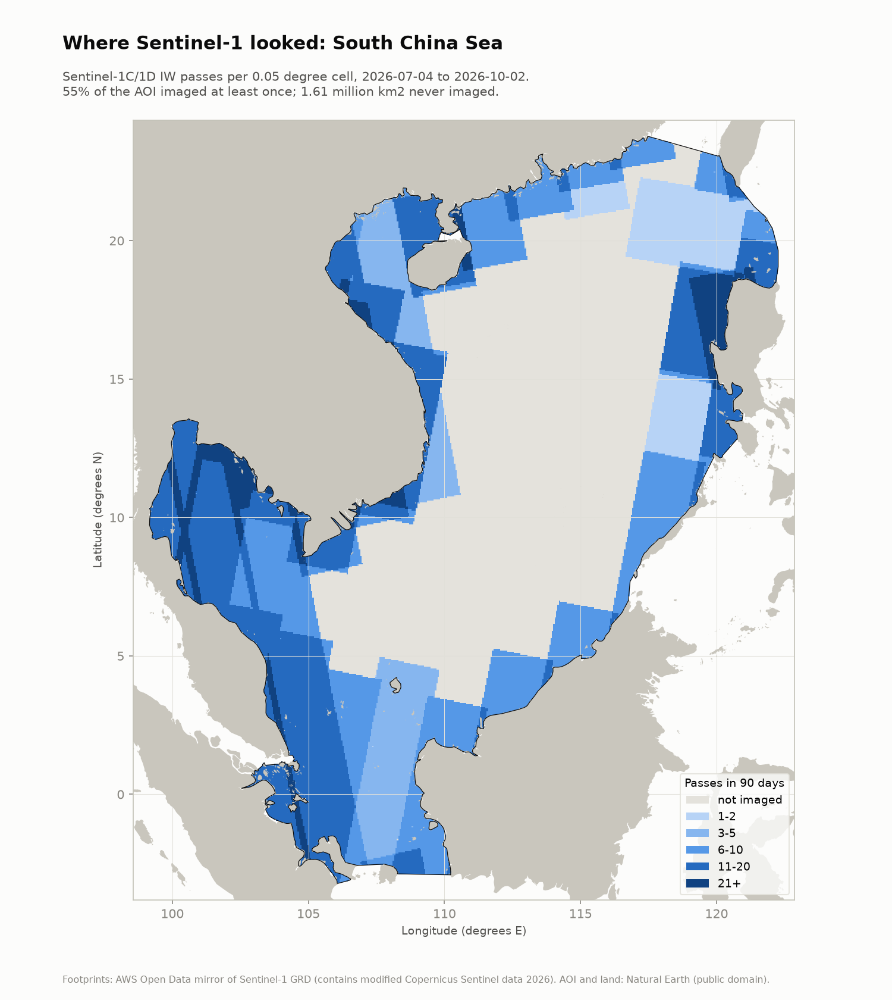

# South China Sea: Sentinel-1 coverage and regional detection

> **"Dark" does not mean illegal.** A dark detection only means no AIS position was matched to it. Many vessels are not required to carry AIS, AIS can be off for lawful reasons, and satellite AIS misses messages in busy coastal waters. No AIS is connected yet, so nothing in this product is labeled dark.

Run date: 2026-10-02. Scripts: `scripts/01_make_aoi.py`, `02_search_scenes.py`, `08_coverage.py`, `09_run_regional.py`.

## 1. Area of interest

The AOI is the union of three Natural Earth 10 m marine areas: "South China Sea", "Gulf of Tonkin" and "Gulf of Thailand" (public domain; `data/aoi.gpkg`). Area 3,583,486 km2 (EPSG:6933, equal area); extent 99.2 to 122.3 E, 3.2 S to 23.8 N. Natural Earth was chosen over a hand-drawn box because it is a citable, neutral definition; no claim lines or maritime boundaries are drawn in any product. Regional layers are delivered in EPSG:4326 and UTM 49N (EPSG:32649, the zone at the centre of the sea); Vietnamese coastal detail stays in UTM 48N.

## 2. Where Sentinel-1 looked, 4 July to 2 October 2026

Source: AWS Open Data mirror of Sentinel-1 GRD, all IW products of Sentinel-1C and 1D whose footprint touches the AOI (`data/s1_footprints.gpkg`, `data/s1_scenes.csv`). Slices of one acquisition are merged into one pass before counting (`src/darkvessel/coverage.py`), on a 0.05 degree grid with exact spherical cell areas.

| Item | Result |
|---|---|
| IW GRD products | 1,042 (Sentinel-1D 835, Sentinel-1C 207), all dual VV + VH |
| Passes (merged acquisitions) | 280 (1D 190, 1C 90); 139 ascending, 141 descending |
| AOI imaged at least once | 55 % |
| AOI imaged 3 / 6 / 10 or more times | 49 % / 42 % / 25 % |
| AOI never imaged | 1,605,966 km2 (45 %) |
| Where imaged: mean passes, typical revisit | 10.3 passes, about one every 8.8 days (maximum 38) |

Rasters: `data/outputs/small/s1_passes_4326.tif` and `s1_passes_utm49n.tif` (COG, passes per cell; 65535 = outside AOI). Statistics: `data/s1_coverage.json`.

What the map shows: Sentinel-1 images a coastal ring (Vietnam, Gulf of Thailand, Malaysia, Borneo, Palawan, Luzon, south China) and leaves the central South China Sea, including the Spratly Islands area, unimaged in IW mode for the whole 90 days. A 12-day check (18 to 29 September) found no EW-mode and no stripmap products over the AOI either. The bucket holds GRD products only, so ocean wave-mode (WV) vignettes, which are not usable for ship detection, are not counted.

Why it matters:
- For the flagship paper, "how many vessels does SAR miss" has a spatial term before any detector term: nearly half of the sea is never looked at by free wide-swath SAR.
- For the product pitch, open Sentinel-1 cannot monitor the central sea at all. Covering it needs tasked SAR (commercial, or a national satellite). This is the strongest argument for a sensor-agnostic pipeline.
- Sentinel-1C does image parts of this AOI (90 passes), even though it took none over Ca Mau. 1C imagery for the transfer letter can come from inside the region.

Verification status: counts come from the AWS mirror and were not cross-checked against Copernicus Data Space (blocked from this environment). Whether the gap reflects the Sentinel-1 observation scenario is UNVERIFIED until the ESA scenario page can be opened.

## 3. Regional detection

In progress: the most recent 6 days of scenes (65 products, 1D and 1C), processed block by block over sea inside the AOI. Results, map and density raster will be added here.
